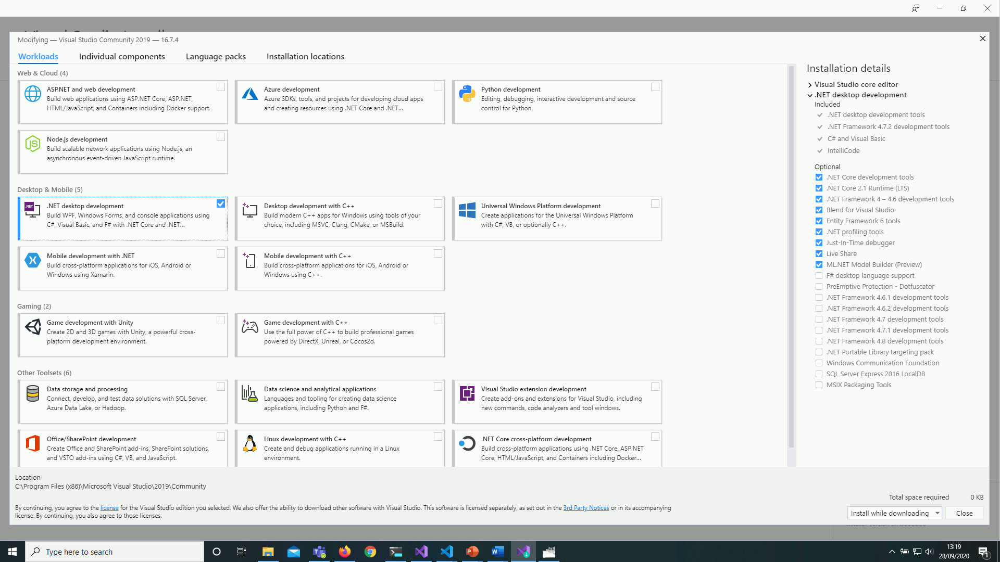

Session 1
=========


Introduction
------------

Introduction to MCOMD1INC.pptx

allan.callaghan@canterbury.ac.uk
About me

Blackboard Module Handbook

https://visualstudio.microsoft.com/downloads/
[Live Share](https://visualstudio.microsoft.com/services/live-share/)



Lecture
-------

Introduction to C#-Week1_2019.pptx

Static Vs Dynamic

https://rosettacode.org/wiki/Mandelbrot_set
* Language X is shit
    * This is the remark of a weak inexperienced programmer
    * Every language was created for a reason - it has (or had) a purpose

* [PYPL PopularitY of Programming Language](http://pypl.github.io/PYPL.html)
* [TIOBE](https://www.tiobe.com/tiobe-index/)-index Software quality company


Resilience - 98% of coding is failure, the code is broken
Men In Black 2 "This is how I fight"


Workshop
--------

5 Tasks


Tutorial
--------

Display Screen Equipment

https://www.hse.gov.uk/msd/dse/


Extras
------

Code Formatter
Refactoring tools - renaming


---

Session 2
=========


https://en.wikipedia.org/wiki/Order_of_operations#Programming_languages

Slide 27


```bash
# sudo apt-get install mono-mcs -y
function csharp { mcs "$1" && clear && mono "${1%.*}.exe" && rm "${1%.*}.exe"; }
csharp program.cs
```

* [Running Windows Forms on Linux with Mono](https://markheath.net/post/running-windows-forms-on-linux-with-mono)