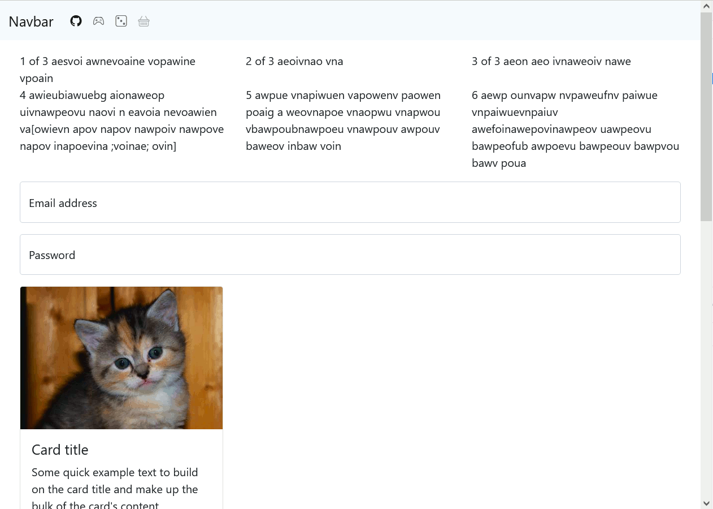

Web Layout Frameworks
=====================
AKA: CSS Frameworks

Objectives
1. Understand some of the core functionality of `css`
    * Id's, class's, selector combinations, transitions, dynamic manipulation of class's
2. Understand the deficiencies of raw css
3. Understand the problems css frameworks are trying to solve
4. Use a range of web frameworks to create a responsive page
5. Understand that a range of frameworks exist

Guidance on Assignment 2

Next week: Test frameworks


HTML Styles
-----------

Old horrible example
```html
<!doctype html>
<html>
<head>
    <meta charset="UTF-8" />
    <title>html test</title>
</head>
<body>
    <h1 style="color: red; font-size: 10em;">My Heading</h1>
    <ul>
        <li style="list-style-type: square;">Thing</li>
        <li style="list-style-type: square;">Thing again</li>
        <li style="list-style-type: square;">Thing more</li>
    </ul>
</body>
</html>
```
Does not scale - as project grows, difficult to maintain consistency

CSS
---

Refresher and some advanced features

### CSS Style tags

```html
<!doctype html>
<html>
<head>
    <meta charset="UTF-8" />
    <title>html test</title>
    <style>
        h1 {
            color: red;
            font-size: 3em;
        }

        ul li {
            list-style-type: square;
        }
    </style>
</head>
<body>
    <h1>My Heading</h1>
    <ul>
        <li>Thing</li>
        <li>Thing again</li>
        <li>Thing more</li>
    </ul>
    <ul>
        <li>Another list</li>
        <li>Another list2</li>
    </ul>
</body>
</html>
```

### Style ID's and Class's

* ID - prefixed  with `#`
    * Only one
    * I tend to only use ID's when their is javascript interaction or associated code/behaviour
* class - refixed with `.`
    * Can be applied many times

```html
<!doctype html>
<html>
<head>
    <meta charset="UTF-8" />
    <title>html test</title>
    <style>
        h1 {
            color: red;
            font-size: 3em;
        }

        ul li {
            list-style-type: square;
        }

        #my_list li {
            display: inline-block;
            border-radius: 1em;
            background-color: lightgray;
            padding: 1em;
            margin: 1em;
        }

        .highlight {
            color: greenyellow;
        }
    </style>
</head>
<body>
    <h1>My Heading</h1>
    <ul id="my_list">
        <li>Thing</li>
        <li>Thing again</li>
        <li class="highlight">Thing more</li>
    </ul>
    <ul>
        <li class="highlight">Another list</li>
        <li>Another list2</li>
    </ul>
</body>
</html>
```

Advanced CSS
------------

### Transitions with animation

Add the following to the above example
```css
        #my_list li {
            /* ... */
            transition: background-color 1000ms linear;
        }
        #my_list li:hover {
            background-color: red;
        }
```

### Style Class's on parent

1. Add this css
    * ```css
        .big #my_list li {
            padding: 2em;
            font-size: larger;
        }
        ```
2. Manually in dev-tools add the class `big` to `body`
    * see it work
3. Add some javascript to toggle the class
```html
<button id="big_button">Make Big</button>

<script type="module">
    const $body = document.getElementsByTagName("body")[0];
    const $element = document.getElementById("big_button");
    $element.addEventListener("click", event => {
        $body.classList.toggle("big");
    });
</script>
```

### Media Queries

Add the css below and resize the browser to less than 600px.
```css
@media only screen and (max-width: 600px) {
  body {
    background-color: lightblue;
  }
}
```

[Challenge: Login Screen - CSS Transition](https://github.com/calaldees/TeachProgramming/tree/master/teachprogramming/static/projects/web/login)


Problems with CSS
-----------------

* Problems
    * It quickly becomes unmanageable
        * elements that inherit form multiple styles create changes all over the site
        * All styles are intertwined somehow
        * Lots and lots of class names that are not named consistently
    * Difficult to make sites look consistent
    * Lost of css required to support responsive design with multiple media query sizes
* Solutions
    * [Sass: Syntactically Awesome Style Sheets](https://sass-lang.com/) - CSS with superpowers 
        * preprocessor scripting language for css
            * Variables, functions, mixins
        * You write in something similar to CSS with cool new features and it generate css files
            * If css your css was complicated before - with sass you've now made it even more complicated
            * Can generate an ungodly amount of plain css as output if used unchecked
        * [Sass in 100 Seconds](https://www.youtube.com/watch?v=akDIJa0AP5c) video
    * CSS Frameworks
        * People that have made MANY beautiful websites have structured their knowledge into refined tools we can use
        * Beware - once you use it, you're locked in! - escape is difficult


12 part grid system
-------------------

* Why not use base 10!
    * Divide by two! yeah! now again .. oh .. 
    * Divide by three ... oh .. 
    * Divide by four ... oh .. 
* Why base 12 is amazing! You can divided it by
    * Two! yeah! and again .. YEAH!
    * Divide by 3, yeah!
    * Divide by 4, YEAH!
    * Divide by 6 yeah!
    * You can slice by quarter and 3rd without fractions


Bootstrap 5.1
-------------

* my example
    * https://barcampcanterbury.com/
    * use dev-tools with mobile simulation

* https://getbootstrap.com/
    * > Build fast, responsive sites with Bootstrap
    * > Quickly design and customize responsive mobile-first sites with Bootstrap, the world’s most popular front-end open source toolkit, featuring Sass variables and mixins, responsive grid system, extensive prebuilt components, and powerful JavaScript plugins. 
    * Responsive
        * Mobile simulation in devtools
        * Resize window
        * Breakpoints https://getbootstrap.com/docs/5.1/layout/breakpoints/
            * sm, md, lg
        * Grid
            * https://getbootstrap.com/docs/5.1/layout/grid/
            * 12 Column system (base 12 rocks!)
        * Utilities
            * Try not to write your own css where possible - use the framework tools
            * https://getbootstrap.com/docs/5.1/utilities/spacing/
            * https://getbootstrap.com/docs/5.1/utilities/borders/
        * Cards
            * https://getbootstrap.com/docs/5.1/components/card/
        * Navbar
            * https://getbootstrap.com/docs/5.1/components/navbar/
            * fixed top?
        * Spinners - for loading
            * https://getbootstrap.com/docs/5.1/components/spinners/
        * Forms
            * validation
            * https://getbootstrap.com/docs/5.1/forms/validation/
            * https://getbootstrap.com/docs/5.1/forms/floating-labels/
        * Toast
        * ScrollSpy
    * [Icons](https://icons.getbootstrap.com/)
        * Via CDN as a web-font
    * [theme's](https://themes.getbootstrap.com/)
    * [Examples](https://getbootstrap.com/docs/5.1/examples/)


Icons
* [Icons](https://icons.getbootstrap.com/)
```
<head>
    <link rel="stylesheet" href="https://cdn.jsdelivr.net/npm/bootstrap-icons@1.7.0/font/bootstrap-icons.css">
</head>

<body>
    <i class="bi-alarm"></i>
    <i class="bi-github" role="img" aria-label="GitHub"></i>
</body>
```

### Task
Create the following

```
Navbar | Shopping basket + Game controller +  Dice

---

large breakpoint

| section1 | section2 | section3 |

| section4 | section5 | section5 |

medium breakpoint

| section1 | section2 | section3 |

| section4                       |
| section5                       |
| section5                       |

small breakpoint

| section1 |
| section2 |
| section3 |
| section4 |
| section5 |
| section5 |

---

Form input with floating text for email and password
A button

---

3 Cards with placekitten images
https://placekitten.com/

```



Starting `index.html`
```html
<!doctype html>
<html lang="en">
  <head>
    <meta charset="utf-8">
    <meta name="viewport" content="width=device-width, initial-scale=1">
    <link href="https://cdn.jsdelivr.net/npm/bootstrap@5.1.3/dist/css/bootstrap.min.css" rel="stylesheet" integrity="sha384-1BmE4kWBq78iYhFldvKuhfTAU6auU8tT94WrHftjDbrCEXSU1oBoqyl2QvZ6jIW3" crossorigin="anonymous">
    <link rel="stylesheet" href="https://cdn.jsdelivr.net/npm/bootstrap-icons@1.7.0/font/bootstrap-icons.css">
    <title>Bootstrap Demo</title>
  </head>
  <body>

    <nav class="navbar">
        ??
    </nav>

    <div class="container my-3">
        ??
    </div>

    <div class="container my-3">
        ??
    </div>


    <script src="https://cdn.jsdelivr.net/npm/bootstrap@5.1.3/dist/js/bootstrap.bundle.min.js" integrity="sha384-ka7Sk0Gln4gmtz2MlQnikT1wXgYsOg+OMhuP+IlRH9sENBO0LRn5q+8nbTov4+1p" crossorigin="anonymous"></script>
  </body>
</html>
```

Skeleton
--------

* http://getskeleton.com
* A dead simple, responsive boilerplate
* Light as a feather at ~400 lines & built with mobile in mind
* Styles designed to be a starting point, not a UI framework
* Quick to start with zero compiling or installing necessary

* Only one breakpoint (to start with)
* Very very lightweight demo


tailwindcss
-----------

* [tailwindcss](https://tailwindcss.com/)
    * Rapidly build modern websites without ever leaving your HTML.
    * [Utility First](https://tailwindcss.com/docs/utility-first)

* My opinion
    * Great when used with a client framework with reusable components
    * Templates become very verbose and bloated - hard to read
    * `@apply` could solve some of this, but requires css compilation framework

```html
<!doctype html>
<html>
<head>
  <meta charset="UTF-8" />
  <meta name="viewport" content="width=device-width, initial-scale=1.0" />
  <!-- From: https://tailwindcss.com/docs/installation#using-tailwind-via-cdn -->
  <link href="https://unpkg.com/tailwindcss@^2/dist/tailwind.min.css" rel="stylesheet">
</head>
<body>

    <div class="p-6 max-w-sm mx-auto bg-white rounded-xl shadow-md flex items-center space-x-4">
        <div class="flex-shrink-0">
            
        </div>
        <div>
            <div class="text-xl font-medium text-black">ChitChat</div>
            <p class="text-gray-500">You have a new message!</p>
        </div>
    </div>


</body>
</html>
```

* padding `p-??` and margin `m-??` 

https://tailwindcss.com/docs/width
https://tailwindcss.com/docs/border-radius#pills-and-circles
https://tailwindcss.com/docs/divide-width#add-borders-between-horizontal-children

Forms is not part of default functionality - requires plugin


Pure.css
--------
https://purecss.io/
* see getting started and grid system
* Pure ships with both a 5ths and 24ths based grid

Bit more than skeleton but still pretty bare bones


Material Design (Google)
------------------------

* [materializecss](https://materializecss.com/about.html)
    * > A modern responsive front-end framework based on Material Design
    * Motion provides meaning + colour
    * [Material Design](https://material.io/)
        * [Material Icons](https://fonts.google.com/icons) searchable
        * [Googled tried to enforce Material Design on iOS platforms](https://sixcolors.com/link/2021/10/googles-apps-to-embrace-ios-on-ios/) they gave up in 2021 because (quite rightly) the users were annoyed and confused


Other Projects
--------------

* https://foundation.zurb.com/
* https://bulma.io/
    * just css (no js)


Further Reading
---------------

* [top bootstrap alternatives](https://hackr.io/blog/top-bootstrap-alternatives)
* [Top 5 CSS Frameworks for Website Developers and Designers](https://www.browserstack.com/guide/top-css-frameworks)
* [10 CSS Pro Tips - Code this, NOT that!](https://www.youtube.com/watch?v=Qhaz36TZG5Y) 10min Video
    * Understand the power of raw CSS without being locked into framework


Guidance with Assignment 2
==========================

Time to start your server and client implementations.
* Clone the repo
* Make commits
* You will submit a repo for me to run your project
* I will details how you will submit your repo over the next few weeks
* Build you server in `server/`
* Make a `Dockerfile` to ensure your server can be run from a container
* Run test on your sever `make test_server`

Missing from last week
* Demo accessing API form javascript (as this failed last week) 
