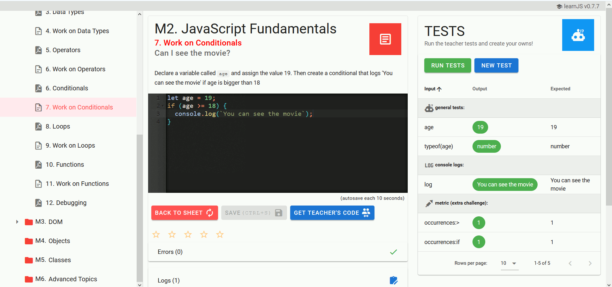

Education Software
==================

Online Course System
--------------------

* Artemis: Interactive Learning with Individual Feedback
    * [codeability](https://codeability.uibk.ac.at/index-en.html) austria
    * [github.com/ls1intum/Artemis](https://github.com/ls1intum/Artemis)
    * [artemis.codeability.uibk.ac.at](https://artemis.codeability.uibk.ac.at/)
    * [docs](https://docs.artemis.ase.in.tum.de/)
        * Languages
            * C
            * Java
            * Python
            * Haskell
        * Jenkins
        * Open?

* [learnJS](https://rqueiros.github.io/learnjs/)
    * Online javascript interactive course
    * [LearnJS - A JavaScript Learning Playground (Short Paper)](https://drops.dagstuhl.de/opus/volltexte/2018/9260/)
    * by [github.com/rqueiros](https://github.com/rqueiros/)
        * [papers](https://dblp.org/pid/67/2409.html)
    * 
    * @RicQueiros
  
* [frama-c](https://frama-c.com/)
    * Analysis of c programms and metrics
    * Overview of a Frama-C analysis for a simple C program

* [Moopec - A tool for creating programming problems](https://github.com/rcm/ICPEC2021/blob/main/moopec.md)

* [Visual-netsim: Development of an interactive browser based network simulator](https://ieeexplore.ieee.org/abstract/document/7821684)
    * paper about tech - I want to download it? TODO?

* [yare.io](https://yare.io/) - Real-Time Strategy game where you control your units by writing JavaScript code.
* [BattleSnake](https://play.battlesnake.com/) tounament