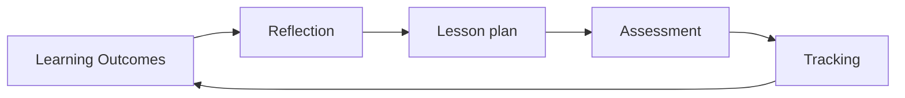
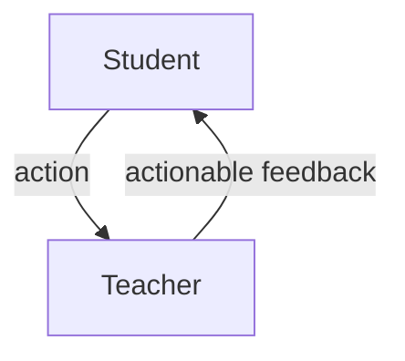

Formative Assessment
====================

TODO:
* [Hello World Issue 12](https://helloworld.raspberrypi.org/issues/12) Page 88
* ASSESSMENT IN SECONDARY COMPUTING - Alan O’Donohoe and John Woollard offer practical, common-sense advice on how to assess Computing for ages 11 to 16

Objectives

* Learning v progress; what does Computing learning look like?
* AfL strategies and feedback to inform subject practice
    * feedback supporting pupils to monitor and regulate their own learning
* Reducing assessment workload
    * High impact high quality feedback

ITT Core Framework
6.1
> Effective assessment is critical to teaching because it provides teachers with information about pupils’ understanding and needs
6.2
> Good assessment helps teachers avoid being over-influenced by potentially misleading factors, such as how busy pupils appear
6.4
> pupils must be able to act on feedback for it to have an effect
6.5
> High-quality feedback can be written or verbal; it is likely to be accurate and clear, encourage further effort, and provide specific guidance on how to improve
6.6
> Over time, feedback should support pupils to monitor and regulate their own learning.

Teachers' Standards
6 - Make accurate and productive use of assessment  
* know and understand how to assess the relevant subject and curriculum areas, including statutory assessment requirements  
* make use of formative and summative assessment to secure pupils’ progress
* use relevant data to monitor progress, set targets, and plan subsequent lessons  
* give pupils regular feedback, both orally and through accurate marking, and encourage pupils to respond to the feedback.

Get a feel for the core concepts of formative assessment

> When the cook tastes the soup, thats formative assessment. When the customer tastes the soup, that's summative assessment.
> Dirkson 1991

Assessment is a critical part of your work

Introduction - Core Formative assessment principles
------------

* EEF [Teacher Feedback to Improve Pupil Learning](https://educationendowmentfoundation.org.uk/tools/guidance-reports/feedback/) 2018 - Six recommendations for using teacher feedback to improve pupil learning
    1. SET EXPECTATIONS: Lay the foundations for effective feedback
    2. TIMELY: Deliver appropriately timed feedback that focuses on moving learning forward
    3. PLAN TO USE: Plan for how pupils will receive and use feedback
    4. WRITTEN: Carefully consider how to use purposeful, and time-efficient, written feedback
    5. VERBAL: Carefully consider how to use purposeful verbal feedback
* [EEF Project: Embedding Formative Assessment](https://educationendowmentfoundation.org.uk/projects-and-evaluation/projects/embedding-formative-assessment/) Trial 2018
    * Local teaching groups asked to have a range of collaborative sessions address these 5 key points
        1. clarifying, sharing and understanding learning intentions
        2. engineering effective classroom discussions and activities
        3. providing feedback that moves learning forward
        4. activating learners as instructional resources for one another
        5. activating learners as owners of their own learning
    6. CONSISTENT: Design a school feedback policy that prioritises and exemplifies the principles of effective feedback

* [Professor Hattie on how to improve learning in the classroom](https://www.youtube.com/watch?v=pnz6Tpm32JM) Hattie 2min YouTube Video
    * > Know thy impact
    * How do you know they've leant? 
    * How do you ensure ALL of them have have learnt/progressed
    * Consistent with other teachers

### Async (1hour)

* From the video answer the following questions (15min)
    * [Dylan Wiliam: What do we mean by Assessment for Learning?](https://www.youtube.com/watch?v=q-myBw36_DA) 9min 2018
        * can you elaborate on _students as owners of their own learning_?
        * can you elaborate on _students are learning resources for one another_
        * What does Dylan mean when he says _view from the rear view mirror_?
        * What is the maximum number of times you should perform formative assessment?
* Read this influential paper - (30min reading + 15min notes and thinking about questions)
    * [Inside the Black Box](https://journals.sagepub.com/doi/10.1177/003172171009200119) (Black and Wiliam, 1998) [alternate](https://weaeducation.typepad.co.uk/files/blackbox.pdf)
    * Questions for later in the session
        * How could we train pupils to self assess their work?
            * What skills, support, time, resources would they need to do this?
        * How do we give feedback?
            * what are the benefits/problems of verbal, written, digital?
        * How will students convey their understanding to you?
        * Can you give examples of feedback (phrases/sentences) that would prompt a student to improve? (we will look as group to see if we can wordsmith these)
        * How would you set regular homework + give meaningly feedback (timely) + observe that the feedback was actioned/had-impact

### Sync (30min)
TASK 1: (5min) In the GoogleDoc create headings for the questions you answerd above - copy and paste ideas from your notes above - put your initials next to your contributions
TASK 2: (25min) Discuss each question - (This will set the stage for some exploration this session)

### Deference of Formative Assessment and AfL

* [Formative assessment, assessment for learning, and all that jazz](https://www.schooleducationgateway.eu/en/pub/viewpoints/experts/formative-assessment-learning.htm) SchoolEducationGateway.eu 2020
    * Assessment for learning (the purpose of the assessment is to promote learning)
        * is any use of assessment that is primarily intended to improve, rather than measure, learning. 
        * If I tell my students on Monday that there is going to be a test on Friday, and the students study for the test, then the assessment is likely to improve the students’ learning, even if I do not actually give the test on Friday. 
        * Testing can also be highly effective as a study technique: as literally hundreds of psychological experiments have shown, taking a test improves learning even if the test is not scored, because it provides practice in retrieving items from memory, which is known to improve long-term learning.
    * Formative Assessment (the results of the assessment need to be used to improve instruction)
        * An assessment functions formatively to the extent that evidence from the assessment is used – by teachers, by students, or by their peers – to make better decisions about the next steps in instruction.
    * ... “formative” and “summative” ... (are)... different kinds of conclusions that might be drawn from assessment outcomes

* 'Formative assessment' should have been called 'responsive teaching' - 'assessment' makes people think of tests
Dylan Wiliam

* [Revisiting Dylan Wiliam’s Five Brilliant Formative Assessment Strategies](https://teacherhead.com/2019/01/10/revisiting-dylan-wiliams-five-brilliant-formative-assessment-strategies/) Tom Sherrington 2019 - Referencing Wiliam 2005
    * > the five strategies should be there, part of the core curriculum for teacher development
    * Five Formative Assessment Strategies
        * Clarifying, understanding, and sharing learning intentions
            * > if you don’t know where you’re going, you’ll never get there
        * Engineering effective classroom discussions, 
            * tasks and activities that elicit evidence of learning
            *  question design – including good diagnostic multiple choice questions
            *  and the role of all-student response techniques.
        * Providing feedback that moves learners forward
            * their capacity to understand the feedback and inclination to accept and act on it
            * goal is to change the students’ capacity to produce better work
            * if learner is reliant on external feedback == SatNav style learning
        * Activating students as learning resources for one another
            * Teacher must NOT be the bottleneck of knowledge. Remove yourself from this role
        * Activating students as owners of their own learning
    * 
    * > Truth be told, a lot of ‘AfL’ was and is a mile away from the formative assessment practice Wiliam is talking about.

Other
* > The main purpose of feedback is to improve the student and not the work Wiliam
* Lesson planning is about what you want them to learn, not what you want them to do
* AfL needs to be established and embedded
* AfL is only good if you use it to inform practice - this may mean 'changing the plan'

[[feed_forward]]

EEF Trial (30min)
---------

* Async - Read (10min)
    * [EEF Project: Embedding Formative Assessment](https://educationendowmentfoundation.org.uk/projects-and-evaluation/projects/embedding-formative-assessment/) EEFTrial 2018
    * What are the 5 key formative assessment strategies suggested by this trial (read the _Full Project Description_; it's hidden!!)
        * We will be working on our own strategies for these points in the session
    * TLC agendas and materials focused on five key formative assessment strategies: 
        * clarifying, sharing and understanding learning intentions
        * engineering effective classroom  discussions and activities
        * providing  feedback - that  moves  learning  forward
        * activating learners as instructional resources for one another
        * activating learners as owners of their own learning 
    * > Within each of these high-level  concepts, the TLC handouts introduced  multiple formative assessment techniques for teachers to consider

* > The additional progress made by children in the lowest third for prior attainment was greater than that made by children in the highest third.
* > The process evaluation indicated it may take more time for improvements in teaching practices and pupil learning strategies to feed fully into pupil attainment. Many teachers thought that younger students were more receptive to the intervention than their older and more exam-minded peers.

TASK:
* Create a heading in the GoogleDoc for each of the 5 areas
* In pairs take two headings (tutor to assign gruops)
* Think about that heading and add some notes to the GoogleDoc (20min)
* Summary as group (15min)

### Loose notes of mine

* From [The Voices of Solution Tree](https://slideplayer.com/slide/3762685/) - 2011 Dylan Wiliam
* Example Course
    * Weeks 1 to 2
        * Individual choice from a range of work provided by the teacher. Student self-assessment using materials provided
    * Weeks 3 to 6
        * Children construct own problems like those in weeks 1 and 2 and select structured math apparatus to aid solutions
    * Weeks 7 to 10
        * Children presented with a new learning objectives, and make up their own problems, without exemplars by the teacher
    * Weeks 11 to 14
        * Children set their own learning objectives, construct appropriate problems, and use appropriate self-assessment
    * Weeks 15 to 20
        * As weeks 1 to 14, but with less monitoring from the teacher and increased freedom of choice and personal responsibility

How do we train groups to interact?
> We are all better at spotting mistakes in the work of others.

* Activating students as learning resources
    * Students assessing their peers’ work
        * Activating self assessment
            * rubrics
            * exemplars
    * “Pre-flight checklist”
    * “Two stars and a wish”
    * Training students to pose questions/identifying group weaknesses
    * End-of-lesson students’ review

David Daidu - Bring work to front until good enough - Mastery marking - There is only one grade and it's A

Other
-----

### "Assessment Literacy"
* Students have to see the value in the assessment
* Students need to know what each of the assessment types are for (summative/formative)
    * Some students don't see the point in formative assessment (only look at the grade)
    * Some students don't see the point in summative assessment (only care about personal progress and little for the course direction)
    * Some think they know the content already
* Feedback prior to summative assessment is vital

### Bias
* Assessments are a social construct
    * There is bias involved
        * What we think students _deserve_ (antonymous marking is better but sometimes not possible)
    * They are not an exact science

TODO
----

TODO:
* [[assessment_ks3]]
https://learningspy.co.uk/workload/the-problem-with-marking-and-how-to-solve-it/

Carless (2015, p.192) defnes feedback as:
> A dialogic process in which learners make sense of information from varied sources and use it to enhance the quality of their work or learning strategies
Feedback also allows us to align with other practioners
Is everything we feedback on accurate, true, relevent, important - do we talk a lot of shit?
Student don't know what feedback is - so you now need to 'cookie message the shit out of this' "This is Feedback: ....". In emails, in conversations
When students are given feedback - most of them don't understand - get them to reciprocate with their intended actions and why

Good Feedback
1. Timely
2. Facilitates self-assessment
3. Delivers high quality information to students about their learning
4. Encourages teacher and peer dialogue
5. Encourages positivity and self-esteem
6. Helps close the gap between current and desired performance
7. Provides valuable information to teachers
Nicol, D. & Macfarlane-Dick, D. (2004) "Rethinking Formative Assessment in HE: a theoretical model and seven principles of good feedback practice“.

TODO making feedback helpful for students (Gibbs & Simpson, 2004)

TODO: 
* [The shape of assessment](https://learningspy.co.uk/assessment/the-shape-of-assessment/) David Daidu
    * tradition Assessment is just to put students in rank order
    * mastery assessment should assume failure is due to 'instruction' (single class) or 'curriculum' (all class's)
* Individual grades - whole class feedback (this is acceptable to ofsed)
* [Improving Functional Programming Understanding through Student-Created Instructional Videos](https://dl.acm.org/doi/10.1145/3304221.3325587) Pedro G. Feijóo-García & Gardner-McCune 2019
    * Activating peers as learners
* [I no longer grade my students’ work – and I wish I had stopped sooner](https://theconversation.com/i-no-longer-grade-my-students-work-and-i-wish-i-had-stopped-sooner-179617) 2022 Elisabeth Gruner (Professor of English)
* [Assessing English at KS3](https://learningspy.co.uk/assessment/assessing-english-at-ks3/) David Daidu
    * Define the terms
    * What they should know
    * What they can do
    * > Teachers know that these are the expectations students are expected to meet, and that if they can’t meet them, then that’s on them.
* [GitHub Copilot may be perfect for cheating CompSci programming exercises](https://www.theregister.com/2022/08/19/copilot_github_students/)
    * Education needs to change
* openai playground

Computer Science: Example Case Study (30min)
-------------------------

* Read (10min)
    * [Programming with T.I.M.E](https://craigndave.org/programming-with-time/) 
        * What does TIME stand for?
        * Craig and Dave suggested - what is the teachers role in the classroom?
        * How is how the answer to your question above linked with formative assessment?
* Video (5min)
    * [Assessment with Craig 'n' Dave - (GCSE)](https://www.youtube.com/watch?v=I19Rtd_puU0)

Sync (10min)
* Discuss - how does this technique relate to the EEF 5 key areas?

* > Programming taught from the front of the class at best only ever effectively teaches a third of the class.
* > Allowing students to learn independently at their own pace and choose their own challenges allows greater flexibility for the teacher to stretch and support individual students.
* > students that are absent from class are not disadvantaged and can even continue their work at home. 
* > If a question is too difficult to answer, or a problem is too difficult to solve, these can be left to be discussed with the teacher. The student can still move on to the next objective or problem.

Feedback Cycle and Tools (30min)
------------------------

### Make Students Think

* Below are a list of general feedback and marking techniques that prompt students to engage with the feedback
* Read (7min)
* [10 Feedback Techniques That Make Students Think](https://www.dylanwiliamcenter.com/wp-content/uploads/sites/3/2015/02/10-Feedback-Techniques.pdf) Dylan Wiliam 2015
    1. Marking for improvement
        * When grading student work, record a grade in your grade-book, but only give students written comments on how to improve. Give students time to read the comments in class and one week to resubmit the work. The final grade is the average of the first and resubmitted grade.
    2. Mastery marking
        * Only accept student work when it is of a specific quality. You might only give one grade, an A. Students are expected to continue to redraft and resubmit their work as many times as necessary in order to achieve an A. The overall grade is then determined by the number of As.
    3. +, –, = (Plus, Minus, Equals) 
        * Mark student work in relation to previous work. If the latest work is of the same quality as the last, it receives an ‘=’, if it is better than the last, it receives a ‘+’, and if it is not as good as the last, it receives a ‘–‘. 
    4. Responding to marking
        * Write your teacher feedback, signed and dated, at the start of the exercise book. Students then make an appropriate response below the teacher feedback, including where to find any redrafting. Do not mark the next piece of work until the student has responded to the last feedback provided.
    5. Focused marking
        * Mark student work against one or two specific criteria, even though there may be many criteria that could be marked. This allows you to provide more focused and detailed feedback on these criteria than if everything was marked. The grade-book contains the skill marked rather than the title of the work set.
    6. Find and fix your mistakes
        * Instead of marking answers as correct or incorrect, tell the students the number of answers that were wrong. Give them time in class to find and correct their mistakes, either individually or in groups.
    7. Margin marking
        * Instead of marking each spelling or grammar mistake on essays, place a mark in the margin. Students then find their own mistakes and correct them
    8. Traffic lights
        * Give students a RED, AMBER or GREEN mark for a piece of work. All RED and AMBER work can be redrafted in an attempt to achieve a GREEN mark. The final grade is calculated from the number of GREEN and AMBER marks
    9. Aim for the next level
        * Students identify areas of improvement by comparing their work to exemplars at the next level of achievement. Students realize that they need to set themselves higher standards. Able students find that they can improve a good piece of work.
    10. Match comments to work 
        * Write comments about students’ work on strips of paper without names. Sit students in groups of four. Each group of four students gets back their four pieces of work and their four comments. The group needs to decide which comment goes with which piece of work.

Consider the question below
* Most of these examples are about a student having a paper workbook (some computing teachers do this!)
    * Can you describe an example of any of these that map to the context of teaching Computing in a digital/remote classroom?

### Feedback Loop/Cycle

* Teacher needs to actively monitor work
    * Students need to know that you care about the work (if you don't care, why should they care)
* Teacher give actionable feedback
* Students needs to digest and then action
* Teacher identify that action has been taken based on the feedback

Show you care - two way process

### Discuss tooling and workflows (15min)

* In the context of the modern Computing classroom - how would we accomplish this 'feedback cycle'?
    * How do we quickly comment on students code? and quickly see their progress?

* TASK: What tools could be used to:
    * facilitate this feedback exchange?
    * record this feedback exchange?
    * facilitate the feedback exchange in a timely manner?
        * provide alerts?
* I've got some ideas ... I'm interested to hear yours
    * git? 
        * (anonymous?, comments, script assisted)
    * [repl.it](https://replit.com/site/teams-for-education)
        * https://replit.com/curriculum/Intro-to-Python
    * physical workbook?

[[all_student_response_systems]]

[[verbal_feedback]]

[[assessment_feedback_task]]

Further Reading
---------------

* [Rethinking models of feedback for learning: the challenge of design](https://www.tandfonline.com/doi/abs/10.1080/02602938.2012.691462?needAccess=true&journalCode=caeh20) Boud 2012
    * > Student feedback is a contentious and confusing issue throughout higher education institutions. This paper develops and analyses two models of feedback: 
        * > the first is based on the origins of the term in the disciplines of engineering and biology. It positions teachers as the drivers of feedback. 
        * > The second draws on ideas of sustainable assessment. This positions learners as having a key role in driving learning, and thus generating and soliciting their own feedback. It suggests that the second model equips students beyond the immediate task and does not lead to false expectations that courses cannot deliver.
    * Curriculum design
    * Time-on-task, the most thoroughly documented contributor to student achievement (Hattie 2009)
    * > there needs to be a way of detecting that there has been an effect in the direction desired. The cycle of feedback needs to be completed. If there is no discernable effect, then feedback has not occurred.
    * Sadler (1989, 78) to identify three conditions for effective feedback: 
        * (1) student knowledge of the standards that needs to be applied; 
        * (2) having to compare those standards to the students’ own work and 
        * (3) the student taking action to close the gap between the two. 
        * The second and third conditions both require the student to actively engage with the feedback.
    * four characteristics of sustainable feedback:
        1. involving students in dialogues about learning which raise their awareness of quality performance;
        2. facilitating feedback processes through which students are stimulated to develop capacities in monitoring and evaluating their own learning;
        3. enhancing student capacities for ongoing lifelong learning by supporting student development of skills for goal setting and planning their learning and
        4. designing assessment tasks to facilitate student engagement over time in which feedback from varied sources is generated, processed and used to enhance performance on multiple stages of assignments
    * > The sustainable notion of feedback fits well with Barnett and Coate’s (2005) view of the curriculum in higher education as deliberately designed to engage students, among others. They write of
      >> the imaginative design of spaces as such, spaces that are likely to generate new energies among students and inspire them, and so prompt their triple engagement – in knowing, acting and being. (3) [their italics]
      > Barnett and Coate are sceptical of ‘curricula rules and templates’ and of specifying ‘in advance the elements of every programme of study’ (2005, 3). We see the suggestions for feedback here as illustrations of many ways in which the ideas they contain can be manifested, not as the only ways in which they could or should be manifested.
    * It is only through taking a curriculum perspective, which is broader than a learning view or an assessment view, that feedback can be adequately located. Such a view enables feedback to be repositioned away from its taken for granted role as a feature of the ways teachers act towards students, towards being seen as an attribute of the curriculum that locates it as a central feature of student engagement. Feedback becomes therefore a key curriculum space for communicating, for knowing, for judging and for acting. It is not something that teachers do, any more than it is something students do: it is a necessary characteristic of any given curriculum, the effectiveness of which is a key indicator of the effectiveness of the whole course of study.
* [Assessment literacy and student learning: the case for explicitly developing students ‘assessment literacy’](https://www.tandfonline.com/doi/abs/10.1080/02602938.2011.598636) 2011 Smith, Worsfoldv
    * > the greatest predictor of enhanced student marks (on the assessment task that was the subject of the experiment), was the development of their ability to judge standards of performance on student work created in response to a similar task. The intervention took just 50 minutes indicating a good educational return on the pedagogical investment.
    * > creating an emphasis on a meta-dialogue about assessment, its purposes and how it functions. A further implication is that gains typically attributable to formative feedback could be enhanced not by a more detailed explication of the feedback by lecturers but rather by deploying assessment literacy (judgement)-enhancing protocols at the formative feedback points during the semester.
    * > Although the gains in student marks were modest in this case, the intervention was extremely brief, just 50 minutes. It is the potential leverage of the development of the ability to judge standards that makes it worthwhile considering incorporating these kinds of assessment literacy-developing protocol into regular teaching practice. In this study the gain was a 10% increase in the marks (approximately 2 in 20) on the task to which the protocol applied.
* [Black Box Thinking: The Surprising Truth About Success](https://www.matthewsyed.co.uk/resource/black-box-thinking-the-surprising-truth-about-success/) 2009 matthew Syed 
    * > we cannot grow unless we are prepared to learn from our mistakes.
    * advocates for changing attitudes towards failure
    * (The eternal battle with the compiler - your friend - better it tell you rather than just breaking later, you code was not right)

* [THE BISCUIT ASSESSMENT GAME](http://cielassociates.co.uk/wp-content/uploads/2018/06/The-Biscuit-Assessment-Game.pdf) Paul Kleiman
    * Define assessment criteria and give it to another group
* [THE BISCUIT GAME: Exploring Criteria for Assessment](https://lta.hw.ac.uk/wp-content/uploads/LTA_Activity-sheet-NO1.pdf) Heriot Whatt University - Whatt Works activity 1

* VleBooks [Formative Assessment for Teaching and Learning](https://www.vlebooks.com/Vleweb/Product/Index/549014) Bill Boyle, Marie Charles, 2013
* [Mike Gershon - Resources for teachers](https://mikegershon.com/resources/) - free powerpoint on starters plenerys and afl tools
    * "The Starter Generator: KS2, KS3, KS4 Starters" + "Plenaries on a Plate"
    * [Assessment For Learning Toolkit (14543)](https://www.tes.com/teaching-resource/assessment-for-learning-toolkit-6020165)
        * > 70 different activities, ideas or tools based around assessment for learning. Each comes with a description and a pretty picture to liven up your day.
    * [Make Your Own AFL Box (9265)](https://mikegershon.com/download/328/) BROKEN LINK
* [Influence of Formative Assessment Classroom Techniques (FACTs) on student’s outcomes in chemistry at secondary school](https://www.researchgate.net/publication/339149613_Influence_of_Formative_Assessment_Classroom_Techniques_FACTs_on_student%27s_outcomes_in_chemistry_at_secondary_school) Babincakova 2020
    * Formative Assessment Classroom Techniques
        * True or false statements
            * 50% guess
        * Vocabulary square (for a word)
            * definition, fact, characteristic, examples
        * checklist - reflect on progress
            * done/not-done yes/no
            * Can do on own / can do with some help / cant do
        * K-W-L chart
            * (K)now, (W)ant to know, (L)earnt during lesson
        * Concept map
            * Visual mind map - useful to see students concept changes
        * Exit card
            * 2 significant points this lesson and 1 question (to be covered next lesson)

Dylan Wiliam - Formative Assessment
------------

* Dylan-Wiliam
    * [dylanwiliam.org](http://www.dylanwiliam.org)
    * [dylanwiliamcenter.com](https://www.dylanwiliamcenter.com/)
    * [@dylanwiliam](https://twitter.com/dylanwiliam)
    * [Author: Amazon](https://www.amazon.co.uk/Dylan-Wiliam/e/B004X8F5IC)

Formative assessment is more effective steaming/setting
* [Inside the Black Box](https://journals.sagepub.com/doi/10.1177/003172171009200119) (Black and Wiliam, 1998) [alternate](https://weaeducation.typepad.co.uk/files/blackbox.pdf)
    * Present policy treats the classroom like a _black box_ and offers no help with as to how to raise attainment. Inputs are money, teachers, resources. Outputs are grades. Whats happens inside the black box?
    * > Feedback to any pupil should be about the particular qualities of his or her work, with advice on what he or she can do to improve, and should avoid comparisons with other pupils
    * > For formative assessment to be productive, pupils should be trained in self-assessment so that they can understand the main purposes of their learning and thereby grasp what they need to do to achieve
    * > Opportunities for pupils to express their understanding should be designed into any piece of teaching, for this will initiate the interaction whereby formative assessment aids learning
    * > The dialogue between pupils and a teacher should be thoughtful, reflective, focused to evoke and explore understanding, and conducted so that all pupils have an opportunity to think and to express their ideas
    * > Tests and homework exercises can be an invaluable guide to learning, but the exercises must be clear and relevant to learning aims. The feedback on them should give each pupil guidance on how to improve, and each must be given opportunity and help to work at the improvement
* [Working inside the Black Box: Assessment for Learning in the Classroom](https://journals.sagepub.com/doi/10.1177/003172170408600105) 2004 Wiliam, Black, et al
* [Inside the Black Box: Raising Standards through Classroom Assessment](https://journals.sagepub.com/doi/full/10.1177/003172171009200119) 2010 Paul Black, Dylan Wiliam
    * [What is formative assessment, why hasn’t it worked in schools, and how can we make it better in the classroom?](https://impact.chartered.college/article/booth-what-formative-assessment-make-better-classroom/) 2017
        * > The big mistake that Paul and I made was calling this stuff “assessment”… because when you use the word assessment, people think about tests and exams’ (Stewart, 2012). He later commented that it should probably have been called something like ‘responsive teaching’ (Wiliam, 2013b).
* [Dylan William: What do we mean by Assessment for Learning?](https://www.youtube.com/watch?v=q-myBw36_DA) 9min 2018
    * Research suggests consistent effects
    * "Assessment of learning" helps teacher - not learner
    * focusing on the intention rather than the action.
    * "Assessment for learning" strategy by the government is all about recording and reporting achievement - if the impact is not with the student then it's not having an effect
    * > Formative assessment == Such assessment becomes formative  when the evidence is actually used to adapt the teaching work to meet the learning needs (Black 2002)
    * Short term - In the moment - impact before they leave the classroom
    * > Changing what teaching think doesn't benefit students until it changes what teachers do
      > ... we've been trying to get teachers to think there way into a new way of acting. We need teachers to act their way into a new way of thinking
    * Aspects of formative assessment

|       | Where is the learner going | Where the learner is | How to get there |
|-------|----------------------------|----------------------|----------------|
| Teacher | Clarify and share learning intentions | Engineering effective discussions, tasks, and activities that elicit evidence of learning | providing feedback that moves learners forward |
| Peer | Understand and share the learning intentions | Activating students are learning resources for one another |
| Learner | Understand the learning intentions | Activating students as owners of their own learning |
* cont ...
    * Activating students as owners of their own learning
        * Self assessment
        * Meta cognition
        * Emotional response (resilience to difficulties/failure)
        * Self efficacy
    * Activating students are learning resources for one another
        * Peer assessment
        * Peer tutoring
        * Mentoring
    * Providing feedback that moves learners forward
        * often the view from the rear view mirror - what was wrong with the last assignment - but they are never going to do that assignment again
        * Feedback should take out of the last assignment, what they need for the next assignment
    * How often should we do formative assessment - not more than once per minuet
* [Formative assessment: The bridge between teaching and learning in high school mathematics](https://www.dylanwiliam.org/Dylan_Wiliams_website/Presentations_files/2013-08-02%20NCTM%20HS%20Institute.pptx) NCTM High School Interactive Institute, August 2nd , 2013: Washington, DC Dylan Wiliam
    * Formative assessment/ Assessment for learning = 8 months additional learning a year = £3,000 per class per year
* [Dylan Wiliam Embedding Formative Assessment SSAT/EEF celebration event keynote](https://www.youtube.com/watch?v=zwGaG1b_T2w) 2017 38min
    * If you don't think you can get better you will reject feedback
    * Create a culture where teachers want to improve - not because they are not good enough
    * Schools are talent refinery's - some kid get it, some kid don't - the good are sifted to the top.
    * Talent incubators or talent factories
    * IQ is 80% of GCSE grade - IQ inhabitability 60%
    * Because it is the case - does not mean it ort to be the case
    * If you get a bell curve - you are not doing your job. A bell curve is what nature gives us
    * I don't want to live in a world where taller people are better at basketball
    * I don't believe in equality of opportunity - because that means the bell curve all over again. We need to give more help to the kids that need it
    * Send all the clever kids home on Thursday/Friday - that will close the achievement gap
    * Lower achieving pupils need a better chance of a good life
    * Consider control/impact matrix
        * some things are outside of your control and have high impact - _poverty_
    * Set's don't seem to impact on achievement - it's not an argument about data, the data is clear - it's about what middle class parents want
    * Some teachers are better than other teacher - so we drive teacher accountability - let's grade teachers - most people cant identify good teachers
    * More struggle more learning - less struggle less learning
    * 7 teachers
        * 3 have performed 0.5 standard deviations above consistently for 3 years
        * 4 have performed 0.5 standard deviations below consistently for 3 years
        * People shown video clips and asked to say good/bad teacher
        * nobody could tell (Strong 2011) - a coinflip was better odds - school principles, mentors, students, parents
    * You need 11 years worth of data to get an estimate predictor of how good a teacher is
    * We have better things to do with our time. There is no upside to grading teachers. Let's stop. Let's just help every teacher get better
    * How can you improve teachers if you cant measure them
    * Pareto 80:20 rule
        * Don't raise money for tax's until you can be sure you are doing the best you can with your current money
        * If have to take away from one thing to add to another - that's a political decision
        * If you can add to something without taking away from another - that's a technical matter and you should do it straight away
        * Can we improve education without adding more money?
        * If anything that you add damages what you have - then you are pareto optimal and only more money will improve it
    * Research will never tell you _what_ to do - it tells you what currently is
        * don't work
            * Smarter teachers
            * paying teachers more
            * learning styles
            * brain gym
        * Might work
            * differentiated instruction
            * grit (only for westpoint graduates)
            * growth mindset (impact on student achievement is not significant - never been validated)
            * social and emotional aspects of teaching
        * work a bit
            * firing bad teachers
            * charter schools
            * class size reduction
        * work a lot
            * curriculum improvement
            * formative assessment
    * Everything was hard before it was easy - remind children how hard it was to tie their shoe laces
    * Expertise is 
        * Specific and limited
        * Weakly related to general ability
        * Not reproducible to propositional knowledge - cant be reduced to words
        * Involves perception fo meaningful patters
    * Most teachers could be as good as the very best teachers within 10 years
    * You could have the very best school - it will just take you 10 years
    * In a collaborative environment teachers reach average of 1.0 in 3 years, in an average school this take teachers 7 years
    * Takeuchi 1995 - companies that manage tacit knowledge well - socialisation of staff
    * You get given advice - you sort of do it but don't really understand it until you were doing it yourself
* [Q&A with Dylan Wiliam at Embedding Formative Assessment SSAT/EEF Celebration Event](https://www.youtube.com/watch?v=aPTZpLaJvUA) 2017 1h15min
    * Schools are hyper optimised - everything you do is valuable - so improving education is hard - you can only improve it by stopping people doing good things so that they can do better things - teachers resist change because the things they are doing are good and needed - it's not laziness that _not everything gets marked_
    * SLT should not be advising in breakout groups - they are too detached - they change the dynamic, they are not the ground workers
        * Theory X - people are lazy and leaders need to monitor
        * Theory Y - people are ok and just need support
        * Better to start the conversation with Theory Y - turns out just asking most people to do their best is a pretty good strategy
        * If the metric is just make sales - that's easy - sell everything at a loss and boost sales ... but that's not what we want, we actually want is profit. 
        * We need corporate alignment. Cascaded objectives (OKRs based on OKRs) - direct reports had objectives that are aligned with theirs. 
        * Everybody made/succeeded in their objectives but the organisation did not get better/more-efficient
            * You MUST fail some of your objectives, otherwise they are not challenging enough.
        * there are no _experts_ in the group - equality of communication
    * A good teacher on their first day will be better than an average teacher after 20 years in the classroom
        * right now teachers are born, because we are not very good at making them
        * High IQ chess players improve in first few years but hit wall of experience. Sometimes the only way to progress is experience
        * Aim to reduce the variation in teacher quality
    * Effective & scaleable teacher professional development
        * better teachers are better, but it's impractical and expensive to replace the whole teacher workforce.
        * It's clear you have to invest in the teachers you've got
    * Formative assessment independent of any curriculum
    * Formative assessment is needed because children do not learn what we teach
    * The most important factor is what the learner already knows. Ascertain this and teach accordingly.
    * "You should know this you're in year 5" ... how do you get into year 5 ... be in year 4 and have a birthday
    * High priest of the spreadsheet - worship it and it would predict
    * Formative assessment is very subject specific
    * Don't ever take in input from one volunteer - at minimum get them to discuss. Every person is active
    * Hold hand up and wait for silence
    * ask everyone to vote with fingers 1,2,3,4,5
    * responsiveness
    * Factors with most difference - 1. high socioeconomic status 2. teacher responsive instruction (formative assessment)
    * Least difference - exploration learner (because teachers probably do it badly). absence.
    * 'Area of Tapesium' 43:00 - introduce one method + formula - then in groups find all other ways
        * https://youtu.be/aPTZpLaJvUA?t=2580
        * couple be useful in computing (how many ways of doing this)
            * one of these methods uses while loops - or uses a stack
        * teacher can 'ramp up' difficulty by prompts during the activity
    * Good teaching looks like - Big question - student discussion - teacher lead - students consolidating
        * setting doesn't work - we get 50% of kid in the right set
    * Lesson Study 50:00 - no guarantee this will help
    * Genuine Peer observation of lessons - no SLT - nothing formerly recorded - teacher request - genuinely formative 52:00
        * Skip the formal assessment, just get to 'things that matter'
    * Don't solve problems that there is no guarantee these will improve learning
        * 4 domains of practice - 2 domains don't matter
        * Teachers can get better at stuff that doesn't matter
    * Stop talking about comment only marking - all engagement and response is more important
    * only 3% can get the top grade (? not overly useful for universities or anyone)
    * Growth mindset is good for saying "you will be more able in this area if you put in effort" - higher achievement not higher intelligence
    * 01:12:20 "You have to have slack to do formative assessment"
    * The thinking capacity of novices and experts is the same. Experts can draw on long term memory

Using evidence of achievement to adapt what happens in classrooms to meet learner needs

Students will resist formative assessment stratergies
> Why am I doing your marking?

Teachers time is 100% full. There is nothing that teachers do that is 'not useful'. To make progress we need to prove that doing X is more effective than doing Y. You need to replace something with something more effective. https://youtu.be/7ynsMwzsCsg?t=2840

`+` `-` `=` for all students every two weeks to parents - why bother writing lengthy comments - if you want to talk, talk to us

Computer-Based Assessment (CBA) - Computer Adaptive Testing (CAT)
-----------------------------------------------------------------

Whole journal and field of research dedicated to this branch of education.

* [What is Computer-Based Assessment (CBA)?](https://now.ntu.ac.uk/d2l/lor/viewer/viewFile.d2lfile/6605/62186/CBA%20Revised/page_01.htm)
    * Bull and McKenna (2004) cite the following reasons to use CBA:
* [Computer-based tools for the assessment of learning processes in higher education: a comparative analysis](https://www.researchgate.net/publication/271211156_Computer-based_tools_for_the_assessment_of_learning_processes_in_higher_education_a_comparative_analysis) 2014
    * List of software and features
* [15 Benefits Of Computer-Based Testing](https://elearningindustry.com/15-benefits-of-computer-based-testing)
    * More testing dates + much exposure (for exam based)
    * Dynamic and individualised
    * Immediate grade
    * accelerate open ended assignments + aid admin efficiency
        * [Kaizena](https://workspace.google.com/marketplace/app/kaizena/354175553078) - google docs plugin for voice comments + skill tracking
    * vertical and horizontal aligned (criterion based) or (norm-referenced)
    * value added growth measure
    * uncover student thinking (diagnostic)
    * engaging
    * analytics for instructor and learner
    * range of devices / situations
* [Models Of Online Assessment, Part 1: Computer Adaptive Testing](https://elearningindustry.com/computer-adaptive-testing-models-online-assessment-part-1)
    * technology-based assessments can (Burns et al., 2010; Burns, Christ, Kovaleski, Shapiro, & Ysseldyke, 2008: 18) #CAT
        * measure complex thinking and lower the cost differential because technology-based assessments take less time to score, store and share. 
        * They can enable quick turnaround of assessment data to the instructor and learners, allowing instructors to assess learner performance at a much more granular, detailed level. 
        * they can allow more reliable scoring and valid data interpretation 
    * > CATs are technology-based or online testing systems created by content specialists, psychometricians, programmers and web designers.
      > They contain large test item banks and, when designed well, can attain high discriminating power. They do this through constant calibration or “adaptation.
* [Journal of Computer Assisted Learning](https://onlinelibrary.wiley.com/journal/13652729)
    * [Review of computer-based assessment for learning in elementary and secondary education](https://doi.org/10.1111/jcal.12172) [pdf](https://myweb.fsu.edu/vshute/pdf/jcal.pdf) Shute and Rahimi 2016
        * Generated personalised tests with question banks and immediate feedback
        * design feedback so that it can be used
        * Our findings indicate that generally, assessment _of_ learning tends to be more prevalent than assessment _for_ learning in online-learning setting
        * Data driven continuous CBAfL
            * spotting statistical weakness
            * extensive and ongoing analyses of the data that the learners produce in various digital learning environments
            * auto pairing students
        * We also expect that innovative CBAfL techniques willmove beyond the laboratory and into the mainstream,and we will no longer have to rely solely on high-staketests for assessing students’knowledge and skills (Shuteet al., 2016a). 
        * > The boundaries between instruction, learn-ing and assessment will eventually become blurred.

[[bebras]]

----

* [AI in Teaching & Assessment​](https://cccu.sharepoint.com/:p:/r/sites/FSESSAllFaculty/_layouts/15/Doc.aspx?sourcedoc=%7BCED47C96-0103-4440-AF6D-F640F4E51A96%7D&file=AI%20in%20assessment%20-%20Dec%202022.pptx&wdOrigin=TEAMS-ELECTRON.p2p.bim&action=edit&mobileredirect=true&cid=631542dc-07be-4517-97d7-d795bf507bcc) University of Bristol - 7 December 2022​ - bristol.ac.uk -
    * steve.bullock@bristol.ac.uk​
    * sebastian.east@bristol.ac.uk 

Unsorted
========

* [Messy marking: a new approach to feedback](https://www.tes.com/magazine/teaching-learning/secondary/messy-marking-new-approach-feedback)
    * Teacher split personal mark-book in two - in-class | post-practice - names of students who achieve and what problems are faced - same after class, looking though work

* [Ideas, technology, and skills: A taxonomy for digital projects](http://www.constructionismconf.org/wp-content/uploads/2020/05/C2020-Proceedings.pdf) 2020 Raspberry Pi Foundation
    * This paper seeks to develop the understanding of how young people engage with digital making projects. It proposes a simple taxonomy for thinking about the factors that are required or must be developed in order for young people to successfully complete a digital making project.
    * TODO

* [Formative Teaching Methods - Geoff Petty Jan 2004](http://geoffpetty.com/wp-content/uploads/2012/12/FormativeTeachingMethods2.doc) - from [Active Learning](http://geoffpetty.com/for-teachers/active-learning/)
    * Massive document with lots of pair/self assessment advice/tasks/strategies - very well constructed

* Criteria set in advance
* Fair
* Feedback
* 

* Why
    * Measure learning
    * Certify Learning
    * Improve Learning
        * If the whole group fails a segment?
    * Promote sustainable learning
* QA of process
    * Equitable, reliable, valid, fair
* Think of types of assessment
    * brainstorm ..
    * Different for every subject and domain
* Formative/Summative
    * Formative assessment
        * Low stakes
        * Only purpose to help improve
    * Summative assessment
        * High stakes
        * The higher the stakes means students will go to great lengths to gain an advantage by cheating
* Types of Assessment Activity
    1.  Traditional Exams
    2.  Short-answer exams
    3.  Multiple-choice exams
    4.  Essays
    5.  Annotated bibliographies
    6.  Reports
    7.  Portfolios of evidence
    8.  Oral exams
    9.  Individual presentations
    10.  Posters
* Rate (the above) on
    * Validity
    * Fairness
    * Whodunit
    * Real world
    * Feedback to learners
    * Advantages
    * Disadvantages
* Principles of design
    * Align with learning objectives
    * Reliable, fair valid
    * inclusive and equitable
    * Feedback is purposeful and supports learning process
        * Referring to learning objectives
    * Timely
    * Efficient and manageable
        * How long will it take to mark? Is the feedback worth it?
* Something to ponder
    * Should students design the learning outcomes? Or is that just for teachers?
    * If students can select their method of assessment is that more inclusive (essay or poster?)
    * How could you ensure that students understand the marking criteria?
    * Most students don't like formative assessment because it dosnt count
    * Rather than _punishing_ plagerisum. How can students be encaruaged to not want to plagerise?

### Feedback

Student survey "Was your feedback helpful"

* What is it? Can you define it?
    * Communicating how they can improve the quality of their work

* Good feedback
    * Timely
    * Facilitate self assessment
    * Delivers high quality information about their learning
    * encourages teacher and peer dialogue
    * Encourages positivity and self-esteem
    * Helps close the gap between current and desired performance
    * provides valuable information to teachers
        * To improve delivery?
    * How is feedback used?
        * Direct instruction
        * Reflective practice
        * 1 to 1 discussion?
        * 'Feed forward' targeting specific areas for improvement
        * Develops students "appraisal expertise"
        * Include students in the process
            * If feedback is _one way_ students don't take it in. Actively engage students with the feedback.
        * Constructive rather than descriptive
            * Just praising does not help growth mindset
                * "Praise makes you feel good, critique makes you better"
        * Something they got right can be built on
    * Anonymous marking
        * The marker does not have any identifying aspects of the students
    
* Bad feedback

* Principles of assessment design (Gibbs and Simpson, 2004)
    * Number of assessments should be proportional to the amount of study time and love
    * Assessment demands should be designed/communicated so students can allocate time/effort
    * Assessment should engage students in producing learning activity of an appropriate kind
    * Sufficient feedback needs to be provided, both often and in enough detail
    * Feedback should focus on students performance and actions the students can control
    * Timely (the feedback should still matter)
    * Feedback needs to match the grade
    * Feedback need to be actionable

Visible Curriculum - The Education Machine (A historical syndical lens)
-----------------------------------------------------------------------

Why are you here?
[Teachers' Standards](https://assets.publishing.service.gov.uk/government/uploads/system/uploads/attachment_data/file/665522/Teachers_standard_information.pdf)

* Help mould young people to be lifelong learners, passionate, self worth, collaborative, community driven human beings

* Can't rely on teachers opinion - no standardisation
* Baseline for comparison across departments/schools/county's
* Evidence based rather than opinion based

* You observe the students - you already know - you know them - you work with 1000's of kids with years of experience. You know. But you need evidence.

* IQ of 86 - Minimum bar for military
    * Under this number there is not a single task that can be given to the individual that is not counter productive.
    * 10% of the population

* Governments 'Value added': +/- from predicted attainment
    * Take Sats (english/maths) estimate IQ
    * Take entire country's GCSE results.
    * Derive average expected GCSE attainment (year 11) from sats (year 7)
    * Apply this derived heuristic to next years cohort (or loosely any future cohort at any yeargroup stage)
* All teachers/departments are ranked in every school.
    * Whether you're told or not; you are ranked.
    * Take a single student
    * Average all their other GCSE's
    * Compare their GCSE average against your subjects attainment +/-
    * Sort the list

* When dealing with averages on this scale, no excuse matters
    * One student had XYZ so they attained poorly. Well averages state another student did better than expected. The world is even. The excuse that a whole class is 'rotten' doesn't hold up against the averages. The weak link is you.

* Schools want this standardised assessment
* Parents want this standardised assessment
* Government's want this standardised assessment

* Teachers in different schools suffer different burdens
    * Ghrama school teachers stating their two level 4's are shameful (one was a school refuser, one had learning difficulty's. The result is still abounding!)
    * Comprehensive school teachers would be overjoyed at 38% of a class attaining level 4

* Cambels law - Any system with a measurable metric is gamed.
* Anything that you do that is not directly related to GCSE metrics (or open evening perception) is pointless.
* SMT Don't know or care.
* If you're _nice_ but don't produce results you'll be seen as a weak practitioner.

* Cash cash cash
    * A-Level class
    * 16 students
    * All predicted E's (because you cant be preicted U's because there is no point in sitting the course)
        * Most students only got 4 GCSE's (in ICT that was 100% coursework), so they take ICT A-Level or Computing A-Level as it' the only foundation skill on paper they have competence in.
    * If they are all predicted U's is this the best choice for this student?
    * Who care's if it's good for the student; every bum on a seat is raw cash baby!!!

* Education is a business
* Welcome to the factory

Every Teacher knows the system is not sufficient - let's not re-enforce that - let's find solutions

Many people have advised governments against this and opinion/process is positively changing
David Didau and Dylan Wiliam + MANY more are inspiring national change

Invisible Curriculum - Character Traits
---------------------------------------

* Draw a picture of a horse as accurately as possible - you will be marked on proportions, feature accuracy, detail - show publicly (5 min)
* Outside (change lesson)
* Write a 3 line poem about Computing. You have (5 min)

Imagine being placed under somebody else's control every 60 minuets and asked to do something that you can't do and then display it publicly and constantly compare you to your peers.

Activity: Why are you here? (Refer to the teacher standards)

* "Everybody is a genius but if you judge a fish by its ability to climb a tree, it will live the rest of it's whole life thinking it's stupid" (Albert Einstein)
* "There is nothing noble in being superior to your fellow men. True nobility lies in being superior to your former self" (Anthony Moore)
* Ken Robinson's Story - Mary - Year 3 - Cold breaktime - drawing God - 'nobody knows what god looks like' - 'they will in a minuet miss' - then the lesson starts, robbed of that freedom.

* The first step is to measure whatever can be easily measured. This is ok as far as it goes.
* The second step is to disregard that which can't be measured or give it an arbitrary quantitative value. This is artificial and misleading.
* The third step is to presume that what can't be measured easily really isn't very important. This is blindness.
* The forth step is to say that that which can't be easily measured really doesn't exist.
(Blatchford 2014)

Activity: Discuss:Some schools ask for an attainment and effort grade? what do you think??

* Brockman story
* Charles Tom story

Activity: Board: What are the character traits we want to inspire? Invisible Curriculum (Refer to the Teachers' Standards for inspiration).

[[live_marking]]

---

ITT Core Framework
6.4
> pupils must be able to act on feedback for it to have an effect
6.5
> High-quality feedback can be written or verbal; it is likely to be accurate and clear, encourage further effort, and provide specific guidance on how to improve
6.6
> Over time, feedback should support pupils to monitor and regulate their own learning.

#### Assessment Criteria -> Peer/Self Assessment

Activity: "Pupils a can identify a range of web page design features and can explain why the designer has chosen to use them for the target audience"

Publish your assessment criteria
Show examples of good/bad work
They now know + can peer self assess

You see 300+ students a week - you dont have a chance of marking it

Advantages of peer assessment
* stepping stone for self assessment
* less threatening than teacher
* more honest (brutal)
* language more relatable
* more likely to interrupt rather than continue listening to teacher
* different approach angle than teacher

#### Questioning Techniques

Questioning is a form of assessment.

hands up
targeted
pair share
  snowball
round robin
expert groups
Jigsaw (different groups, different questions)
individual whiteboards
Opinion line

Questioning 1-to-1 to assess understanding

Question to diagnose 

[[assessment_online]]

* [Tom Sherrington @teacherhead](https://twitter.com/teacherhead/status/1349330126769631234)
    * > Here's my two- minute guide to using googleforms for dynamic or pre-planned question and answer during remote learning.  Add new questions spontaneously or set them in advance.Superb tool.  Includes uploading screenshots for offline work.
    * Uploading screenshots of work as answers to questions - investigate

[[assessment_rethinking]]

[[exam]]

Tracking
--------

* [OCR Assessment Resources](https://www.ocr.org.uk/qualifications/gcse/computer-science-j276-from-2016/assessment/)
    * OCR Project tracking sheet

* Transparency - Available to everyone? - Data protection
* See who's falling behind
* Setting targets
* Tracking should be available to you, students, department - How?

* Students should have a habit of evidence gathering - the process is more important than the outcome

* Dictaphone? - how to archive/store? catalog? transcribe?

Activity:
* What data will you track for a class?
* How often?
* How will this data help
    * you? (accountability)
    * students?
    * department?
* How will you track it?
    * Spreadsheet
    * SIM's Software (ubertrack for smt impractical for everyday use)

Lambert and Lines (2000) describe how teachers fall into an 'Accountability Trap' where they see there own tracking systems as being used to 'prove' their competence.

### 'Cover your ass' case study

* Every practical focused A-Level lesson. Sat one-to-one with student. These are the deadlines you've missed. These are the attainments of your current work. Conversation recorded in database. Key points for improvement. New deadlines for missing work. weekley log of everything agreed with student. They know they have work that is 3 weeks late a letter will be sent home.
* Near end of year a student realised they were really really really behind. Made a sob story about how they were not supported properly and it was the school/teachers fault. Parent goes on warpath. Calls meeting with Head of 6th form and Head of Department and Teacher. Parent ready for a fight. Teacher puts down 5 sheets of A4 with every conversation with the student over the year documented. Multiple letters sent home that 'never got there'. Student frog marched out of room.
* NO Student. However good your rapport with, is your friend. They will turn on you. Your department will turn on you. The only defence you will ever have is assessment evidence and records. They are your lifeline. ALWAYS keep good records.

### Software Concept

* My tracker idea
* Is there such a thing?
* AI voice recognition cloud service (Global Radio hack - 'freq')

KS3
---

[National Curriculum](https://www.gov.uk/government/publications/national-curriculum-in-england-computing-programmes-of-study/national-curriculum-in-england-computing-programmes-of-study#key-stage-3)

You wanted more control ... now you've got it!
How do we know we're marking consistently with other practitioners?

* primary to secondary?
* change schools?
* compare schools?
* compare teachers?

moderation across department, schools
Do this sooner rather than later

Becoming a standard
* [CAS Progression Pathways](https://www.computingatschool.org.uk/data/quick_start_secondary/progression_path.pdf)
    * [Mark Dorling](https://mirandanet.ac.uk/computing-curriculum-in-english-schools/)
        * [Managing Key Stage 1 – 3 Assessment: In Practice](https://magpie.education/computing_faq7a.html)
are all strands equal? overall grade? 7 in noe and 4 in another
how dose this level help the student?

### Entry Level Qualifications

[OCR Entry Level](https://www.ocr.org.uk/qualifications/entry-level/computer-science-r354-from-2016/)
* 100% center assessed + externally moderated
* Good progression for GCSE
Activity: look at the spec

KS4 + KS5
---------

Activity: OCR GCSE - Assessment - Sample Assessment Material

exam boards
* [OCR GCSE](https://www.ocr.org.uk/qualifications/gcse/computer-science-j276-from-2016/)
    * [computing-resources](https://www.ocr.org.uk/qualifications/by-subject/computing/computing-resources/)
* [AQA](https://www.aqa.org.uk/subjects/computer-science-and-it)
spec
papers
mark schemes
examiners report
sample projects

Good Kids in Poor schools
-------------------------

Are not harmed.
Makes me consider the reality of how much impact schools actually have.
The most important thing is 'igniting the spark of passion' in young people. The _system_ is not the reason we exist.

Other
-----

ICT needed for other subjects
Computing not understood why it is needed

TODO
====

Give a class in an "exam hall" to psychology prepare them for being in an exam hall. Familiar place.

"I don't know the 12 times table"
"Lets try"
"take 12, add 12, now add 12, now add 12"
"why do you keep adding 12 sir? Oh times tables are easier than I thought"

Personalised learning

WHich of these is not a logic gate
Not
And
Plus

* [Assessment A4 revision notes](https://twitter.com/Lucyjc1612/status/1332345899184508929)
    * > Did a pre-mock past paper test with my middle set Y11s this week and told them they could bring one sheet of A4 into the test with them, with any notes they want. They were thrilled they got to ‘cheat’ and I’m thrilled that they did such awesome revision - win win

Terminology
* Moderation
* Standardisation

Gamification - code combat

Assessing just the artefact (final code) is not sufficient to understand the process that lead to it.
Sentence says - assess abilities
assess design - assess by interview

* [How assessment drives curriculum at every level, and not necessarily in the right direction...](https://bigeducation.org/rethinking-blogs/how-assessment-drives-curriculum-at-every-level-and-not-necessarily-in-the-right-direction/) 2020 Sarah Fletcher High Mistress, St Paul’s Girls’ School, London
    * > Our current knowledge-based system only goes part of the way towards equipping young people with the skills that will give them the confidence and resilience to shape their own path through life.  They need to make the best of human capacity for imagination and critical judgment, especially with our ever-greater dependency on technology and artificial intelligence.”
    * > The world is moving fast, and education risks falling behind. 

* NCCE [Teach Computing Curriculum Journey](https://static.teachcomputing.org/curriculum_journey.pdf) - Poster of KS1 to KS4 progress with assessment objectives

* [Quick Read: Using observation techniques to record student behaviour for research or evaluation](https://blog.teachcomputing.org/using-observation-techniques-to-record-student-behaviour-for-research-or-evaluation/)
* [Quick Read: Planning effective surveys and interviews for research or evaluation](https://blog.teachcomputing.org/planning-effective-surveys-and-interviews-for-research-or-evaluation/)

Course
-----

* [Introducing Assessment for Learning](https://www.futurelearn.com/courses/introducing-assessment-for-learning)
    * STEM Learning

Unsorted
--------

* [High jump vs hurdles: Replacing grades with curriculum related expectations](https://learningspy.co.uk/assessment/replacing-grades-with-curriculum-related-expectations/) David Didau
* Concept Invetories (as an assessment)
    * are an assessment tool designed to determine whether pupils have remembered important component knowledge
    * TODO LINK - A Rachmatullah, B Akram, D Boulden, B Mott, K Boyer, J Lester and E Wiebe, ‘Development and validation of the middle grades computer science concept inventory (mg-csci) assessment’, in ‘Eurasia Journal of Mathematics, Science and Technology Education’, Volume 16, Issue 5, 2020
    * 
* [CAS Assessment Working Group](https://community.computingatschool.org.uk/resources/5304/single#)
    * [CAS Assessment working group response to Consultation on how GCSE, AS and A level grades should be awarded in summer 2021](https://community.computingatschool.org.uk/files/11162/original.pdf)
    * How do we see what the group have produced?

Set the same test again - tell the students this - give them time to prepare - you can measure the improvement
This can be the same for interleived questions

Computing ()
---------

* weak sources
    * [Formative assessment in the computer science classroom](https://www.raspberrypi.org/blog/research-seminar-formative-assessment-computer-science-classroom/) Sentence 2020
        * Not much detail here
    * [Formative Assessment](https://www.csforallteachers.org/blog/formative-assessment) Noah Mealy 2016
        * Just talks about Socrative

Summative/Formative Assessment
------------------------------

* Summative
    * focus is on the outcome
    * gcse result, grade, number
    * no meaningful feedback
* Formative
    * > Any assessment that helps a pupil to learn and develop is formative (Perrenoud) 1991
    * facilitates the participants development
        * corrects a misconception
    * suggestions for improvement, questioning, verbal feedback, self evaluation, peer assessment

Ofsted (historically) wanted to ask students:
* What grade/level are you currently at
* What is there next step. How to improve
    * Target setting is a formalised for of feedback - specific and challenging
    * Short term and long term goals are required to make progress

ITT Core Framework
6.1
> Effective assessment is critical to teaching because it provides teachers with information about pupils’ understanding and needs
6.2
> Good assessment helps teachers avoid being over-influenced by potentially misleading factors, such as how busy pupils appear

[//begin]: # "Autogenerated link references for markdown compatibility"
[feed_forward]: feed_forward.md "feed_forward"
[assessment_ks3]: assessment_ks3.md "Assessment - KS3"
[all_student_response_systems]: all_student_response_systems.md "all_student_response_systems"
[verbal_feedback]: verbal_feedback.md "verbal_feedback"
[assessment_feedback_task]: assessment_feedback_task.md "assessment_feedback_task"
[bebras]: bebras.md "bebras"
[live_marking]: live_marking.md "Live Marking"
[assessment_online]: assessment_online.md "Assessment Online"
[assessment_rethinking]: assessment_rethinking.md "assessment_rethinking"
[exam]: exam.md "exam"
[//end]: # "Autogenerated link references"