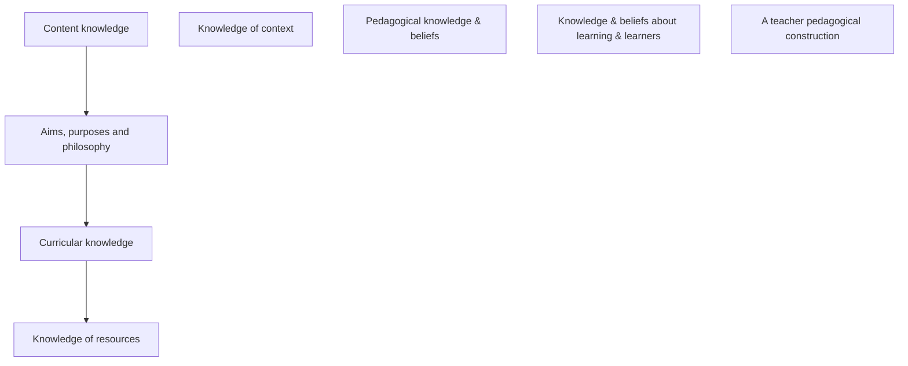

Pedagogical Content Knowledge
=============================

* What is Computer Science specific pedagogy and how is it defined in subject research?
* Differences between _subject knowledge_ and _subject pedagogy_
* Introduction to Shulman’s SK and PCK theory – an example of theory used in educational research and practice
    * Identifying conceptions of SK and PCK and own development

Pedagogical Content Knowledge (PCK)
-----------------------------------

Venn diagram of
* Subject Knowledge
* Pedagogical Knowledge
* Context Knowledge

> Pedagogical Content Knowledge (PCK) conceptualises both the link and the distinction between knowing something for yourself and being able to enable others to know it.
Shulman

Imagine if I started talking to you and as long as I kept talking, then by the time I stopped talking you would would know everything about computing that I do. Simple right!
We need PCK.

* [Exploring the Correlation Between Teacher Pedagogical Content Knowledge and Content Knowledge in Computer Science Classrooms](https://dl.acm.org/doi/10.1145/3304221.3325556) 2019

Task1: Draw ven diagram of subject knowledge and pedagogical knowledge - discuss as class
Task2: Add Content knowledge to ven diagram
Task3: Add technology to the ven diagram (TPACK later)

What is Computer Science Pedagogy
---------------------------------

* NCCE [Promoting effective computing pedagogy](https://teachcomputing.org/pedagogy/) (duplicated in [./whatIsComputing.md](./whatIsComputing.md))
    * Lead with concepts
        * Vocabulary, Key terms, concept maps
    * Work together
        * Pair program, peer instruction
    * Get hands on
        * Physical computing
    * Unplug, unpack, repack
    * Model everything
        * Live coding, debugging
    * Foster program comprehension
        * Code tracing
    * Create projects
        * [[project_based]] learning
    * Add variety
        * Different forms of assessment (presentations, free text questions, portfolios)
    * Challenge misconceptions
    * Make concrete
        * Real world examples, culturally relevant
    * Structure lessons
        * PRIMM
    * Read and explore code first
        * Code tracing, PRIMM
* [Pedagogy in teaching Computer Science in schools: A Literature Review](https://royalsociety.org/~/media/policy/projects/computing-education/literature-review-pedagogy-in-teaching.pdf) 2017 Jane Waite QMUL + Kings College London
    * See Figure 1 pg 8 for map
    * Briefly describe Unplugged, Physical (makeymakey.org?), Pair programming
* [Pedagogical content knowledge in computing education: a review of the research literature](https://www.tandfonline.com/doi/full/10.1080/08993408.2018.1509580) 2018 Aleata Hubbard
    * More about computing PCK - Good historical
    * > they remind us that PCK does not exist or operate in isolation by calling our attention to the influence of an individual’s beliefs and motivations
* [You Can’t Think About Thinking Without Thinking About Thinking About Something](https://www.citejournal.org/wp-content/uploads/2016/04/v5i3seminal4.pdf) Seymour Papert MIT 2005 (author of Mindstorms 1980)
    * > the child could be in charge of the machine not the machine in charge of the child by offering what was the a new image of children using computers as tools for creativity
    * > The idea that “teaching thinking” is appropriate in elementary school does have some antecedents but in 1970 it was certainly not current in the mainstream of American education circles
        * Abstraction, Decomposition

General Pedagogy
----------------

* [What makes great pedagogy? Nine claims from research](https://assets.publishing.service.gov.uk/government/uploads/system/uploads/attachment_data/file/329746/what-makes-great-pedagogy-nine-claims-from-research.pdf) 2012 - Chris Husbands and Jo Pearce - National College for School Leadership
    * The research underpinning these claims is outlined in the article
    1. Effective pedagogies give serious consideration to pupil voice.
    2. Effective pedagogies depend on behaviour (what teachers do), knowledge and understanding (what teachers know) and beliefs (why teachers act as they do).
    3. Effective pedagogies involve clear thinking about longer term learning outcomes as well as short-term goals.
    4. Effective pedagogies build on pupils’ prior learning and experience.
    5. Effective pedagogies involve scaffolding pupil learning.
    6. Effective pedagogies involve a range of techniques, including whole-class and structured group work, guided learning and individual activity.
    7. Effective pedagogies focus on developing higher order thinking and metacognition, and make good use of dialogue and questioning in order to do so.
    8. Effective pedagogies embed assessment for learning.
    9. Effective pedagogies are inclusive and take the diverse needs of a range of learners, as well as matters of student equity, into account. 
    

Magnusson et al. (1999)
* knowledge of goals and objectives for teaching a specific topic in the curriculum, (GO)
* knowledge of students’ understanding of this topic, (SU)
* knowledge of instructional strategies concerning this topic, (IS)
* knowledge of ways to assess students’ understanding of this topic (AS)
combinations of PKC in the form GO-IS

* [Teacher pedagogical constructions: A reconfiguration of pedagogical content knowledge](https://www.researchgate.net/publication/289963334_Teacher_pedagogical_constructions_A_reconfiguration_of_pedagogical_content_knowledge) Hashweh 2005 [ResearchGate](https://www.researchgate.net/publication/289963334_Teacher_pedagogical_constructions_A_reconfiguration_of_pedagogical_content_knowledge)
    * pg 6
        1. PCK represents personal and private knowledge.
        2. PCK is a collection of basic units called teacher pedagogical constructions.
        3. Teacher pedagogical  constructions  result  mainly  from  planning,  but  also  from the interactive and post-active phases of teaching.
        4. Pedagogical constructions result from an inventive process that is influenced by the interaction of knowledge and beliefs from different categories.
        5. Pedagogical constructions constitute both a generalized event-based and a story-based kind of memory.
        6. Pedagogical constructions are topic specific.
        7. Pedagogical constructions are (or ideally should be) labelled in multiple interesting  ways  that  connect  them  to  other  categories  and  subcategories of teacher knowledge and beliefs.
    * Teacher pedagogical constructions develop through experience (pg 7 examples)

* See Figure 2 - pg11
    * TODO Mermaid diagram

Let's attempt to build TPACK
----------------------------

This is going to be hard ...

* [Self-reported technological pedagogical content knowledge (TPACK) of pre-service teachers in relation to digital technology use in lesson plans](https://www.sciencedirect.com/science/article/pii/S0747563220303332) Mirjam Schmid Eliana Brianza, Dominik Petko 2021
    * Technological Pedagogical Content Knowledge (TPACK; Koehler & Mishra, 2008; Mishra & Koehler, 2006) is probably the most prominent model of teacher expertise regarding the educational use of digital technologies
        * [What Is Technological Pedagogical Content Knowledge (TPACK)?](https://punyamishra.com/wp-content/uploads/2014/01/BUJoE.V193.3.Koehler.Mishra.Cain_.pdf) Mishra & Koehler 2013
            * from Koehler 2008
        * [Meaningful Professional Development SOlutions with TPACK and SWIMGrid](https://www.beyondk12.com/wp-content/uploads/2020/10/eBook-Future-Proofing-Teachers-With-TPACK-and-SWIMGrid-V3.pdf) Malia Hoffman 2020
    * Knowledge framework proposed by Shulman (1986, 1987), teachers need to combine different knowledge dimensions to effectively teach with technology. These include the three core components of 
        * pedagogical knowledge (PK)
        * content knowledge (CK)
        * technological knowledge (TK)
    * In addition, there are three first level hybrid components formed at their intersections, namely 
        * pedagogical content knowledge (PCK),
        * technological pedagogical knowledge (TPK),
        * technological content knowledge (TCK).
    * These combine into the second level hybrid component, technological pedagogical content knowledge (TPCK)
    * Existing questionnaires have been criticized regarding the fuzzy, technology-unspecific, and content-agnostic wording of questionnaire items, which ask participants to rate the “appropriateness” of their competencies 
    * self-evaluated knowledge is relative to the extent of a person's knowledge itself.
    * This “unskilled and unaware” bias has been recognized in research on TPACK as well: 
    * Drummond and Sweeney (2017) showed that self-reported TPACK of pre-service teachers revealed only a weak correlation with a more objective, fact-based knowledge test on TPACK
    *  Starkey (2019) points out, TPACK needs to be enacted by three different types of competencies: the ability to use particular technologies as a teacher, the ability to decide which technology to use for a specific teaching purpose, and the ability to guide and support students when learning with digital tools.
    * Krauskopf and Forssell (2018) propose that self-report questionnaires are more likely to measure confidence and self-efficacy with regard to the TPACK domains rather than actual knowledge
    * [table1](https://www.sciencedirect.com/science/article/pii/S0747563220303332#tbl1)

From [ictevangelist.com](https://ictevangelist.com/technological-pedagogical-and-content-knowledge/)

TASK: Let's build the model as a group
* For each area, ask "What would I be able to do? What would this look like"
* Reveal slowly

pk1	I can adapt my teaching based upon what students currently understand or do not understand.
pk2	I can adapt my teaching style to different learners.
pk3	I can use a wide range of teaching approaches in a classroom setting.
pk4	I can assess student learning in multiple ways.

ck1	I have sufficient knowledge about my teaching subject.
ck2	I can use a subject-specific way of thinking in my teaching subject.
ck3	I know the basic theories and concepts of my teaching subject.
ck4	I know the history and development of important theories in my teaching subject.

tk1	I keep up with important new technologies.
tk2	I frequently play around with the technology.
tk3	I know about a lot of different technologies.
tk4	I have the technical skills I need to use technology.

pck1	I know how to select effective teaching approaches to guide student thinking and learning in my teaching subject.
pck2	I know how to develop appropriate tasks to promote students complex thinking of my teaching subject.
pck3	I know how to develop exercises with which students can consolidate their knowledge of my teaching subject.
pck4	I know how to evaluate students' performance in my teaching subject.

tpk1	I can choose technologies that enhance the teaching approaches for a lesson.
tpk2	I can choose technologies that enhance students' learning for a lesson.
tpk3	I can adapt the use of the technologies that I am learning about to different teaching activities.
tpk4	I am thinking critically about how to use technology in my classroom.

tck1	I know how technological developments have changed the field of my subject.
tck2	I can explain which technologies have been used in research in my field.
tck3	I know which new technologies are currently being developed in the field of my subject.
tck4	I know how to use technologies to participate in scientific discourse in my field.

tpck1	I can teach lessons that appropriately combine my teaching subject, technologies, and teaching approaches.
tpck2	I can use strategies that combine content, technologies, and teaching approaches that I learned about in my coursework in my classroom.
tpck3	I can choose technologies that enhance the content of a lesson.
tpck4	I can select technologies to use in my classroom that enhance what I teach, how I teach, and what students learn.

How do we develop PCK?
----------------------

* [Pedagogy by proxy: developing computing PCK through shared lesson resources](https://sure.sunderland.ac.uk/id/eprint/13728/) Hidson, Elizabeth (2021)
    * PCK by proxy
    * There is an unheard commentary that is a part of any shared lesson resource
        * You would normally have this by talking to the other teacher
    * Lesson resources are missing _pedagogical metadata_
    * _Why_ we do what we do
    * Pedagogical reasoning - Know how to:
        * Know what you need to be able to teach
        * Know how to find it
        * How to repurpose it
        * How to teach with it

TASK: Look at ks3 computing books. In pairs select a topic. Ask yourself the questions
1. What is being taught (surface)
2. How is it being taught
3. Why is it being taught like that (THE GOLDEN QUESTION!)

Key point
> Lesson resources are missing _pedagogical metadata_

### Cited conversation

* [twitter](https://twitter.com/mikercameron/status/1435123936962940929)
    * Mike Cameron @mikercameron
        * > New rule:-
          > All materials produced in school are Crown Copyright and must be made available on a public facing website in an editable format.
          > If DfE is serious about reducing teacher workload this would do it.
    * Mark Enser @EnserMark
        * > I'm not sure this would help workload. Geography teachers are great at uploading their resources on to free sharing sites but the time it has taken me to find something I want to use is always more than the time it would take me to produce it myself.

### How do we get this lesson metadata?

* [Pedagogical Content Knowledge: Teachers' Integration of Subject Matter, Pedagogy, Students, and Learning Environments](https://narst.org/research-matters/pedagogical-content-knowledge) NARST 1997
    * Recomendations from Shulman, 1986

TASK: Read the recommendations
How is Item 3 relevant when you enter school?
(reminder missing lesson plan metadata)
What questions would you ask

Unsorted
========

* [Those Who Understand: Knowledge Growth in Teaching](https://www.wcu.edu/WebFiles/PDFs/Shulman.pdf) Shulman 1986
    * TODO

* [KS3/KS4 Cybersecurity](https://sites.google.com/moodle.thehollins.com/royalsociety/home) - School working with experts - example

[//begin]: # "Autogenerated link references for markdown compatibility"
[project_based]: project_based.md "Project Based"
[//end]: # "Autogenerated link references"