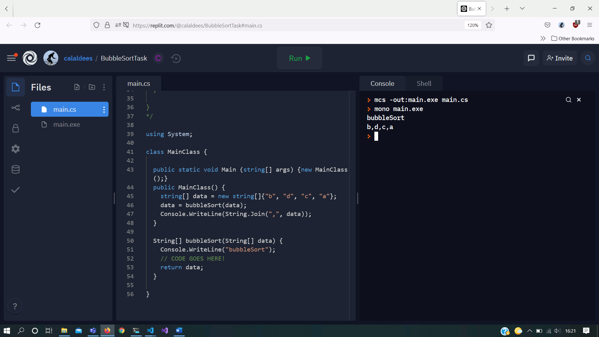
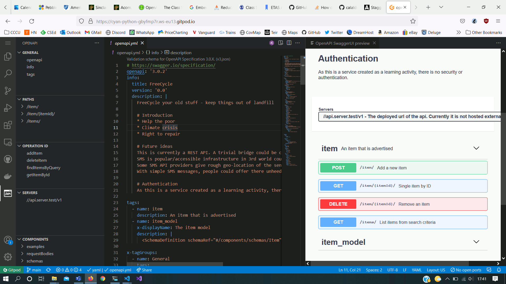
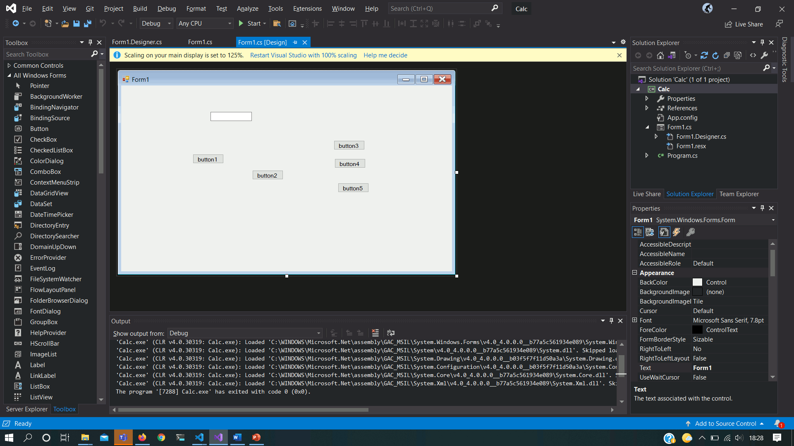

ETAS
====

The use of learning technology (702 words)
------------------------------

Using industry standard software tooling to teach introductory programming has benefits and drawbacks.

One of the barriers for students to engage with 'computer programming' is setup of a software development environment. Professional software development environments are complex to setup and often have many 'moving parts' (Ng et al., 2005). When starting a new software project, most modern tools ask a range of questions about the project setup. A novice programmer who's objective is to  experiment with a 3 or 4 line program, has to navigate multiple dialogues with terminology that the learner is not yet familiar with. This is daunting and unsettling for learners.

This setup issue is also problematic for lecturers. Demoing simple concepts quickly is contaminated by slow arduous setup steps. These are especially noticeable when demonstrating these concepts live to class's.

To tackle this problem, Cloud/web-browser based development environments are becoming more common in education settings. 
50% of development environments used in HE education are now accessible online through a web-browser (Sim & Lau 2018).
Learners can be given a URL and they can begin coding with reduced setup time.

At Canterbury Christ Church University we teach using "Microsoft Visual Studio". While teaching "Application Development with C#" I found I repeatedly wanted to demo techniques without disrupting the students currently active/loaded project. I also wanted to give students a constrained sandbox to focus/develop one technique. 

Using a service called "repl.it", I constructed a coding exercise (A1 Design and Plan). I listed a complete 'Java' program to implement a bubble-sort algorithm. I also created a stub starter scaffold for a bubble-sort in the the target language for the learner of 'C#' (K1 Subject Knowledge). The task was to implement bubble-sort in C#. As I identified students that needed extra support, I was able to direct them to my additional support activity via a url. With one url students had a code environment presented to them with supporting description text. (see appendix for listing of exercise)

Student feedback was excellent. Once students completed the support task they were able to integrate the solutions into their project. Out of a class size of 68 students, I refereed 20 of them to my support activity. Some remarked "why didn't we start with this". This was fed back to the module lead. (K6 quality assurance)

Next year we intend to use an extended period of training material. Rather than relying on an external service like "repl.it", we should be able to house something similar internally using "jupyter.org". Jupyter notebooks would allow code examples to be displayed interactively as a development environment embedded in a webpage. Jupyter notebooks have successfully been used in some select education settings (Johnson, 2020). I am working with the wider School of Computing to develop our use of Jupyter notebooks. (A1 design and plan, K1 Subject knowledge)

The pandemic this year has amplified the disadvantage of some students. During my delivery of Application Development in C# (MCOMD1ADC)
Students that had 'Apple mac' or lower spec computers were unable to participate at home as they required a Windows 10 PC to use Microsoft Visual Studio. These students has had limited access to campus and struggled to participate remotely. (V2 promote participation, V4 Wider context, K6 quality enhancement)

I have begun to experiment with 'Cloud' based development environments. The development environment would run remotely on the cloud and allowing students with low spec machines to access the tooling. (Iorio, Palesandro and Risso, 2020), describes how the Politecnico di Torino in Italy have provided cloud based development environments to their entire Computing cohort. I am in the process of designing an upcoming module "Frameworks and Languages" that is constructed with a 'Cloud first' mentality to give a consistent experience to all students. (A1 design and plan, K1 Subject knowledge). I am investigating "codetasty.com" and "gitpod.io". (Hartmann et al., 2017) and (Antonova and Bartkova, 2020) consider cloud based development environments the way forward for education as it removes technical, administrative and economic barriers. It is also time-saving, flexible and facilitates new modes of realtime collaboration between students (V2 promote participation). (D2 IV appropriate teaching practices, K4 appropriate technologies)

Cloud based development environments look to be the next big disruptive technology in Computer Science education. 


### Reference list

Antonova, А. and Bartkova, S. (2020). An overview of the advantages of cloud computing and online IDE. Automation of technological and business processes, [online] 12(3), pp.50–54. Available at: https://journals.onaft.edu.ua/index.php/atbp/article/view/1927/2142 [Accessed 3 Jun. 2021].

Canterbury Christ Church University (n.d.). Remote Desktop Service. https://cccu.canterbury.ac.uk/information-technology/working-off-campus/remote-desktop-service.aspx. Staff Intranet.

CodeTasty (n.d.). CodeTasty Cloud IDE Overview. [online] . Available at: https://codetasty.com/ [Accessed 10 Aug. 2021].

GitPod (n.d.). GitPod Cloud IDE Overview. [online] . Available at: https://gitpod.io/ [Accessed 10 Aug. 2021].

Hartmann, S.B., Braae, L.Q.N., Pedersen, S. and Khalid, M.S. (2017). The Potentials of Using Cloud Computing in Schools: A Systematic Literature Review. Turkish Online Journal of Educational Technology - TOJET, [online] 16(1), pp.190–202. Available at: https://eric.ed.gov/?id=EJ1124903 [Accessed 10 Aug. 2021].

Iorio, M., Palesandro, A. and Risso, F. (2020). CrownLabs—A Collaborative Environment to Deliver Remote Computing Laboratories. IEEE Access, 8, pp.126428–126442.

Johnson, J.W. (2020). Benefits and Pitfalls of Jupyter Notebooks in the Classroom. Proceedings of the 21st Annual Conference on Information Technology Education.

Ng, S.C., Choy, S.O., Kwan, R. and Chan, S.F. (2005). A Web-Based Environment to Improve Teaching and Learning of Computer Programming in Distance Education. Advances in Web-Based Learning – ICWL 2005, pp.279–290.

replit (n.d.). Teams for Education. [online] replit. Available at: https://replit.com/teams-for-education [Accessed 10 Aug. 2021].

Sim, T.Y. and Lau, S.L. (2018). Online Tools to Support Novice Programming: A Systematic Review. [online] IEEE Xplore. Available at: https://ieeexplore.ieee.org/abstract/document/8632649 [Accessed 10 Aug. 2021].
‌
### Appendix: Learning Technology



```csharp
/*
https://replit.com/@calaldees/BubbleSortTask

Below is an example of a bubblesort in `java`.
Try to implement this in C#

class Main {

  public static void main(String[] args) {new Main();}
  Main() {
    String[] data = new String[]{"b", "d", "c", "a"};
    data = bubbleSort(data);
    System.out.println(String.join(",", data));
  }

  String[] bubbleSort(String[] data) {
    //System.out.println("bubbleSort");
    Boolean has_changed = true;
    while (has_changed) {
      //System.out.println(String.join(",", data));
      has_changed = false;
      for (Integer i=0 ; i < data.length-1 ; i++) {
        String a = data[i];
        String b = data[i+1];
        //System.out.println("comparing "+i+":"+a+" with "+(i+1)+":"+b);
        if (a.compareTo(b) > 0) {
          //System.out.println("swap");
          data[i] = b;
          data[i+1] = a;
          has_changed = true;
        }
      }
    }
    return data;
  }

}
*/

using System;

class MainClass {

  public static void Main (string[] args) {new MainClass();}
  public MainClass() {
    string[] data = new string[]{"b", "d", "c", "a"};
    data = bubbleSort(data);
    Console.WriteLine(String.Join(",", data));
  }

  String[] bubbleSort(String[] data) {
    Console.WriteLine("bubbleSort");
    // CODE GOES HERE!
    return data;
  }

}
```





Assessment and feedback practice (642 words)
--------------------------------

I deliver the PGCE in Secondary Computing course. I provide a framework for trainee teachers to perform a gap analysis of their subject knowledge and track their subject knowledge development throughout the course. Trainee teachers subject knowledge is not assessed in isolation and is instead assessed by proxy of evidence to meet the UK Teacher Standards. 

Students are required to self assess their skills and identify their subject knowledge gaps (Rhoades 2014). Rhoades states "any overestimation or even underestimation of your knowledge will be counter productive". Trainee's self assessment of subject knowledge is varied and inaccurate as trainees have no benchmark or reference point to based their skills assessment upon (Schmid 2021 1.1). Trainees lack the knowledge of the curriculum to judge if their stills are sufficient. (Jones et al., 2019) cited McNamara (1991) in stating; a teachers' restricted subject knowledge affects the quality of teaching and causes serious deficiencies in student learning, this deficiency is not immediately identifiable. (D2 V pedagogical research)

Currently trainees are asked to rate their knowledge category's on a scale of 1 (insecure knowledge) to 4 (I could teach this) each school term.
Some examples of the current categories:
* Understand why computer hardware needs computer software (programs)
* Know what computer programming syntax is
* Explain what a computer is

The categories above are vague; How could a trainee identify/justify that they have moved between a level 2 to level 3? Without the context of the level of curriculum that is being taught (e.g. key-stage 2, 3, 4 or 5) and the curriculum content knowledge, the trainees might answers could vary significantly.

> Existing questionnaires have been criticized regarding the fuzzy, technology-unspecific, and content-agnostic wording of questionnaire items, which ask participants to rate the “appropriateness” of their competencies
(Schmid, Brianza and Petko, 2021)

When assessing my trainees I have asked "can you justify/evidence the growth in your subject knowledge". It has been difficult for them to provide evidence of their growth. (A3 assessment give feedback)

I propose two changes to enhance the effectiveness of the subject knowledge audit. We could 1. tighten the scope of the categories and 2. clarify the level criteria. This would allow for more accurate self assessment and in turn enhance their effectiveness as teachers.

My re-worked subject knowledge audit proposes a new level system:
1. Theoretical understanding (evidence - maybe past exam question or previous degree module grade)
2. Have a practical implementation on a computer (evidence - link to github? screenshot?)
3. Have taught (evidence resources created or lesson plans)

It is clear from the evidence they can present which level they are operating at.
The categories will all be taken from the Keystage 5 curriculum. The earlier keystage's are a subset of this knowledge.
The categories will be correlated with industry practice. e.g.
* Algorithms: Sorting: bubble, quick, merge, selection, insertion (2 of)
* Use of remote pair-programming live coding tool
* Use of unit-tests


This new system is much clearer and precise. The ambiguity has been removed and the categories relate directly to practical skills required in the classroom. This impact of this alteration will be assessed in more details as part of the SSPI module next term. (D2 V pedagogical research)

My proposed subject knowledge audit is only designed to address 'Technological Knowledge' and not the other strands of 'Content Knowledge' and 'Pedagogical Knowledge' from the prominent model of teacher expertise Technological Pedagogical Content Knowledge (TPACK) (Koehler and Mishra, 2014) (D2 V pedagogical research)

Ultimately assessing subject knowledge for trainee teachers is a secondary concern. What matters is that they can deliver good lessons (V4 wider context). Subject knowledge could ultimately be assessed through the lesson content that the trainees create and deliver. This approach is confirmed by (Blömeke and Delaney, 2014) who state that we should be moving beyond self-reported subject knowledge audits. (K1 subject material)


### Reference list

Blömeke, S. and Delaney, S. (2014). Assessment of Teacher Knowledge Across Countries: A Review of the State of Research. International Perspectives on Teacher Knowledge, Beliefs and Opportunities to Learn, pp.541–585.

Connell, A., Edwards, A.D. and Hramiak, A. (2015). A practical guide to teaching computing and ICT in the secondary school. Abingdon, Oxon ; New York, Ny: Routledge. Chapter 1: Developing your capability to teach Computing. Gavin Rhoades pg 10.

Jones, L.C.R., McDermott, H.J., Tyrer, J.R. and Zanker, N.P. (2019). The effect of teacher’s confidence on technology and engineering curriculum provision. International Journal of Technology and Design Education.

Koehler, M.J. and Mishra, P. (2014). Handbook of Technological Pedagogical Content Knowledge (TPCK) for Educators. [online] : Routledge. Available at: https://doi.org/10.4324/9781315759630 [Accessed 10 Aug. 2021].
‌
Pu, S., Ahmad, N.A., Khambari, M.N.M. and Yap, N.K. (2020). Factors Affecting Practical Knowledge Acquisi-tion of Pre-service Computer Science Teachers During the Practicum: A Multiple Regression Analysis. International Journal of Learning, Teaching and Educational Research, 19(2), pp.214–230.

Schmid, M., Brianza, E. and Petko, D. (2021). Self-reported technological pedagogical content knowledge (TPACK) of pre-service teachers in relation to digital technology use in lesson plans. Computers in Human Behavior, 115, p.106586.

Thorsnes, J., Rouhani, M. and Divitini, M. (2020). In-Service Teacher Training and Self-efficacy. Informatics in Schools. Engaging Learners in Computational Thinking, pp.158–169.
‌


Other - Enhancing PGCE Recruitment Practice (713 words)
--------------------------------------

I am part of Initial Teacher Training and Education (ITTE) and deliver the PGCE in Secondary Computing for Canterbury Christ Church University. I'm going to discuss students retention in the context of teacher training. I will describe the withdrawals from the course this year as a case study and attempt to analyse possible actions to improve retention in future years.

As educators we are under pressure to recruit for our courses. Without enrolment, our courses and organisation are not financially viable. We are also accountable for our retention rates. If our retention rates are not in-line with the national average, the OfS may suspend our ability to deliver our courses. (OfS 2018) (D2 IV teaching practice)

In a drive to recruit more teachers the DfE stated:
> The process to become a teacher is too complicated and burdensome. We will radically simplify the process for becoming a teacher
(DfE Teacher Recruitment and Retention Strategy 2019)

As an institution we are no longer able to mandate experience in schools as a prerequisite. Could we be removing needed barriers for candidates to consider the gravity/reality of working in this profession?

The statistics for my cohort of trainee computing teachers 2020/2021: 9 students. 6 PGCE, 3 School Direct (see Hodgson J 2013). Only 4 students completed (44%). This is unacceptable. Recruitment of candidates plays a role in these figures. Other factors such as availably of student support would need also need to be investigated.

At CCCU we support a diverse range of learners (V1 Individual Learners). (O’Shea and Groves 2020) describes how university leavers are 'left in the dark' and are not provided appropriate guidance with transitioning to the world of professional work. One of my young candidates that withdrew stated in an exit interview "I don't know where I fit-in in the world". The student cited that as there were only a few years in age difference between them and the secondary school students, they felt like they were misplaced as a member of teaching staff. (V4 Wider Context). 

Multiple of the PGCE students that withdrew were young and had the relevant entry qualifications. According to (Vare, Dewalt and Dockery, 2003). The biggest predictors of success in Initial Teacher Education was candidates SAT's scores from secondary school. IQ and academic achievement are important factors but this cannot be taken in isolation. I think this is only part of the story. If candidates do not posses the correct rational for training to teach, it is unlikely they will be successful. (Yong, 1995) comments that aspiring trainees could have a 'distorted view' of what teaching entailed, leaving the profession as they began to understand the reality's of the role. (V4 wider context)

My new strategy when conducting my PGCE interviews is I describe the historical situation that younger students have found themselves in and ask the interview candidate to describe why they might succeed where others have not. We should recognise potential, but we should not knowingly entice candidates that we suspect might be not understand the realities of the profession. I have vetted this question with the 'secondary teacher training lead' as part of ongoing QA of our process (K6 QA).

(Mullinix, 2002), highlights the importance of 'retaining teacher mentors'. Mentors in school can be empowered by being active participants in the recruitment process. As part of my role I have contacted computing teacher mentors across our partnership schools. We have rearranged our interview times so that school mentors can participate in our PGCE trainee recruitment. 

When discussing the candidates with mentors, after the interview I ask them; "Would you be happy mentoring this applicant in your school? Why? Or why not?". I also confer with mentors about the nature of the candidates motivation and their suitability for the profession.

By including mentors in the process of recruitment I hope to build a stronger bond with the training process in schools. By understanding both the individual students and the mentors backgrounds and strengths, I should be able to collaborate with mentors when allocating school placements. By enhancing the personalised allocation of placements and giving the mentor some ownership of the placement student, learning will be more personalised with the students background and needs considered. I expect to see retention rates improve. (K6 implications of quality enhancement)


### Reference list

Advance HE (2017). Student retention and success in higher education | Advance HE. [online] Advance-he.ac.uk. Available at: https://www.advance-he.ac.uk/guidance/teaching-and-learning/student-retention-and-success [Accessed 19 Dec. 2019].

Brooks, V., Sikes, P.J. and Husbands, C. (1997). The good mentor guide : initial teacher education in secondary schools. Buckingham England ; Philadelphia: Open University Press.

Department for Education (2019). Teacher recruitment and retention strategy. [online] GOV.UK. Available at: https://www.gov.uk/government/publications/teacher-recruitment-and-retention-strategy.

John Hodgson (2014) Surveying the wreckage: the professional response to changes to initial teacher training in the UK, English in Education, 48:1, 7-25, DOI: 10.1111/17548845.2014.11912499

la Velle, L., Newman, S., Montgomery, C. and Hyatt, D. (2020). Initial teacher education in England and the Covid-19 pandemic: challenges and opportunities. Journal of Education for Teaching, pp.1–13.

Millard, L, Hollins, N & Sharman, R 2020, Students as colleagues: creating belonging and confidence through employment on campus. in W Ashall & W Garnham (eds), Transitions into, through and out of higher education: supporting students. SEDA Special, vol. 44, Staff and Educational Development Association (SEDA), London, pp. 17-19. Chapter 6: ‘I have had to tap around in the dark’: Exploring how first in family students navigate the transition out of university and into employment. Sarah O’Shea and Olivia Groves

Mullinix, B.B. (2002). Selecting and Retaining Teacher Mentors. ERIC Digest. [online] ERIC. ERIC Clearinghouse on Teaching and Teacher Education, American Association of Colleges for Teacher Education, 1307 New York Avenue, N. Available at: https://eric.ed.gov/?id=ED477728 [Accessed 10 Aug. 2021].

Office for Students (OfS) (2018). Regulatory Advice 3: Registration of new providers for 2019-20 Guidance for providers about the application process. [online] . Available at: https://www.officeforstudents.org.uk/media/1100/ofs2018_05.pdf Item 65 page 15.

Vare, J.W., Dewalt, M.W. and Dockery, E.R. (2003). Making the Grade: Predicting Retention in Undergraduate Teacher Education. Journal of College Student Retention: Research, Theory & Practice, 5(3), pp.275–292.

Yong, B.C.S. (1995). Teacher trainees’ motives for entering into a teaching career in Brunei Darussalam. Teaching and Teacher Education, 11(3), pp.275–280.
‌

Reflection on an authentic practice observation (1774 words)
-----------------------------------------------

In term 1 (September 2020) I was allocated a number of hours to support the School of Computing. This was a turbulent time as students were to be taught on campus during the sars-cov-2 pandemic. Students were to be taught in computer labs in group size of the stated room capacity (between 14 and 20). Lectures could no longer be given to the whole cohort of 180 students. As a supporting member of staff I had to deliver the lecture material and labs for the "Introduction to C#" module.

In term 2 (January 2021) it was identified that I had a good ongoing rapport with students and solid subject knowledge. I was allocated to support "Application Development in C#". During this period, another module (Networks and Operating Systems) was facing difficulties and I was allocated at short notice to support the delivery of "Network and Operating Systems".


### Reflections on critical incident - Networks module

I am going to use Tripp's critical indigent framework to analyse issues with the delivery of "Network of Operating Systems" module. After describing the setting I will reflect but using Dilemma Identification and Personal Theory Analysis (Ayres, 2017)

Multiple members of the Computing team were applied at short notice to support "Network and Operating Systems". An external lecturer was selected to lead the remainder of the module. We requested the lecture materials and assessment from the module lead. These were significantly delayed. The materials that we received were incomplete. More worryingly the materials were structured with sequential hours of solid lectures with no planned interaction by the students. This breaks the departments goal of being a CDIO institution (cdio.org 2021).
> CDIO is based on a commonly shared premise that engineering graduates should be able to: Conceive – Design — Implement — Operate complex value-added engineering systems in a modern team-based engineering environment to create systems and products.

The lab material provided required the students to use "Cisco Packet Tracer" as a simulated network environment. This was _free_ software but would require installation. Installing this on the normal campus machines required a lengthily process of approval (CCCU - New Software Request). The computing department had their own machines and network, but this is an isolated network. "Cisco Packet Tracer" required a 'Cisco account' and required an internet connection to startup the software. It was not possible to use "Cisco Packet Tracer" given the time we had available. (A1 Design and Plan, K1 Subject Material)

Communication with the external module lead was difficult with lengthily delays. As a team we collectively took the initiative to rework the lectures to have student interactions and provide an alternative lab with software appropriate to our software environnement restrictions. See appendix for evidence of lesson plans and labs we developed. We modified the original lecture slides to include group discussion and research activities (see slide 6 slide 14) to match the department requirements for CDIO (CCCU School of Technology Design and Engineering 2020).

My colleagues behaviour was exemplary. There was no talk of accusing other staff or negative tone. Conversations were professional and focused on resolving the problem with the resources and time available. Empathy was shown to the external module lead's situation. The lead had been placed in a difficult situation at short notice. Maybe the module lead had not been briefed adequately about their role and requirements. There had possibly been a failure of communication. My team were role models of professionalism.

Planning took an additional time overhead. It was raised that we were going beyond our contractual responsibility's. I stated "We do this because we care about the students". Another colleague replied "Therein lies another problem, we can be exploited". This is a view I had not considered before. By taking action at a personal time cost to ourselves, are we preventing the natural failure of a system. Without visible failure, issues may not be identified. Our attempt to resolve this situation may have been hiding/masking and underlying organisational issue that needed to be exposed. Our pride as professionals may have been preventing long term improvements.

The lecture/lab was run multiple times because of the room size restrictions. The first time the lab was run the module lead delivered the material. I was present to observe the delivery as I am not a network specialist and was due to deliver the same workshop in the afternoon session. The module lead was not comfortable delivering online and in-person at the same time and opted to teach the physically present students. The delivery was stilted and dry. The opportunities for discussion and research activities were not explained or described to students. Students were left confused. Many of them were stressed and panicked as they were due to submit an assessment from the earlier "Operating Systems" part of the module. Using Brookfields lenses (Bookfield 2005); from my lenses I could see how the organisation of the module was impacting on the students focus. From the student lenses there was genuine stress. The students were looking at their mobile phones and not engaging with the module leads material. From the lens of colleagues, another computing peers was present in part of the session. They also expressed concern as they too were fielding questions from distracted panicked students during the group work segments.

The afternoon session that I delivered was recorded and broadcast live online as well as delivered to physically present students. I followed best practice of online pedagogy by facilitating breakout groups for online participants while physically present students engaged in group work. The labs were used to break up the theory material (V2 Promote participation). A comment at the of of the lecture by a physically present student was "That was one of the best lectures we have ever had". Similar praise was given on the online chat. This sentiment was relayed at a later date to multiple other colleagues in the school of computing from multiple students. (K6 Implications of quality assurance)

The response from the students was surprising. The session was constructed in a rush. It was not exemplary. From my lens was that it was adequate. Form the lens of scholarship (Sell, Rüütmann and Seiler, 2014) and (Barbour et al., 2020) it followed identified remote practice. From the lens of the students and colleagues it was highly valued. There we clearly historical organisational issues that were being worked though. I was very happy with the emotional response of my immediate team.

After two session my involvement with the Networks module ended and other staff took over the assessment. I was congratulated by the head of Computing who remarked "I like people who can get the job done". Following this, the School of Computing opened 4 new lecturing positions to bring new skills into the department. I have now been appointed "Lecturer in Computing" for 2021/2022 and have my own module "Frameworks and Languages" to prepare. 

I am aware of how unsettled and frustrated the students undertaking the Networks module were. As an institution, student wel-being is part of CCCU's Learning and Teaching Strategy. We should be mindful of students well-being as this implications on CCCU's Retention and Success Framework. Organisational issues will arise as part of normal operation. As professionals it is our responsibility to continue to improve the experience of our students.


### Reflections on teaching strategies for class size

While supporting the module "Application Development in C#", we were unable to accommodate the whole class in one computer room due to covid restrictions. I physically managed one room while the module lead gave the lecture and demoded their programming environment next door. It was difficult for us to hear and see the material due to the quality of the AV equipment. I could see students struggling. Being familiar with the material I switched to delivering the material myself. The students were immediately more engaged. I broke the tasks up into short busts of lecture and practical activities. See appendix for my FormCalc example. Gordon Aiken (Senior Lecturer) observed my delivery. He remarked at how personal I made the interactions and I was able to match the pace of learners through ongoing formative assessment as I was able to circulate the room.

The next week I delivered the next segment of the course. There was some confusion about wether we would be delivering in two separate rooms again. We had to wait until we knew the total student attendance. Many of the students were deliberately being non committal about which room they were allocating themselves too as they were waiting to see which room I would be lecturing in. I raised this with the senior lecturer. He remarked that this was because the students who had been taught in my smaller group last session had mistook the smaller more intimate class size as more productive. We eventually allocate all students to a single room and I began to deliver the material. My feedback was good. I attempted to make the learning personal. It was much harder to circulate and formatively assess with a bigger class size. The observation comments highlighted that with my current assessment and feedback technique, I was unable to help each student personally.

In "The Class Size Debate" (Mishel et al., 2002); Krueger argues that smaller class sizes improve students performance.  Hanushek suggests that the quality of the teaching is more impactful. (Ehrenberg et al., 2001) state that there is little evidence of class size affecting student attainment but different instructional strategies must be employed to cater for different class sizes. The Education Endowment Foundation (EEF) commissions studies to investigate the effectiveness of teaching strategies against cost. In their 2018 report the EEF identify that reduced class sizes are only effective if the instructional strategies is aligned with that group size. My technique of allocating time to individuals was sufficient for class sizes below 15 but was insufficient to cater for the larger class sizes I was experiencing. (D2 IV Engagement with appropriate teaching practice)

In his book "Embedded Formative Assessment" (Wiliam, 2018) talks about a range of formative assessment techniques for larger class sizes. Wiliam suggests that 'mini whiteboards' could be used to solicit responses from a whole class. This strategy would allow me as a practitioner to assess students understanding in much more effect way than my previous strategy of individually engaging students in conversation. When delivering lessons simultaneously remotely and in person, I could utilise systems like "whiteboard.fi" to provide digital mini whiteboards for a whole class. My remote students have an internet connection to participate and physically present students are already using a networked computer. (A3 Assessment and feedback, K4 Appropriate technologies)


### Reference list

Ayres, D. (2017). Critical Incidents in Teaching. [online] ResearchGate. Available at: https://www.researchgate.net/publication/318430010_Critical_Incidents_in_Teaching [Accessed 10 Aug. 2021].

Barbour, M.K., LaBonte, R., Hodges, C., Moore, S., Lockee, B.B., Trust, T., Bond, M.A., Hill, P. and Kelly, K. (2020). Understanding pandemic pedagogy: Differences between emergency remote, remote, and online teaching. [online] vtechworks.lib.vt.edu. Available at: https://vtechworks.lib.vt.edu/handle/10919/101905.

Brookfield, S. (2017). Becoming a Critically Reflective Teacher. 2nd ed. San Francisco: Jossey-Bass.

Canterbury Christ Church University (2015). Learning and Teaching Stratergy 2015 -2022. [online] . Available at: https://www.canterbury.ac.uk/learning-and-teaching-enhancement/docs/Learning-and-Teaching-Strategy-2015-2022.pdf [Accessed 10 Aug. 2021].

Canterbury Christ Church University (n.d.). New Software Request Form. [online] Canterury Christ Church University. Available at: https://cccu.canterbury.ac.uk/information-technology/purchasing/new-software-request.aspx [Accessed 10 Aug. 2021]. Internal staff intranet.

Canterbury Christ Church University (2018). Student Retention and Success Framework. [online] https://cccu.canterbury.ac.uk. Available at: https://cccu.canterbury.ac.uk/education-enhancement-and-student-experience/docs/Retention-and-Success-Framework-June-2018.pdf [Accessed 10 Aug. 2021]. Accessible to CCCU internal staff.

CDIO (2020). CDIO Optional Standards 3.0. [online] www.cdio.org. Available at: http://www.cdio.org/content/cdio-optional-standards-30 [Accessed 10 Aug. 2021].

CDIO (n.d.). CDIO Vision. [online] cdio.org. Available at: http://cdio.org/cdio-vision [Accessed 10 Aug. 2021].

Cisco (2019). Download The Packet Tracer Simulator Tool & Find Courses | Networking Academy. [online] Cisco Networking Academy. Available at: https://www.netacad.com/courses/packet-tracer [Accessed 10 Aug. 2021].

Education Endowment Foundation (2018). Reducing Class Size - Evidence Summary. [online] educationendowmentfoundation.org.uk. Available at: https://educationendowmentfoundation.org.uk/evidence-summaries/teaching-learning-toolkit/reducing-class-size/ [Accessed 10 Aug. 2021].

Ehrenberg, R.G., Brewer, D.J., Gamoran, A. and J. Douglas Willms (2001). Class Size and Student Achievement. Psychological Science in the Public Interest, [online] 2(1), pp.1–30. Available at: https://www.psychologicalscience.org/journals/pspi/pdf/pspi2_1.pdf?origin=p.

Mishel, L.R., Rothstein, R., Krueger, A.B., Hanushek, E.A. and Jennifer King Rice (2002). The class size debate. Washington, D.C.: Economic Policy Institute.

netsimk.com. (2003). NetSimK.com - CCNA Network Simulator. [online] Available at: http://netsimk.com/ [Accessed 10 Aug. 2021].

Sell, R., Rüütmann, T. and Seiler, S. (2014). Inductive Teaching and Learning in Engineering Pedagogy on the Example of Remote Labs. International Journal of Engineering Pedagogy (iJEP), [online] 4(4), pp.12–15. Available at: https://online-journals.org/index.php/i-jep/article/view/3828 [Accessed 10 Aug. 2021].

Tripp, D. (2012). Critical incidents in teaching : developing professional judgement. London ; New York: Routledge.

Wiliam, D. (2018). Embedded Formative Assessment. 2nd ed. Bloomington, Indiana Solution Tree Press.
‌
### Appendix‌ - Reflections Evidence



```csharp
using System;
using System.Collections.Generic;
using System.ComponentModel;
using System.Data;
using System.Drawing;
using System.Linq;
using System.Text;
using System.Threading.Tasks;
using System.Windows.Forms;

namespace Calc
{
    public partial class Form1 : Form
    {
        string mem = "";
        string operation = "";

        public Form1()
        {
            InitializeComponent();
        }

        private void button1_Click(object sender, EventArgs e)
        {
            textBox1.Text += "1";
        }

        private void button2_Click(object sender, EventArgs e)
        {
            textBox1.Text += "2";
        }

        private void button3_Click(object sender, EventArgs e)
        {
            operation = "+";
            mem = textBox1.Text;
            textBox1.Text = "";

        }

        private void button4_Click(object sender, EventArgs e)
        {
            operation = "-";
            mem = textBox1.Text;
            textBox1.Text = "";
        }

        private void button5_Click(object sender, EventArgs e)
        {
            double num1 = double.Parse(mem);
            double num2 = double.Parse(textBox1.Text);
            double ans = 0;
            switch (operation) {
                case "+":
                    ans = num1 + num2;
                    break;
                case "-":
                    ans = num1 - num2;
                    break;

            }
            textBox1.Text = $"{ans}";
        }
    }
}


```


Brief
=====


The assessment for this module will take the form of a teaching portfolio.
The portfolio will be made up of 4 sections on the following topics:


1. The use of learning technology
2. Assessment and feedback practice
3. Other 
    * (participant’s choice of focus e.g. students as partners in learning, reflective practice in the classroom, use of Academic Peer Mentors etc.)
(All three sections will add up to a total of 2000 words or each of the three parts equivalent in total e.g. 4 minutes of an alternative such as video or voiced PowerPoint - X 3 would be a total of 12-13 minutes)

4. A reflection on an authentic practice observation and feedback activity
(2000 words or equivalent - e.g. 12-13 minutes voiced PowerPoint recording, video with annotations)

Two things to keep at the front of your mind are REFLECT CONSTANTLY and EVALUATE YOUR OWN PRACTICE - so everything you do is about recognising, developing and enhancing your practice and linking it to the activities and research that you do for this module. This does need to be linked to research in the field so try to draw links between what yo read and what you do. 

UKPSF Descriptors that should be covered on this module's summative assessment:
D2.I: A1 and A3 must be achieved. Other As can be achieved between ETAS and SSPI
D2.II: K1, K4 and K6 must be achieved. Others Ks can be achieved between ETAS and SSPI
D2.III: V2 and V4 must be achieved. Other Vs can be achieved between ETAS and SSPI
D2.IV: must be partially achieved in relation to the use of learning technologies and QAE processes
D2.V: must be partially achieved in relation to specific scholarship discussed in the module
D2.VI: does not need to be achieved yet


Use the table below to check that you have met the necessary D2 descriptors in your summative assessment and tick them off as you achieve them:


D2 descriptors checklist

A1: Design and plan learning activities/ and or programmes of study
A3: Assess and give feedback to learners
K1: The subject material
K4: The use and value of appropriate technologies
K6: The implications of quality assurance and quality enhancement for academic practice – particularly teaching
V2: Promote participation in higher education and equality of opportunity for learners
V4: Acknowledge the wider context in which higher education operates recognising the implications for professional practice

IV: Successful engagement in appropriate teaching practices related to the Areas of Activity
V: Successful incorporation of subject and pedagogical research and/or scholarship within the above activities, as part of an integrated approach to academic practice


Evidence
========

Observation
-----------

* In what ways did the observed session incorporate an identified enhancement to learning, teaching or assessment?  How could this be improved?
  * Allan’s engagement with the material and the students was extremely personal, he made fantastic connections with the students, making sure that learning was active rather than passive. Visual examples produced by Allan in real time were used to guide students through their challenges with enough ‘scaffolding’ that they could navigate their own path. 
  * The enhancement of real time programming support, rather than a direction to passive examples was well received by students, and furthermore, identifying this with industrial experience assisted the students in seeing why these concepts are valuable, not just in a university lecture but as a key skill in their future careers.
  * In an ideal world this would have been better as a fully immersive session, but as the class was separated into on premises and remote learners there were challenges that can be resolved in the future.
* In what ways did the observed session make use of the chosen enhancement to promote learning of the subject discipline?  How could this be improved?
  * Active learning is a far better method of teaching in a technical subject such as programming. The majority of learners are ‘doers’ and have to engage in practical learning to commit the concepts to long term memory. By engaging them in a tutorial format (very short 5-minute ‘lectures’, with longer active learning practicals) the students remained engaged, and did not get tired or distracted with what is a very challenging subject. As previously mentioned, this could be improved with additional support for those interacting online.
  * How well did the chosen enhancement meet the requirements of an inclusive curriculum?  How could this be improved?
  * As each student was able to interact with the tutor to the level that they needed, this very much meets the requirements of an inclusive curriculum. The tutorial style also encourages pair programming, synonymous in academia with peer learning. Rather than a structure that the students have no control over, this style of teaching can be led by the class at the speed and depth needed. 
  * Smaller group sizes would speed this up if the resource was available.


Application Development in C#
-----------------------------

Notes
=====

Learning Tech
-------------


---

https://replit.com/teams-for-education

repl.it


The technology barrier to engaging with a coding task had been dramatically reduced.

Remote Desktop staff only
https://cccu.canterbury.ac.uk/information-technology/working-off-campus/remote-desktop-service.aspx


Equity to all students
Cloud based development environments

https://replit.com/teams-for-education
https://codetasty.com/
https://www.gitpod.io/

[Benefits and Pitfalls of Jupyter Notebooks in the Classroom](https://dl.acm.org/doi/epdf/10.1145/3368308.3415397) Johnson 2020

[CrownLabs—A Collaborative Environment to Deliver Remote Computing Laboratories](https://ieeexplore.ieee.org/stamp/stamp.jsp?arnumber=9136697) MARCO IORIO May 2020
Department of Computer and Control Engineering, Politecnico di Torino, 10129 Turin, Italy


An overview of the advantages of cloud computing and online IDE
Antonova, Аlfiia. Avtomatizaciâ Tehnologičeskih I Biznes-Processov Volume: 12 Issue 3 (2020) ISSN: 2312-3125 Online ISSN: 2312-931X


juyter notebox for teaching
mooshack
Atrimus

regex crossword

K1 subject


program to generate individual questions for students


* [A Web-Based Environment to Improve Teaching and Learning of Computer Programming in Distance Education](https://link.springer.com/chapter/10.1007/11528043_28) 2005     S. C. Ng S. O. Choy R. Kwan S. F. Chan
* [Online Tools to Support Novice Programming: A Systematic Review](https://ieeexplore.ieee.org/abstract/document/8632649) 2018 Sim & Lau
* [The Potentials of Using Cloud Computing in Schools: A Systematic Literature Review](https://eric.ed.gov/?id=EJ1124903) Hartmann, et al 2017
    * Codifys the theams that barriers for cloud computing in education
        * technical, admistrative, economy, timesaving, collaboration, flexability, easyer access to education


Assessment
----------


Technological Pedagogical Content Knowledge


* [Self-reported technological pedagogical content knowledge (TPACK) of pre-service teachers in relation to digital technology use in lesson plans](https://www.sciencedirect.com/science/article/pii/S0747563220303332) Mirjam Schmid, Eliana Brianza, Dominik Petko
* [The effect of teacher's confidence on technology and engineering curriculum provision](https://link.springer.com/article/10.1007/s10798-019-09542-4) Lewis C. R. Jones, Hilary J. McDermott, John R. Tyrer & Nigel P. Zanker  2021

Drummond and Sweeney (2017) and Maderick, Zhang, Hartley, and Marchand (2016) showed that self-reported TPACK of pre-service teachers revealed only a weak correlation with a more objective, fact-based knowledge test on TPACK.

research on teacher professional knowledge has moved beyond self-reports and focused on actual classroom performance (Blömeke & Delaney, 2014; Hill, Loewenberg-Ball, & Schilling, 2008).

[A Practical Guide to Teaching Computing and ICT in the Secondary School](https://www.routledge.com/A-Practical-Guide-to-Teaching-Computing-and-ICT-in-the-Secondary-School/Connell-Edwards-Hramiak-Rhoades-Stanley/p/book/9780415819466)  2014 by Routledge 
By Andrew Connell, Anthony Edwards, Alison Hramiak, Gavin Rhoades, Neil Stanley
Gavin Rhoades "Auditing your subject knowlge, skills and understanding" pg10
Gap anlysis
Concienciously and honestly, any overestimation or even understimation of your knowlege will be counter productive
[google book snippet](https://books.google.co.uk/books?hl=en&lr=&id=rxccBQAAQBAJ&oi=fnd&pg=PP1&dq=teacher+training+subject+knowledge+computing&ots=einUnsGODf&sig=pe97p_7LhUzkNDPpoIWt0YnV9Po&redir_esc=y#v=onepage&q&f=false)


* [In-Service Teacher Training and Self-efficacy](https://link.springer.com/chapter/10.1007/978-3-030-63212-0_13) -     Jørgen Thorsnes, Majid Rouhani, Monica Divitini 2020


* [Factors Affecting Practical Knowledge Acquisition of Pre-service Computer Science Teachers During the Practicum: A Multiple Regression Analysis](https://doi.org/10.26803/ijlter.19.2.13) Song Pu, Nor Aniza Ahmad*  and Mas Nida Md. Khambari  2020

A3 assessment give feedback
SCITT Marking
Joseph - fail
3rd year programming project supervision
V4 wider context
K6: The implications of quality assurance and quality enhancement for academic practice – particularly teaching


* [Students Perception on the use of Project-Based Learning in Software Engineering Education](https://dl.acm.org/doi/abs/10.1145/3350768.3352457) 2019
* [PBL Integration into a Software Engineering Undergraduate Degree Program Curriculum: An Analysis of the Students' Perceptions](https://dl.acm.org/doi/abs/10.1145/3131151.3131178)
* [Aligning software engineering education with industrial needs: A meta-analysis](https://www.sciencedirect.com/science/article/pii/S0164121219301347)
    * requirements, design and testing, SE process)


Teacher Training Retention
---------------------------


* [OfS: Regulatory Advice 3: Registration of new providers for 2019-20](https://www.officeforstudents.org.uk/media/1100/ofs2018_05.pdf) Item 65 pg 15
* [Selecting and Retaining Teacher Mentors](http://www.vtaide.com/png/ERIC/Selecting-n-Retaining-Teacher-Mentors.htm) Mullinix, Bonnie B. 2002
* [Surveying the wreckage: the professional response to changes to initial teacher training in the UK]() Hodgson J, 2013
Yong, B.C.S. (1995) Teacher trainees’ motives for entering into a teaching career in Brunei
Darussalam. Teaching and Teacher Education 11 (3), 275– 80

### (TODO? remove?) Professional Communication Skills

Multiple students of mine had placements terminated early because of the students inability to communication professionally (UK Teacher Standards: Part2). They were not used to email being a formal mode of communication. In my course next year I will take time to explicitly discuss expected professional behaviours to pre-empt similar issues from occurring again. This year I had identified these problems early and attempted to resolve them by one-to-one discussion. This intervention seemed ineffective. The department has a new 'Targeted Support Plan' process in place. Next year I will highlight to the student the importance of professional communication and use the process to track measurable targets. This formal identification and paperwork should highlight the need to develop these crucial 'softer' skills for the profession. In turn, pre-empting these problems should lead to greater retention.


1 schools direct interrupted
2 pgce withdrew
1 cause for concern with professional communication
2 terminated first placements


Belonging is linked to better academic, psychological, and health outcomes (Jose, Ryan 2012)

* [Supporting student success: strategies for institutional change - What Works? Student Retention & Success programme](https://www.advance-he.ac.uk/knowledge-hub/supporting-student-success-strategies-institutional-change) 2017
    * [pdf](https://s3.eu-west-2.amazonaws.com/assets.creode.advancehe-document-manager/documents/hea/private/hub/download/what_works_2_-_summary_report_1568037359.pdf) 2017 Paul Hamlyn Foundation - Liz Thomas
    * > Every student that drops out of their higher education course is a loss: a loss to their university or college, a loss to the future economy and, above all, a loss to that individual. <sub>Professor Patricia Broadfoot 2017</sub>
    * > What Works1? found that: It is the human side of higher education that comes first – finding friends, feeling confident and, above all, feeling a part of your course of study and the institution
    * > HE experience that is relevant to students’ interests and future goals
    * > relationship between interventions and intended outcomes, while recognising both positive and negative unintended consequences, 
    * > it is valuable to understand the local contexts, including the disciplines, courses and modules with lower than expected rates of success;
    * > Effective interventions had an academic purpose that was explicitly relevant to students
    * > provision of data to be used to improve student engagement, belonging, retention and success
    * > Monitoring enabled individual student behaviour and performance to be tracked – and additional interventions to be made if necessary.
    * Students are partners
    1. First-generation retention and success focused on ‘fixing up’ the needs of specific groups of students through additional support services to improve retention (pre-What Works?).
    2. Second-generation retention and success focused on student engagement and belonging in their academic learning context to improve success (What Works?1).
    3. Third-generation retention and success focuses on the whole institution working together and using evidence to understand the issues and implement contextually relevant changes across the whole student lifecycle and the entire institution.

[Initial teacher education in England and the Covid-19 pandemic: challenges and opportunities](https://www.tandfonline.com/doi/full/10.1080/02607476.2020.1803051) 2020 Velle L, et al
> both schools and universities, raised significant issues of both equity and pedagogy.


* [Sense of belonging and social and emotional learning](https://ies.ed.gov/ncee/edlabs/regions/northwest/pdf/social-emotional-learning.pdf) - (the fish school diagram)
* [AdvanceHE: Student retention and success in higher education](https://www.advance-he.ac.uk/guidance/teaching-and-learning/student-retention-and-success)

* SEDA (Staff and Educational Development Association) [Transitions Into, Through and Out of Higher Education: Supporting Students](https://learn.canterbury.ac.uk/bbcswebdav/pid-2803763-dt-content-rid-4229027_1/courses/E20MAPIN4ETE/SEDA%20Special%2044%20Artwork_FINAL%20Pre-reading.PDF)  Wendy Ashall and Wendy Garnham

* Chapter 6 [‘I have had to tap around in the dark’: Exploring how first in family students navigate the transition out of university and into employment](https://learn.canterbury.ac.uk/bbcswebdav/pid-2803763-dt-content-rid-4229027_1/courses/E20MAPIN4ETE/SEDA%20Special%2044%20Artwork_FINAL%20Pre-reading.PDF) Sarah O’Shea and Olivia Groves 2020
    * > Provide a realistic cost-benefit analysis from different fields of study, so that students can make informed choices about the qualifications they pursue.


https://www.officeforstudents.org.uk/advice-and-guidance/promoting-equal-opportunities/effective-practice/
minority enthic, Care, millitarry, disbaled, etstranged, mature, refugee, criminal, males from low socio econic

Student retention?
Loss of students this year

K6 implicationed of quality assurance
V2 equality

sutability to teach pannel

[Making the Grade: Predicting Retention in Undergraduate Teacher Education](https://journals.sagepub.com/doi/abs/10.2190/D0M6-GH6Y-9WT9-RKN7) Jonatha W. Vare, et al 2003
600 students sat scores and origin school


* > Every student that drops out of their higher education course is a loss: a loss to their university or college, a loss to the future economy and, above all, a loss to that individual. <sub>Professor Patricia Broadfoot 2017</sub>

From a cohort of 9 candidates, 4 completed, 5 withdrew/interrupted/extended. That's over 50% loss.

### Equity of School Experience

(Paul Hamlyn Foundation 2017) states "feeling a part of your course of study and the institution" is one of the biggest drivers of retention.

(Velle 2020) highlights the challenges with teacher training during a pandemic. "both schools and universities, raised significant issues of both equity and pedagogy". Some schools felt burdened by student teachers. One candidate of mine had a placement terminated quite quickly. They were alienated and alone until a second placement was organised. The second school welcomed the students Computing expertise. The student felt valued and needed. "That was exactly want I wanted, to feel needed". It transformed that students engagement with the course.

In conventional courses, the delivery of all aspects of a course are controlled by the delivery team. The PGCE differers because the majority of time is actively training in schools. We are not in control of entire experience of the students. Each school experience is unique. How can we give our students an equitable experience with so many elements being outside of our direct sphere of influence? In my role of QAing school mentors, I will ask them to emphasise a sense of belonging for their placement students as a priority.


Class Size
----------


* [Embedded Formative Assessment] Wiliam D, 2011
* [The Class Size Debate](http://hanushek.stanford.edu/sites/default/files/publications/Hanushek 2002 ClassSizeDebate.pdf) Economic Policy institute 2002 ISBN 0-944826-92-X
(Shapson 1980) found no relations between class size and student engagement or “classroom atmosphere.”
* [Class Size and Student Achievement](https://journals.sagepub.com/doi/full/10.1111/1529-1006.003) 2001
Ronald G. Ehrenberg, Dominic J. Brewer, Adam Gamoran, J. Douglas Willms
* Education Endowment Foundation [Reducing class size](https://educationendowmentfoundation.org.uk/evidence-summaries/teaching-learning-toolkit/reducing-class-size/) 2018
    * Moderate impact for high cost, based on moderate evidence.
		


Students smaller groups
"I'm waffling" "thats what we've come for"
"We want to be in your class"
Solidarity with other staff

Engagement

Push beyond


Networks module
---------------


* [Cantebury Christ Chuch - Learning and Teaching Strategy](https://www.canterbury.ac.uk/learning-and-teaching-enhancement/strategies/learning-and-teaching-strategy.aspx) 2015 to 2022
* [Student Retention and Success Framework](https://cccu.canterbury.ac.uk/education-enhancement-and-student-experience/docs/Retention-and-Success-Framework-June-2018.pdf) 2018

* [Understanding pandemic pedagogy: Differences between emergency remote, remote, and online teaching](https://vtechworks.lib.vt.edu/handle/10919/101905) Barbour, Michael K et al 2020 Virginia Tech University Libraries
* [Inductive Teaching and Learning in Engineering Pedagogy on the Example of Remote Labs ](https://online-journals.org/index.php/i-jep/article/view/3828) Raivo Sell, Tiia Rüütmann, Sven Seiler 2020


* [Critical Incidents in Teaching](https://www.researchgate.net/publication/318430010_Critical_Incidents_in_Teaching) Ayres D, 2017
    * Tripp D, 2012
* [New Software Request](https://cccu.canterbury.ac.uk/information-technology/purchasing/new-software-request.aspx)
* [Cisco Packet Tracer](https://www.netacad.com/courses/packet-tracer)
* [NetSimK](http://netsimk.com/)

http://cdio.org/content/cdio-standards-30
http://cdio.org/cdio-vision


build community

guest speakers in education


I will be using the four lenses model developed by Brookfield (2005) to reflect on my teaching observations


