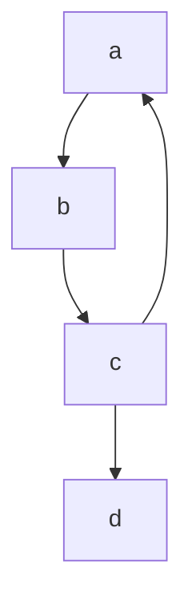
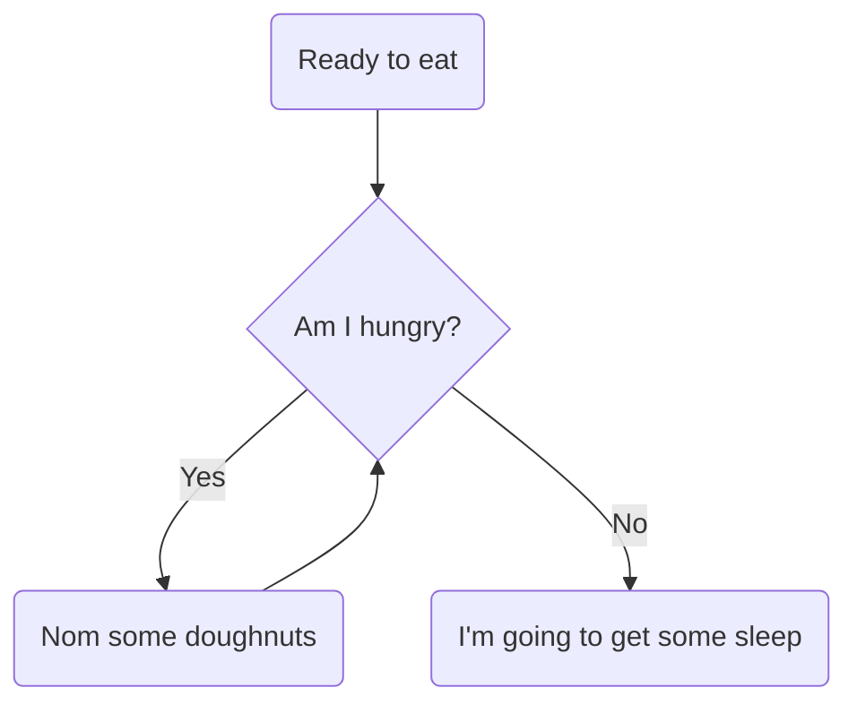
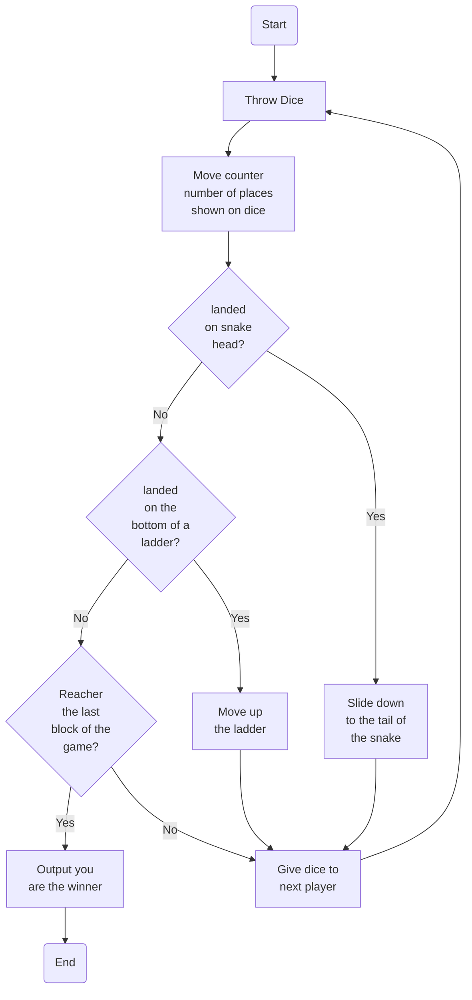
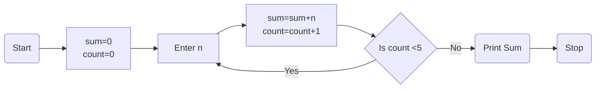

Computer Science Diagram Tooling
================================

* Learning objective
    * Understand that _formal technical computer science diagrams_ can be represented in _plain text_ and rendered as diagrams
* Timing
    * 10 min technology introduction
    * 5 min hands on
    * 5 min summary

## Formal Computer Science diagram notations

* [FlowChart](https://en.wikipedia.org/wiki/Flowchart)
    * A flowchart can also be defined as a diagrammatic representation of an algorithm
    * Any drawing program can be used to create flowchart diagrams, but these will have no underlying data model
    * Many software packages exist that can create flowcharts ... from a flowchart description language
* [State Diagram](https://en.wikipedia.org/wiki/State_diagram) is a type of diagram used in computer science and related fields to describe the behaviour of systems
* [UML](https://en.wikipedia.org/wiki/Unified_Modeling_Language) (Unified Modelling Language)
    * [Class Diagram](https://www.visual-paradigm.com/guide/uml-unified-modeling-language/what-is-class-diagram/)
    * [Sequence Diagram](https://www.visual-paradigm.com/guide/uml-unified-modeling-language/what-is-sequence-diagram/) interaction diagrams that detail how operations are carried out
* [Entity Relationship Diagram](https://www.smartdraw.com/entity-relationship-diagram/) the relationships of entity sets stored in a database
* There are more ...

How many of these have you heard of?

* Computing textbooks are full of these formal notations
* In an exam, students could be asked to:
    * Translate a flowchart into code
    * Complete a state transition diagram
    * Create SQL statements from an ER Diagram
    * Follow a tree with a depth first search algorithm
    * etc
* As computing teachers:
    * We regularly need to create activities with these diagrams
    * We need tools to make creating these diagrams swifter

## General purpose drawing tools

* General freeform vector shapes/text - often connectable with lines (sometimes anchorage to shapes)
* Examples
    * Drawing tools in Microsoft Office (desktop)
    * [diagrams.net](https://app.diagrams.net/)
* Problems
    * Time consuming
    * Inconsistent layout
    * Difficult to enforce consistent style

## Advantages of _text representation of formal diagrams_
* Less human time required
* Accessibility
* Consistent styling
* Trivially distributable and modifiable

## Technology example `Mermaid`

* [Mermaid](https://mermaid-js.github.io/mermaid/)
    * [Mermaid Live Editor](https://mermaid-js.github.io/mermaid-live-editor/)

### Tutor Demo 1 - Basic syntax


### Tutor Demo 2 - Naming items and ladled arrows


### Task: Create a mermaid flowchart

* Reproduce the following program as a flowchart using [Mermaid Live Editor](https://mermaid-js.github.io/mermaid-live-editor/) (7 min)
* Paste your solutions into the chat


```
start program
init sum to 0 and count to 0
ask user for a number `n`
sum=sum+n
count=count+1
if count < 5 then ask for the user for another number
print sum
stop program
```

(copy and paste this to start)
```
graph TD
    start(Start)
    init[sum=0 <br> count=0]
    %% complete this?
    stop(Stop)

    start --> init --> stop
```

## Use

* Trivially export SVG's
* Mermaid (and other tech) can be embedded in Markdown
    * [HackMD](https://hackmd.io/) supports mermaid + other renderers
    * [HackMD plugin for vscode](https://marketplace.visualstudio.com/items?itemName=HackMD.vscode-hackmd)
    * [GitLab supports mermaid](https://docs.gitlab.com/ee/user/markdown.html#diagrams-and-flowcharts)
    * GitHub - does not support mermaid - [Mermaid Support ticket](https://github.community/t/feature-request-support-mermaid-markdown-graph-diagrams-in-md-files/1922/42)

## Summary

* Learning objective
    * Understand that _formal technical computer science diagrams_ can be represented in _plain text_ and rendered as diagrams
* Questions?
* Do you think you will use these tools in future?
* Next 15min - self exploration ...
    * Consolidate mermaid flowcharts?
    * Try another mermaid variant?
    * Explore other technology's feature-set?

## Further Reading

Explore some of the other diagram tech and types

* Other tech
    * [Mermaid](https://mermaid-js.github.io/mermaid/)
    * [PlantUML](https://plantuml.com/) - text rendering for [UML](https://en.wikipedia.org/wiki/Unified_Modeling_Language) diagrams and more
        * some examples
            * [activity-diagram](https://plantuml.com/activity-diagram-beta)
            * graphical [json](https://plantuml.com/json) visualisation
    * [flowchart.js](http://flowchart.js.org/)
    * [graphviz](https://graphviz.org/)
        * [gallery](https://graphviz.org/gallery/)
        * [Drawing Graphs using Dot and Graphviz](https://www.tonyballantyne.com/graphs.html)
        * [WebGraphViz](http://www.webgraphviz.com/)
        * [create diagrams with code using graphviz](https://ncona.com/2020/06/create-diagrams-with-code-using-graphviz/)
* All these technologies can be embed in Markdown
    * [My HackMD Examples](https://hackmd.io/FBO5lLHhQkeWApUisqAHRQ?view)
* Discussions about why diagrams as code is useful
    * [Filling the void of a physical whiteboard](https://blog.tawhidhannan.co.uk/practices/fill-void-physical-whiteboard/)


### Further Example

Snakes and ladders flowchart



Solution



Other Diagram Types
===================

* [Nassi–Shneiderman diagram](https://en.wikipedia.org/wiki/Nassi%E2%80%93Shneiderman_diagram)
    * 