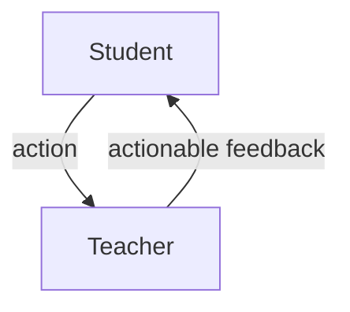

Formative Assessment
====================

Objectives

* Learning v progress; what does Computing learning look like?
* AfL strategies and feedback to inform subject practice
    * feedback supporting pupils to monitor and regulate their own learning
* Reducing assessment workload
    * High impact high quality feedback

ITT Core Framework
6.1
> Effective assessment is critical to teaching because it provides teachers with information about pupils’ understanding and needs

6.2
> Good assessment helps teachers avoid being over-influenced by potentially misleading factors, such as how busy pupils appear

6.4
> pupils must be able to act on feedback for it to have an effect

6.5
> High-quality feedback can be written or verbal; it is likely to be accurate and clear, encourage further effort, and provide specific guidance on how to improve

6.6
> Over time, feedback should support pupils to monitor and regulate their own learning.

Introduction - Core Formative assessment principles (1.5 hours)
------------

Get a feel for the core concepts of formative assessment

### Async (1hour)

* From the video answer the following questions (15min)
    * [Dylan William: What do we mean by Assessment for Learning?](https://www.youtube.com/watch?v=q-myBw36_DA) 9min 2018
        * can you elaborate on _students as owners of their own learning_?
        * can you elaborate on _students are learning resources for one another_
        * What does Dylan mean when he says _view from the rear view mirror_?
        * What is the maximum number of times you should perform formative assessment?
* Read this influential paper - (30min reading + 15min notes and thinking about questions)
    * [Inside the Black Box](https://journals.sagepub.com/doi/10.1177/003172171009200119) (Black and Wiliam, 1998) [alternate](https://weaeducation.typepad.co.uk/files/blackbox.pdf)
    * Questions for later in the session
        * How could we train pupils to self assess their work?
            * What skills, support, time, resources would they need to do this?
        * How do we give feedback?
            * what are the benefits/problems of verbal, written, digital?
        * How will students convey their understanding to you?
        * Can you give examples of feedback (phrases/sentences) that would prompt a student to improve? (we will look as group to see if we can wordsmith these)
        * How would you set regular homework + give meaningly feedback (timely) + observe that the feedback was actioned/had-impact

### Sync (30min)

TASK 1: (5min) In the GoogleDoc create headings for the questions you answerd above - copy and paste ideas from your notes above - put your initials next to your contributions
TASK 2: (25min) Discuss each question - (This will set the stage for some exploration this session)

EEF Trial (1 hour)
---------

* Async - Read (10min)
    * [EEF Project: Embedding Formative Assessment](https://educationendowmentfoundation.org.uk/projects-and-evaluation/projects/embedding-formative-assessment/) EEFTrial 2018
    * What are the 5 key formative assessment strategies suggested by this trial
        * We will be working on our own strategies for these points in the session

TASK:
* Create a heading in the GoogleDoc for each of the 5 areas
* Decide as a group - As individuals take a heading each - think about that heading and add some notes to the GoogleDoc (15min)
* Form pairs - critique and refine your two headings (15min) (I will help odd groupings)
* Summary to group (15min)

### Loose notes of mine

* From [The Voices of Solution Tree](https://slideplayer.com/slide/3762685/) - 2011 Dylan Wiliam
* Example Course
    * Weeks 1 to 2
        * Individual choice from a range of work provided by the teacher. Student self-assessment using materials provided
    * Weeks 3 to 6
        * Children construct own problems like those in weeks 1 and 2 and select structured math apparatus to aid solutions
    * Weeks 7 to 10
        * Children presented with a new learning objectives, and make up their own problems, without exemplars by the teacher
    * Weeks 11 to 14
        * Children set their own learning objectives, construct appropriate problems, and use appropriate self-assessment
    * Weeks 15 to 20
        * As weeks 1 to 14, but with less monitoring from the teacher and increased freedom of choice and personal responsibility

How do we train groups to interact?
> We are all better at spotting mistakes in the work of others.

* Activating students as learning resources
    * Students assessing their peers’ work
        * Activating self assessment
            * rubrics
            * exemplars
    * “Pre-flight checklist”
    * “Two stars and a wish”
    * Training students to pose questions/identifying group weaknesses
    * End-of-lesson students’ review

David Daidu - Bring work to front until good enough - Mastery marking - There is only one grade and it's A

Computer Science Pedagogy (30min)
-------------------------

Async (20min)
* Read (15min)
    * [Programming with T.I.M.E](https://craigndave.org/programming-with-time/) 
        * What does TIME stand for?
        * Craig and Dave suggested - what is the teachers role in the classroom?
        * How is how the answer to your question above linked with formative assessment?
* Video (5min)
    * [Assessment with Craig 'n' Dave - (GCSE)](https://www.youtube.com/watch?v=I19Rtd_puU0)

Sync (10min)
* Discuss - how does this technique relate to the EEF 5 key areas?

Feedback Cycle and Tools (30min)
------------------------

15min async
15min sync

### Make Students Think

* Below are a list of general feedback and marking techniques that prompt students to engage with the feedback
* Read (7min)
* [10 Feedback Techniques That Make Students Think](https://www.dylanwiliamcenter.com/wp-content/uploads/sites/3/2015/02/10-Feedback-Techniques.pdf) Dylan Wiliam 2015
    1. Marking for improvement
        * When grading student work, record a grade in your grade-book, but only give students written comments on how to improve. Give students time to read the comments in class and one week to resubmit the work. The final grade is the average of the first and resubmitted grade.
    2. Mastery marking
        * Only accept student work when it is of a specific quality. You might only give one grade, an A. Students are expected to continue to redraft and resubmit their work as many times as necessary in order to achieve an A. The overall grade is then determined by the number of As.
    3. +, –, = (Plus, Minus, Equals) 
        * Mark student work in relation to previous work. If the latest work is of the same quality as the last, it receives an ‘=’, if it is better than the last, it receives a ‘+’, and if it is not as good as the last, it receives a ‘–‘. 
    4. Responding to marking 
        * Write your teacher feedback, signed and dated, at the start of the exercise book. Students then make an appropriate response below the teacher feedback, including where to find any redrafting. Do not mark the next piece of work until the student has responded to the last feedback provided. 
    5. Focused marking
        * Mark student work against one or two specific criteria, even though there may be many criteria that could be marked. This allows you to provide more focused and detailed feedback on these criteria than if everything was marked. The grade-book contains the skill marked rather than the title of the work set.
    6. Find and fix your mistakes
        * Instead of marking answers as correct or incorrect, tell the students the number of answers that were wrong. Give them time in class to find and correct their mistakes, either individually or in groups.
    7. Margin marking
        * Instead of marking each spelling or grammar mistake on essays, place a mark in the margin. Students then find their own mistakes and correct them. 
    8. Traffic lights
        * Give students a RED, AMBER or GREEN mark for a piece of work. All RED and AMBER work can be redrafted in an attempt to achieve a GREEN mark. The final grade is calculated from the number of GREEN and AMBER marks.
    9. Aim for the next level
        * Students identify areas of improvement by comparing their work to exemplars at the next level of achievement. Students realize that they need to set themselves higher standards. Able students find that they can improve a good piece of work.
    10. Match comments to work 
        * Write comments about students’ work on strips of paper without names. Sit students in groups of four. Each group of four students gets back their four pieces of work and their four comments. The group needs to decide which comment goes with which piece of work.

Consider the questions below (7min)
* Most of these examples are about a student having a paper workbook (some computing teachers do this!)
    * Can you describe an example of any of these that map to the context of teaching Computing in a digital/remote classroom?
* In the context of Computing and the Context of remote work - how would we accomplish this 'feedback cycle'?
    * How do we quickly comment on students code? and quickly see their progress?

### Feedback Loop/Cycle

* Teacher needs to actively monitor work
    * Students need to know that you care about the work (if you dont care, why should they care)
* Teacher give actionable feedback
* Students needs to digest and then action
* Teacher identify that action has been taken based on the feedback

Show you care - two way process

* TASK: What tools could be used to:
    * facilitate this feedback exchange?
    * record this feedback exchange?
    * facilitate the feedback exchange in a timely manner?
        * provide alerts?

### Tools?

* Sync: Discuss tooling and workflows (15min)
    * I've got some ideas ... I'm interested to hear yours
        * git?
        * repl.it?
        * physical workbook?

All student response systems (30 min)
----------------------------

Don't get responses from one student - get from all students all the time

* [Canterbury Christ Church: Classroom Response Systems](https://www.canterbury.ac.uk/learning-and-teaching-enhancement/learning-platform-suite/classroom-response-systems.aspx)
    * Classroom Response Systems (CRS) can allow for polling of student opinions / ideas / resources in or out of the class, usually through the use of an app or web interface.
    * hummm ... not really overly impressive
* [The Classroom Experiment: Dylan Wiliam: All Student Response Systems](https://youtu.be/J25d9aC1GZA?t=1973) 32:53 to 35:10 (2.5min)
    * The principles of whiteboard and traffic light cups are transferable to the digital domain

### Mini Whiteboards

* Physical Mini Whiteboards
    * Advantages
        * Private(ish)
        * Freeform responses
            * Code + diagrams
    * Disadvantages
        * Transient (not trackable)
* Shared Text Chat
    * Advantages
        * Simple
    * Disadvantages
        * Public (could be setup to be one way?)
        * Limited to text
* [plickers.com](https://plickers.com/) (Kind of a QRcode with orientation printed on A4 paper)
    * Advantages
        * Private
        * Trackable
    * Disadvantages
        * Requires technology to participate
        * Limited to multiple choice responses
* [whiteboard.fi](https://whiteboard.fi/)
    * Advantages
        * Realtime
        * Private?
        * Savable
    * Disadvantages
        * Requires technology

### Traffic Light Cups

In a physical classroom you can visibly see the progress of most students. This takes a lot of expertise and concentration. You need to actively move around the room. Your opinion is not always accurate.

* How will you know how your students are progressing at a glance?
    * You could ask for hands up if you're stuck. This is has a number of problems. Must be responded to timely. No granularity.

* Coloured cups give ongoing feedback - 100% of the time - AMAZING tool!
    * Used when working solo
    * Used when you are demoing
    * Used when in group work
* What they mean is for you to define - clearly!
    * Green: Ok
    * Amber: Bit confused, few bumps, need guidance
    * Red: Blocked
* If any kid loses, damages or gratifies their cup - they loose their ability to feedback

TASK: Read (10min)
* [10 top tips for using traffic light cups to improve assessment](http://www.innovatemyschool.com/ideas/traffic-light-cups-to-enhance-assessment-for-learning-ten-top-tips) 2011 blog (by a cup company)

#### Online?
* In an online context Blackboard has support for this 'status' but it is temporal (will decay after 60 seconds).
* How else could we do this online?

#### Purchase Ideas
* Some link ideas from a few mins of searching
    * [Unique-Party-99196-Green-Paper](https://www.amazon.co.uk/Unique-Party-99196-Green-Paper/dp/B01NBSBBFD/)
    * [Beiersi Party Paper Cups 9oz (250ml) Disposable Party Cups,Pack of 10 (Yellow) ](https://www.amazon.co.uk/Beiersi-Party-Paper-Disposable-Yellow/dp/B076JK46V5/)
    * [PARTY TABLEWARE - Plates/Cups/Napkins/Tablecovers/Bags/Balloons - 8 Colours](https://www.ebay.co.uk/itm/PARTY-TABLEWARE-Plates-Cups-Napkins-Tablecovers-Bags-Balloons-8-Colours/142262660211?var=441321487781&epid=1605170486&hash=item211f83ec73:g:0jYAAOSw7NNT7GtT)

### Async - long form

* What about responses systems in an async world?
* How would the tools be different?
    * Wiki? Forums?

A software idea to support assessment? (15min demo)
--------------------------------------

We are developers. We have the superpower of building solutions. Other teachers can't do this.
We can rapidly prototype ideas. These are sometimes refereed to as _hack projects_.

### Problem

In 2005 I wanted to build a teacher feedback capture system.

I observed that most teacher datasystems required me to sit at a desktop computer and enter data. I needed a mobile/portable data capture system.

### Idea

I wanted a handheld seating plan where I could tap a student and record information. The information was stored and available to the students. I had plans for making that data available as an _active desktop_ so that students logged in an immediately had their progress feedbacks and targets on the desktop.

Laptops were possible but bulky. PDA's were possible, but difficult to program. There were no smartphones. PDA's had VERY limited web ability. I did not have the time to code a system with the limited developer tooling of the era.

The interface would have been complex radio buttons and dialogues. I considered having an audio capture system. By just holding the stylus on a student name I could record audio/voice comments. At least I would have a record. When writing reports or parents evening I could go though all the audio snippets?

### Prototype? 2021

Mobile phones are now prevalent. Speech to text is a service available in HTML5 web browsers (currently only GoogleChrome, more are coming).

I spent 3 hours this holiday making a proof of concept mobile feedback capture system. (1.5 hours was pratting around with web layout ... I'm always on the back foot with web layout, I need to raise my skill-set with it)

* [feedbackLogger](https://calaldees.dreamhosters.com/teaching/teacherTools/feedbackLogger.html) 
    * proof of concept on my webserver
    * it's just a single html file that you can save locally
    * it saves comments in memory that can downloaded as json
    * the seating plan is currently hard coded
    * I've tested it with desktop chrome (It may need a few tweaks to be used on mobile?)
* [github.com/calaldees/teacherTools](https://github.com/calaldees/teacherTools)

TASK: Give it a try
Can we think of any other simple tools that could help us with data management for feedback?
(This leads on to next session _Data and Management_)

The important next step would be making this feedback visible to the student.

Further Reading
---------------

* VleBooks [Formative Assessment for Teaching and Learning](https://www.vlebooks.com/Vleweb/Product/Index/549014) Bill Boyle, Marie Charles, 2013
* [Mike Gershon - Resources for teachers](https://mikegershon.com/resources/) - free powerpoint on starters plenerys and afl tools
    * [Assessment For Learning Toolkit (14543)](https://www.tes.com/teaching-resource/assessment-for-learning-toolkit-6020165)
    * [Make Your Own AFL Box (9265)](https://mikegershon.com/download/328/)
* [Influence of Formative Assessment Classroom Techniques (FACTs) on student’s outcomes in chemistry at secondary school](https://www.researchgate.net/publication/339149613_Influence_of_Formative_Assessment_Classroom_Techniques_FACTs_on_student%27s_outcomes_in_chemistry_at_secondary_school) Babincakova 2020
    * Formative Assessment Classroom Techniques
        * True or false statements
            * 50% guess
        * Vocabulary square (for a word)
            * definition, fact, characteristic, examples
        * checklist - reflect on progress
            * done/not-done yes/no
            * Can do on own / can do with some help / cant do
        * K-W-L chart
            * (K)now, (W)ant to know, (L)earnt during lesson
        * Concept map
            * Visual mind map - useful to see students concept changes
        * Exit card
            * 2 significant points this lesson and 1 question (to be covered next lesson)

---

* [10 Feedback Techniques That Make Students Think](https://www.dylanwiliamcenter.com/wp-content/uploads/sites/3/2015/02/10-Feedback-Techniques.pdf) Dylan Wiliam 2015 (15min)
    * Here are a list of general feedback and marking techniques
    * In the context of Computing and the Context of remote work - how would we acomplish this 'fast feedback cycle'?
        * We will discuss tooling and workflows

* [EEF Project: Embedding Formative Assessment](https://educationendowmentfoundation.org.uk/projects-and-evaluation/projects/embedding-formative-assessment/) Trial 2018
    * Local teaching groups asked to have a range of collaborative sessions address these 5 key points
        1. clarifying, sharing and understanding learning intentions
        2. engineering effective classroom discussions and activities
        3. providing feedback that moves learning forward
        4. activating learners as instructional resources for one another
        5. activating learners as owners of their own learning

---

Assessment (Old Notes)
======================

Objective:
* Understand the required formal assessment methods in schools
* Understand the need/techniques for Summative and Formative assessment
* Appreciate the difference between the visible and invisible curriculum

This session fundamentally describes the entire profession.
This is the single most important session in the entire year.

We must deeply internalise and understand the extremes.
We NEED assessment and we NEED humanisation.
We are going to journey through a range of emotions.

Visible Curriculum - The Education Machine (A historical syndical lens)
-----------------------------------------------------------------------

Why are you here?
[Teacher Standards](https://assets.publishing.service.gov.uk/government/uploads/system/uploads/attachment_data/file/665522/Teachers_standard_information.pdf)

* Help mould young people to be lifelong learners, passionate, self worth, collaborative, community driven human beings

* Can't rely on teachers opinion - no standardisation
* Baseline for comparison across departments/schools/county's
* Evidence based rather than opinion based

* You observe the students - you already know - you know them - you work with 1000's of kids with years of experience. You know. But you need evidence.

* IQ of 86 - Minimum bar for military
    * Under this number there is not a single task that can be given to the individual that is not counter productive.
    * 10% of the population

* Governments 'Value added': +/- from predicted attainment
    * Take Sats (english/maths) estimate IQ
    * Take entire country's GCSE results.
    * Derive average expected GCSE attainment (year 11) from sats (year 7)
    * Apply this derived heuristic to next years cohort (or loosely any future cohort at any yeargroup stage)
* All teachers/departments are ranked in every school.
    * Whether you're told or not; you are ranked.
    * Take a single student
    * Average all their other GCSE's
    * Compare their GCSE average against your subjects attainment +/-
    * Sort the list

* When dealing with averages on this scale, no excuse matters
    * One student had XYZ so they attained poorly. Well averages state another student did better than expected. The world is even. The exucse that a whole class is 'rotten' doesn't hold up against the averages. The weak link is you.

* Schools want this standardised assessment
* Parents want this standardised assessment
* Government's want this standardised assessment

* Teachers in different schools suffer different burdens
    * Ghrama school teachers stating their two level 4's are shameful (one was a school refuser, one had learning difficulty's. The result is still abounding!)
    * Comprehensive school teachers would be overjoyed at 38% of a class attaining level 4

* Cambels law - Any system with a measurable metric is gamed.
* Anything that you do that is not directly related to GCSE metrics (or open evening perception) is pointless.
* SMT Don't know or care.
* If you're _nice_ but don't produce results you'll be seen as a weak practitioner.

* Cash cash cash
    * A-Level class
    * 16 students
    * All predicted E's (because you cant be preicted U's because there is no point in sitting the course)
        * Most students only got 4 GCSE's (in ICT that was 100% coursework), so they take ICT A-Level or Computing A-Level as it' the only foundation skill on paper they have competence in.
    * If they are all predicted U's is this the best choice for this student?
    * Who care's if it's good for the student; every bum on a seat is raw cash baby!!!

* Education is a business
* Welcome to the factory

Every Teacher knows the system is not sufficient - let's not re-enforce that - let's find solutions

Many people have advised governments against this and opinion/process is positively changing
David Didau and Dylan Wiliam + MANY more are inspiring national change

Invisible Curriculum - Character Traits
---------------------------------------

* Draw a picture of a horse as accurately as possible - you will be marked on proportions, feature accuracy, detail - show publicly (5 min)
* Outside (change lesson)
* Write a 3 line poem about Computing. You have (5 min)

Imagine being placed under somebody else's control every 60 minuets and asked to do something that you can't do and then display it publicly and constantly compare you to your peers.

Activity: Why are you here? (Refer to the teacher standards)

* "Everybody is a genius but if you judge a fish by its ability to climb a tree, it will live the rest of it's whole life thinking it's stupid" (Albert Einstein)
* "There is nothing noble in being superior to your fellow men. True nobility lies in being superior to your former self" (Anthony Moore)
* Ken Robinson's Story - Mary - Year 3 - Cold breaktime - drawing God - 'nobody knows what god looks like' - 'they will in a minuet miss' - then the lesson starts, robbed of that freedom.

* The first step is to measure whatever can be easily measured. This is ok as far as it goes
* The second step is to disregard that which can't be measured or give it an arbitrary quantitative value. This is artificial and misleading.
* The third step is to presume that what cant be measured easily really isn't very important. This is blindness.
* The forth step is to say that that which can't be easily measured really doesn't exist
(Blatchford 2014)

Activity: Discuss:Some schools ask for an attainment and effort grade? what do you think??

* Brockman story
* Charles Tom story

Activity: Board: What are the character traits we want to inspire? Invisible Curriculum (Refer to the Teacher Standards for inspiration).

### Assessing Character Traits and Attitudes (Andrew Hammond)

The 'language' of character

Terms that are rubbish
* soft skills
* progress (end in mind)
* potential (fixed)
* performance (refers to measuring)

'development' implies growth

* Grit
    * gritty, tenacious, committed, courageous, plucky, resolute
* Adaptability
    * adaptable, flexible, accommodating, open, tolerant
* Optimism
    * Optimistic, resilient, positive, confident, enthusiastic, hopeful
* Self-Control
    * Composed, graceful, poised, reserved, in-control, self-directed, self-regulatory
* Empathy
    * Empathic, understanding, considerate, compassionate, kind
* Discernment
    * Discerning, reasoned, rational, responsible, shrewd, astute, grounded, balanced
* Trust
    * collaborative, cooperative, team-player, trusting, participative

'Observable evidence' (not assessment)

Teacher as a model learner
* '6th form complaints about other teacher' story

The Rules?

| Have Courage       | Help others to be strong          |
| Stay positive      | look for the good in others       |
| Show self-control  | Work together as a team           |
| Embrace change     | Help those who find change hard   |
| Believe in yourself | Believe in others                  |
| Respect yourself   | Show respect to others            |
| Do what is right   | Help others to do the right thing |

* If there is a mark in a spreadsheet, markbook, notebook it suddenly has professional weight/value. The knowledge in your head carrys less weight.
* so record it

Learning is something the learners have to do for themselves
Failed a test: Not because you didn't prepare well, it's because your stupid.

Summative/Formative Assessment
------------------------------

* Summative
    * focus is on the outcome
    * gcse result, grade, number
    * no meaningful feedback
* Formative
    * > Any assessment that helps a pupil to learn and develop is formative (Perrenoud) 1991
    * facilitates the participants development
        * corrects a misconception
    * suggestions for improvement, questioning, verbal feedback, self evaluation, peer assessment

Ofsted (historically) wanted to ask students:
* What grade/level are you currently at
* What is there next step. How to improve
    * Target setting is a formalised for of feedback - specific and challenging
    * Short term and long term goals are required to make progress

ITT Core Framework
6.1
> Effective assessment is critical to teaching because it provides teachers with information about pupils’ understanding and needs
6.2
> Good assessment helps teachers avoid being over-influenced by potentially misleading factors, such as how busy pupils appear

### Formative

Formative assessment is more effective steaming/setting
* [Inside the Black Box](https://journals.sagepub.com/doi/10.1177/003172171009200119) (Black and Wiliam, 1998) [alternate](https://weaeducation.typepad.co.uk/files/blackbox.pdf)
    * Present policy treats the classroom like a _black box_ and offers no help with as to how to raise attainment. Inputs are money, teachers, resources. Outputs are grades. Whats happens inside the black box?
    * > Feedback to any pupil should be about the particular qualities of his or her work, with advice on what he or she can do to improve, and should avoid comparisons with other pupils
    * > For formative assessment to be productive, pupils should be trained in self-assessment so that they can understand the main purposes of their learning and thereby grasp what they need to do to achieve
    * > Opportunities for pupils to express their understanding should be designed into any piece of teaching, for this will initiate the interaction whereby formative assessment aids learning
    * > The dialogue between pupils and a teacher should be thoughtful, reflective, focused to evoke and explore understanding, and conducted so that all pupils have an opportunity to think and to express their ideas
    * > Tests and homework exercises can be an invaluable guide to learning, but the exercises must be clear and relevant to learning aims. The feedback on them should give each pupil guidance on how to improve, and each must be given opportunity and help to work at the improvement

Ruth Butler 1987
* mark only
* comment only (30% improvement)
* mark and comment

* [Dylan William: What do we mean by Assessment for Learning?](https://www.youtube.com/watch?v=q-myBw36_DA) 9min 2018
    * Research suggests consistent effects
    * "Assessment of learning" helps teacher - not learner
    * focusing on the intention rather than the action.
    * "Assessment for learning" strategy by the government is all about recording and reporting achievement - if the impact is not with the student then it's not having an effect
    * > Formative assessment == Such assessment becomes formative  when the evidence is actually used to adapt the teaching work to meet the learning needs (Black 2002)
    * Short term - In the moment - impact before they leave the classroom
    * > Changing what teaching think doesn't benefit students until it changes what teachers do
      > ... we've been trying to get teachers to think there way into a new way of acting. We need teachers to act their way into a new way of thinking
    * Aspects of formative assessment

|       | Where is the learner going | Where the learner is | How to get there |
|-------|----------------------------|----------------------|----------------|
| Teacher | Clarify and share learning intentions | Engineering effective discussions, tasks, and activities that elicit evidence of learning | providing feedback that moves learners forward |
| Peer | Understand and share the learning intentions | Activating students are learning resources for one another |
| Learner | Understand the learning intentions | Activating students as owners of their own learning |
* cont ...
    * Activating students as owners of their own learning
        * Self assessment
        * Meta cognition
        * Emotional response (resilience to difficulties/failure)
        * Self efficacy
    * Activating students are learning resources for one another
        * Peer assessment
        * Peer tutoring
        * Mentoring
    * Providing feedback that moves learners forward
        * often the view from the rear view mirror - what was wrong with the last assignment - but they are never going to do that assignment again
        * Feedback should take out of the last assignment, what they need for the next assignment
    * How often should we do formative assessment - not more than once per minuet
* [Formative assessment: The bridge between teaching and learning in high school mathematics](https://www.dylanwiliam.org/Dylan_Wiliams_website/Presentations_files/2013-08-02%20NCTM%20HS%20Institute.pptx) NCTM High School Interactive Institute, August 2nd , 2013: Washington, DC Dylan Wiliam
    * Formative assessment/ Assessment for learning = 8 months additional learning a year = £3,000 per class per year
* [Dylan Wiliam Embedding Formative Assessment SSAT/EEF celebration event keynote](https://www.youtube.com/watch?v=zwGaG1b_T2w) 2017 38min
    * If you don't think you can get better you will reject feedback
    * Create a culture where teachers want to improve - not because they are not good enough
    * Schools are talent refinery's - some kid get it, some kid don't - the good are sifted to the top.
    * Talent incubators or talent factories
    * IQ is 80% of GCSE grade - IQ inhabitability 60%
    * Because it is the case - does not mean it ort to be the case
    * If you get a bell curve - you are not doing your job. A bell curve is what nature gives us
    * I don't want to live in a world where taller people are better at basketball
    * I don't believe in equality of opportunity - because that means the bell curve all over again. We need to give more help to the kids that need it
    * Send all the clever kids home on Thursday/Friday - that will close the achievement gap
    * Lower achieving pupils need a better chance of a good life
    * Consider control/impact matrix
        * some things are outside of your control and have high impact - _poverty_
    * Set's don't seem to impact on achievement - it's not an argument about data, the data is clear - it's about what middle class parents want
    * Some teachers are better than other teacher - so we drive teacher accountability - let's grade teachers - most people cant identify good teachers
    * More struggle more learning - less struggle less learning
    * 7 teachers
        * 3 have performed 0.5 standard deviations above consistently for 3 years
        * 4 have performed 0.5 standard deviations below consistently for 3 years
        * People shown video clips and asked to say good/bad teacher
        * nobody could tell (Strong 2011) - a coinflip was better odds - school principles, mentors, students, parents
    * You need 11 years worth of data to get an estimate predictor of how good a teacher is
    * We have better things to do with our time. There is no upside to grading teachers. Let's stop. Let's just help every teacher get better
    * How can you improve teachers if you cant measure them
    * Pareto 80:20 rule
        * Don't raise money for tax's until you can be sure you are doing the best you can with your current money
        * If have to take away from one thing to add to another - thats a political decision
        * If you can add to something without taking away from another - that's a technical matter and you should do it straight away
        * Can we improve education without adding more money?
        * If anything that you add damages what you have - then you are pareto optimal and only more money will improve it
    * Research will never tell you _what_ to do - it tells you what currenty is
        * don't work
            * Smarter teachers
            * paying teachers more
            * learning styles
            * brain gym
        * Might work
            * differentiated instruction
            * grit (only for westpoint graduates)
            * growth mindset (impact on student achievem ent is not significant - never been validated)
            * social and emotional aspects of teaching
        * work a bit
            * firing bad teachers
            * charter schools
            * class size reduction
        * work a lot
            * curriculum improvement
            * formative assessment
    * Everything was hard before it was easy - remind children how hard it was to tie their shoe laces
    * Expertise is 
        * Specific and limited
        * Weakly related to general ability
        * Not reproducible to propositional knowledge - cant be reduced to words
        * Involves perception fo meaningful patters
    * Most teachers could be as good as the very best teachers within 10 years
    * You could have the very best school - it will just take you 10 years
    * In a collaborative environment teachers reach average of 1.0 in 3 years, in an average school this take teachers 7 years
    * Takeuchi 1995 - companies that manage tacit knowledge well - socialisation of staff
    * You get given advice - you sort of do it but don't really understand it until you were doing it yourself
* [Q&A with Dylan Wiliam at Embedding Formative Assessment SSAT/EEF Celebration Event](https://www.youtube.com/watch?v=aPTZpLaJvUA) 2017 1h15min
    * Schools are hyper optimised - everything you do is valuable - so improving education is hard - you can only improve it by stopping people doing good things so that they can do better things - teachers resist change because the things they are doing are good and needed - it's not laziness that _not everything gets marked_
    * SLT should not be advising in breakout groups - they are too detached - they change the dynamic, they are not the ground workers
        * Theory X - people are lazy and leaders need to monitor
        * Theory Y - people are ok and just need support
        * Better to start the conversation with Theory Y - turns out just asking most people to do their best is a pretty good strategy
        * If the metric is just make sales - that's easy - sell everything at a loss and boost sales ... but that's not what we want, we actually want is profit. 
        * We need corporate alignment. Cascaded objectives (OKRs based on OKRs) - direct reports had objectives that are aligned with theirs. 
        * Everybody made/succeeded in their objectives but the organisation did not get better/more-efficient
            * You MUST fail some of your objectives, otherwise they are not challenging enough.
    * TODO - continue at 12:00

Using evidence of achievement to adapt what happens in classrooms to meet learner needs

* [Formative assessment in the computer science classroom](https://www.raspberrypi.org/blog/research-seminar-formative-assessment-computer-science-classroom/) Sentence 2020
    * Not much detail here
* [Formative Assessment](https://www.csforallteachers.org/blog/formative-assessment) Noah Mealy 2016
    * Just talks about Socrative

---

ITT Core Framework
6.4
> pupils must be able to act on feedback for it to have an effect
6.5
> High-quality feedback can be written or verbal; it is likely to be accurate and clear, encourage further effort, and provide specific guidance on how to improve
6.6
> Over time, feedback should support pupils to monitor and regulate their own learning.

#### Assessment Criteria -> Peer/Self Assessment

Activity: "Pupils a can identify a range of web page design features and can explain why the designer has chosen to use them for the target audience"

Publish your assessment criteria
Show examples of good/bad work
They now know + can peer self assess

You see 300+ students a week - you dont have a chance of marking it

Advantages of peer assessment
* stepping stone for self assessment
* less threatening than teacher
* more honest (brutal)
* language more relateable
* more likely to interrupt rather than continue listening to teacher
* different approach angle than teacher

#### Questioning Techniques

Questioning is a form of assessment.

hands up
targeted
pair share
  snowball
round robin
expert groups
Jigsaw (different groups, different questions)
individual whiteboards
Opinion line

Questioning 1-to-1 to assess understanding

Question to diagnose 

Online
------

[Teaching online-Ways to Assess Students](https://www.youtube.com/watch?v=7eGk9FgCjR4) - Russell Stannard (Teacher Training Videos)

* Quiz
    * Google Forms
        * Free + gives you data
        * First question == what is your name
        * watch video
        * images as multiple choice answers
        * Gap fill (for short answers)
    * Kahoot
    * Plickers
* Student Record themselfs
    * Snaggit (paid)
        * YouTube unlisted
        * Onedrive, GoogleDrive, Dropbox
    * [Screencast-O-Matic](https://screencast-o-matic.com/)
    * [screencastify](https://www.screencastify.com/)
        * Web based screen recorder
            * Download or post to YouTube
    * Students work in pairs? Help with remote collaboration
    * 3 slide limit? or 60 seconds?
    * Self evaluation, peer evaluation?, eportfolio (choose one for teacher to mark)
* e-portfolio
    * Part of lesssons
        * reflections/actions
    * Google sites (all interlinked with other google products)
    * Open them up and leave comments - they must know you care and are watching.
* Automated tests - GitHub classroom
    * ??

Exam
----

* [AQA: GCSE Computer Science From 2020](https://www.aqa.org.uk/subjects/computer-science-and-it/gcse/computer-science-8525)
* [OCR: Computer Science (9-1) - J277 From 2020](https://www.ocr.org.uk/qualifications/gcse/computer-science-j277-from-2020/)
    * [Assessment Story: exploring our question papers](https://www.ocr.org.uk/Images/562109-assessment-story-exploring-our-question-papers.pdf)
* [Revised arrangements for GCSE computer science](https://www.gov.uk/government/news/revised-arrangements-for-gcse-computer-science)
    * > Ofqual has today (8 January 2018) announced that non-exam assessment will not count to the final 9 to 1 grade in GCSE computer science in 2018 or 2019. It is, however, still an important part of the course and contributes to student learning and progress, so all schools must continue to give students the opportunity within the timetable to complete the tasks.
* [Future assessment arrangements for GCSE (9 to 1) computer science](https://www.gov.uk/government/consultations/future-assessment-arrangements-for-gcse-computer-science)
    * [Decisions on future assessment arrangements for GCSE (9 to 1) computer science](https://assets.publishing.service.gov.uk/government/uploads/system/uploads/attachment_data/file/779004/Decision_GCSE_computer_science_6464_1_ADD.pdf) November 2018 Ofqual
        * > We understand that features of working practice, such as collaboration and reference to online coding repositories,would not normally be allowed in exams.Exams are by their nature artificial constructs which allow a particular aptitude to be measured.There are many subjects where the established form of assessment does not reflect how the skills and understanding imparted during the course of study might be used in real-life contexts.Students will, of course, be able to work collaboratively and use online resources as they develop their programming skills.
        * > We also noted the point made by one teacher that assessment by examination is in fact the predominant form of assessment used in recruitment in industry: “Many organisations use only exam assessment to recruit new developers. It is therefore reasonable to assume that similar methods of assessment can be used by the exam boards.”
* [GCSE (9 to 1) subject level conditions and requirements for computer science ](https://www.gov.uk/government/publications/gcse-9-to-1-subject-level-conditions-and-requirements-for-computer-science)
    * [GCSE Subject Level Conditions and Requirements for Computer Science: For qualifications examined from 2022 onwards](https://assets.publishing.service.gov.uk/government/uploads/system/uploads/attachment_data/file/779192/GCSE-subject-level-conditions-and-requirements-for-computer-science-examined-2022-onwards.pdf) feb 2019 Ofqual

* [Long-term plan for GCSE computer science confirmed ](https://www.gov.uk/government/news/long-term-plan-for-gcse-computer-science-confirmed) DfE Jan 2019
    * exam boards will be free to adopt approaches to assessing programming skills by examination that they feel are most appropriate from 2022 onwards. This affords them the opportunity to consult with stakeholders and be innovative in their approach
    * schools and colleges will confirm to their exam board that their students have been given the opportunity to complete a programming task as part of their course
    * the current interim arrangements, where schools and colleges must set aside 20 timetabled hours for students to undertake a programming task, will remain in place for students sitting exams up to 2021

Tracking
--------

* [OCR Assessment Resources](https://www.ocr.org.uk/qualifications/gcse/computer-science-j276-from-2016/assessment/)
    * OCR Project tracking sheet

* Transparency - Available to everyone? - Data protection
* See who's falling behind
* Setting targets
* Tracking should be available to you, students, department - How?

* Students should have a habit of evidence gathering - the process is more important than the outcome

* Dictaphone? - how to archive/store? catalog? transcribe?

Activity:
* What data will you track for a class?
* How often?
* How will this data help
    * you? (accountability)
    * students?
    * department?
* How will you track it?
    * Spreadsheet
    * SIM's Software (ubertrack for smt impractical for everyday use)

Lambert and Lines (2000) describe how teachers fall into an 'Accountability Trap' where they see there own tracking systems as being used to 'prove' their competence.

### 'Cover your ass' case study

* Every practical focused A-Level lesson. Sat one-to-one with student. These are the deadlines you've missed. These are the attainments of your current work. Conversation recorded in database. Key points for improvement. New deadlines for missing work. weekley log of everything agreed with student. They know they have work that is 3 weeks late a letter will be sent home.
* Near end of year a student realised they were really really really behind. Made a sob story about how they were not supported properly and it was the school/teachers fault. Parent goes on warpath. Calls meeting with Head of 6th form and Head of Department and Teacher. Parent ready for a fight. Teacher puts down 5 sheets of A4 with every conversation with the student over the year documented. Multiple letters sent home that 'never got there'. Student frog marched out of room.
* NO Student. However good your rapport with, is your friend. They will turn on you. Your department will turn on you. The only defence you will ever have is assessment evidence and records. They are your lifeline. ALWAYS keep good records.

### Software Concept

* My tracker idea
* Is there such a thing?
* AI voice recognition cloud service (Global Radio hack - 'freq')

KS3
---

[National Curriculum](https://www.gov.uk/government/publications/national-curriculum-in-england-computing-programmes-of-study/national-curriculum-in-england-computing-programmes-of-study#key-stage-3)

You wanted more control ... now you've got it!
How do we know we're marking consistently with other practitioners?

* primary to secondary?
* change schools?
* compare schools?
* compare teachers?

moderation across department, schools
Do this sooner rather than later

Becoming a standard
* [CAS Progression Pathways](https://www.computingatschool.org.uk/data/quick_start_secondary/progression_path.pdf)
    * [Mark Dorling](https://mirandanet.ac.uk/computing-curriculum-in-english-schools/)
        * [Managing Key Stage 1 – 3 Assessment: In Practice](https://magpie.education/computing_faq7a.html)
are all strands equal? overall grade? 7 in noe and 4 in another
how dose this level help the student?

### Entry Level Qualifications

[OCR Entry Level](https://www.ocr.org.uk/qualifications/entry-level/computer-science-r354-from-2016/)
* 100% center assessed + externally moderated
* Good progression for GCSE
Activity: look at the spec

KS4 + KS5
---------

Activity: OCR GCSE - Assessment - Sample Assessment Material

exam boards
* [OCR GCSE](https://www.ocr.org.uk/qualifications/gcse/computer-science-j276-from-2016/)
    * [computing-resources](https://www.ocr.org.uk/qualifications/by-subject/computing/computing-resources/)
* [AQA](https://www.aqa.org.uk/subjects/computer-science-and-it)
spec
papers
mark schemes
examiners report
sample projects

Good Kids in Poor schools
-------------------------

Are not harmed.
Makes me consider the reality of how much impact schools actually have.
The most important thing is 'igniting the spark of passion' in young people. The _system_ is not the reason we exist.

Other
-----

ICT needed for other subjects
Computing not understood why it is needed

* Dylan-Wiliam
    * [dylanwiliam.org](http://www.dylanwiliam.org)
    * [dylanwiliamcenter.com](https://www.dylanwiliamcenter.com/)
    * [@dylanwiliam](https://twitter.com/dylanwiliam)
    * [Author: Amazon](https://www.amazon.co.uk/Dylan-Wiliam/e/B004X8F5IC)

TODO
====

Rethinking assessment
---------------------

[A discussion on assessment by members of the Rethinking Assessment group](https://my.chartered.college/2020/11/webinar-rethinking-assessment/)

High stakes
Does not reflect a young persons future capacity

Lord Baker - National curriculum
1950 - 7% went on to FE - 93% left
2020 - 93% on to fe - 7% leave
Why bother showing 93% of certificates - abolish GCSE's - progrss8 and EBAC and harms broard and balanced curriculum - cultural subject dropped
Other countries don't have serious exams 16
Why has it taken so long to identify GCSE are not working?
Technical colleges 40% troubled pupils are doing well
The fire in the flit is not visible unless struck

Professor sarah jayne blackmore
Professor of Psycology and Congative neuroscience
University of cambridge
Adolescent brain + mental health - 18 years research
MRI studies show - 25years - substantial change
Creativity is highest in adolescence
75% of all mental illness manifest before 18
Adolescent mental health prevalence increased significantly in last decade
Progressive linear assessment may be a cause
(really? but we have always had assessment?)
Neuroplasticity is heightened in adolescence
Vulnerability (mental health) and Opportunity (creativity)

?? Rachel
Exam system is disadvantaging pupils
1/3 of all youngsters fail gcse
disadvantages >1/2 fail
lower attendance rate - due to infection, malnutrition, moving more frequently, more time caring for siblings/elderly
Teacher assessment can include bias
Stress

Professor Bill Lucas - university of winchester
[Rethinking Assessment](https://bigeducation.org/rethinking-assessment-home/) - [blogs](https://bigeducation.org/blogs-ra/)
Assessment could be fairer?
Development of the socialsocial intenigence
KIPP school angel duckworth: Zest, grit, optimisum, self control, gratitude
Martin celadrum: Creativity, Curiosity, Judgement, perspective, bravery, persiverience, zest, honesty, social inteligencem kindness, love, leadership, fairness, teamwork, forgivness, love of learning, gratitude, spirituality, self-regulation, humility, apprecaiting of beatuy, prudence, hope, humor
Why would we want to assess this? could this be used in the intest of young people?
OECD PISA Creative thinking 2021 test? State of Victoria in Australia at 15
ACARA Progression Critical and Creative thinking leaning continuum
"Pedagogies for Deeping Learning"
"Skills Builder Partnership"
All students have a digital portfolio - validated by teachers and peers
Tallis Habits - 
  Inquisitive, collaborative, persistent, disciplined, imaginative
  Excelling, securing, developing, emerging
NoMoreMarking - ?? investigate
IB Learner Profile - 

Peter Hyman - co director of big education
School 21 (stratford - east london)
2:1 from a rustle group is no longer appropriate for the skills they are looking for
Not suiting employers, not suiting individuals
Why is it a competition? (1/3 fail?)
Assessment a purpose of education need to be aligned
Schools need to be recognised for what they offer beyond exam results

Geoff Barton
"For my 1/3fail is to give the other 2/3pass a meaning" dignitiy
I am more than just a grade
Portfolio what you can do

Assessment of groups (not just individual)
Most employers are interested in ability to work in groups
pizza 2015 Reliably assess collaborative problem solving
* [PISA 2015 COLLABORATIVE PROBLEM-SOLVING FRAMEWORK](https://www.oecd.org/pisa/pisaproducts/Draft%20PISA%202015%20Collaborative%20Problem%20Solving%20Framework%20.pdf)
    * > Collaborative problem solving competency is the capacity of an individual to effectively engage in a process whereby two or more agents attempt to solve a problem by sharing the understanding and effort required to come to a solution and pooling their knowledge, skills and efforts to reach that solution
* [Collaborative Problem Solving: Considerations for the National Assessment of Educational Progress](https://nces.ed.gov/nationsreportcard/pdf/researchcenter/collaborative_problem_solving.pdf)
    * an essential 21st century skil
    * a new assessment domain
    * An Interdisciplinary Experience

* [Inside the Black Box: Raising Standards through Classroom Assessment](https://journals.sagepub.com/doi/full/10.1177/003172171009200119) 2010 Paul Black, Dylan Wiliam
    * [What is formative assessment, why hasn’t it worked in schools, and how can we make it better in the classroom?](https://impact.chartered.college/article/booth-what-formative-assessment-make-better-classroom/) 2017
        * > The big mistake that Paul and I made was calling this stuff “assessment”… because when you use the word assessment, people think about tests and exams’ (Stewart, 2012). He later commented that it should probably have been called something like ‘responsive teaching’ (Wiliam, 2013b).

* [Assessment A4 revision notes](https://twitter.com/Lucyjc1612/status/1332345899184508929)
    * > Did a pre-mock past paper test with my middle set Y11s this week and told them they could bring one sheet of A4 into the test with them, with any notes they want. They were thrilled they got to ‘cheat’ and I’m thrilled that they did such awesome revision - win win

* [What is Computer-Based Assessment (CBA)?](https://now.ntu.ac.uk/d2l/lor/viewer/viewFile.d2lfile/6605/62186/CBA%20Revised/page_01.htm)
    * Bull and McKenna (2004) cite the following reasons to use CBA:
* [Computer-based tools for the assessment of learning processes in higher education: a comparative analysis](https://www.researchgate.net/publication/271211156_Computer-based_tools_for_the_assessment_of_learning_processes_in_higher_education_a_comparative_analysis) 2014
    * List of software and features
* [15 Benefits Of Computer-Based Testing](https://elearningindustry.com/15-benefits-of-computer-based-testing)
    * More testing dates + much expossure (for exam based)
    * Dynamic and individualised
    * Immediate grade
    * accelerate open ended assignments + aid admin efficiency
        * [Kaizena](https://workspace.google.com/marketplace/app/kaizena/354175553078) - google docs plugin for voice comments + skill tracking
    * vertical and horizontal aligned (criterion based) or (norm-referenced)
    * value added growth measure
    * uncover student thinking (diagnostic)
    * engaging
    * analytics for instructor and learner
    * range of devices / situations
    * 
* [Models Of Online Assessment, Part 1: Computer Adaptive Testing ](https://elearningindustry.com/computer-adaptive-testing-models-online-assessment-part-1)
    * technology-based assessments can (Burns et al., 2010; Burns, Christ, Kovaleski, Shapiro, & Ysseldyke, 2008: 18)
        * measure complex thinking and lower the cost differential because technology-based assessments take less time to score, store and share. 
        * They can enable quick turnaround of assessment data to the instructor and learners, allowing instructors to assess learner performance at a much more granular, detailed level. 
        * they can allow more reliable scoring and valid data interpretation 
    * > CATs are technology-based or online testing systems created by content specialists, psychometricians, programmers and web designers.
      > They contain large test item banks and, when designed well, can attain high discriminating power. They do this through constant calibration or “adaptation.

Terminology
* Moderation
* Standardisation

Gamification - code combat

* [Journal of Computer Assisted Learning](https://onlinelibrary.wiley.com/journal/13652729)
    * [Review of computer-based assessment for learning in elementary and secondary education](https://myweb.fsu.edu/vshute/pdf/jcal.pdf) Shute and Rahimi 2016
        * Generated personalised tests with question banks and immdiate feedback
        * design feedback so that it can be used
        * Our findings indicate that generally, assess-ment _of_ learning tends to be more prevalent than assess-ment _for_ learning in online-learning setting
        * Data driven continuous CBAfL
            * spotting statistical weakness
            * extensive and ongoing analyses of the data that the learners produce in various digital learning environments
            * auto pairing students
        * We also expect that innovative CBAfL techniques willmove beyond the laboratory and into the mainstream,and we will no longer have to rely solely on high-staketests for assessing students’knowledge and skills (Shuteet al., 2016a). The boundaries between instruction, learn-ing and assessment will eventually become blurred.

Assessing just the artefact (final code) is not sufficient to understand the process that lead to it.
Sentence says - assess abilities
assess design - assess by interview

[How assessment drives curriculum at every level, and not necessarily in the right direction...](https://bigeducation.org/rethinking-blogs/how-assessment-drives-curriculum-at-every-level-and-not-necessarily-in-the-right-direction/) 2020 Sarah Fletcher High Mistress, St Paul’s Girls’ School, London
    * > Our current knowledge-based system only goes part of the way towards equipping young people with the skills that will give them the confidence and resilience to shape their own path through life.  They need to make the best of human capacity for imagination and critical judgment, especially with our ever-greater dependency on technology and artificial intelligence.”
    * > The world is moving fast, and education risks falling behind. 

* [Teach Computing Curriculum Journey](https://static.teachcomputing.org/curriculum_journey.pdf) - Poster of KS1 to KS4 progress with assessment objectives

* [Quick Read: Using observation techniques to record student behaviour for research or evaluation](https://blog.teachcomputing.org/using-observation-techniques-to-record-student-behaviour-for-research-or-evaluation/)
* [Quick Read: Planning effective surveys and interviews for research or evaluation](https://blog.teachcomputing.org/planning-effective-surveys-and-interviews-for-research-or-evaluation/)
