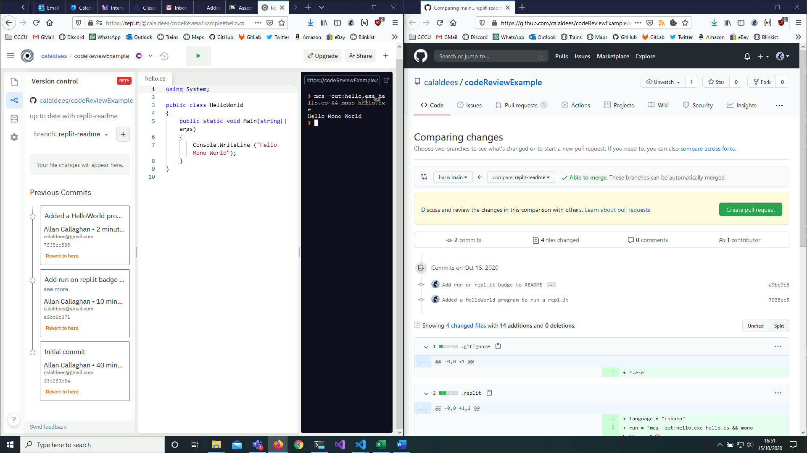

Collaboration
=============

* ITT CCF 4.9
    * > Paired and group activities can increase pupil success, but to work together effectively pupils need guidance, support and practice
* ITT CCF 4.10
    * > How pupils are grouped is also important; care should be taken to monitor the impact of groupings on pupil attainment, behaviour and motivation.
* ITT CCF 5.5
    * > Flexibly grouping pupils within a class to provide more tailored support can be effective, but care should be taken to monitor its impact on engagement and motivation, particularly for low attaining pupils
* CCCU Curriculum
    * Paired and group activities
        * to work together effectively pupils need guidance, support and practice
        * care should be taken to monitor the impact of groupings on pupil attainment, behaviour and motivation

Task (1 hour)
-------------
* TASK 1: Read the "How to make the most of group work" (5min) (every word is a gem! great little article)
* TASK 2: Make individual notes on: (10min)
    * group work you've observed
    * How was it done?
    * Was it effective? Why was it effective?
    * How was/should the group work be scaffolded? assessed?
    * Draw upon the concepts in the article with further notes
* TASK 3: Attempt a mini socratic circle
    * Select participants and assign roles (3 inner, 3 outer)
        * (This is just a demo and slightly fake, the inner circle normally have more time to prepare, but yolo)

* [How to make the most of group work](https://my.chartered.college/2018/08/how-to-group-work-teaching-strategies/)
    * Summary
        * In general, don’t do group work for the sake of it or without the right conditions.
            * > Cooperative learning or group work can be extremely effective, but it needs the right conditions.
    * What does it mean?
        * It is vital to distinguish between 
            * structured team learning and 
            * informal group learning. 
        * Structured team learning – or cooperative learning – has yielded strong results in trials when there are two conditions in place:
            1. Group goals
                * The aim of the task must be to achieve success in something purposeful, possibly to gain a reward of some kind. It isn’t enough to work in a team without a clear goal.
            2. Individual accountability
                * The success of each student in terms of their learning must contribute to the overall team success, otherwise some students dominate the task and others become passengers.
        * It is common for teachers to deploy informal group learning where these conditions do not apply. 
            * This can weaken learning gains and reduce their effectiveness when compared with individual working.
    * What are the implications for teachers?
        * This is a classic example of it being ‘the way you do it’ that gets results.
        * In general, don’t do group work for the sake of it or without taking account of the conditions in which it is effective. 
        * Group work is not inherently a good idea or a bad idea, its effectiveness depends on what you want students to learn and how you organise the groups.
        * If students are all to succeed, the task must be designed so they have to help and challenge each other. 
        * This links to Dylan Wiliam’s idea of students learning to act as resources for each other to generate formative feedback. 
        * It is also important that they all have a clear role. 
        * Every student’s contribution must matter and no one student should be able to opt out or hang back while the others do all the thinking.
        * Also stick to smaller groups (pairs and threes) 
            * because it is harder to ensure there is accountability and defined roles as the number of students in the group increases (this is known as the Ringelmann effect).
    * Top tip
        * Consider whether students might learn more doing a task by themselves or whether a group task would help to push all the students forward in their thinking, or support practice and formative assessment.

Socratic Circle/Debate
----------------------

* Inner group Group interact/discuss/plan/teach
* Outer group take notes
* Outer group asked for input
* Groups then inverted

Prevents 'passive' learning

* [20 things every computing teacher should try! Socratic Debate](https://www.teachwithict.com/socratic.html) Teach with ICT
    * Arrange the seats into two circles (inner and outer circle) 
    * “Surveillance technology is a bad thing, discuss!” or “Why do we need technology to track the movements of individuals?”.
    *  asking the students in the outer circle to reveal their question or mission to the rest of the class and to respond with their answer or observation.
    * See "Socratic questioning techniques" sacafold handout - types of questions to ask in debate
        * Clarification, Challenge, use of evidence, explore other viewpoints, considering consequences, Questioning the question
    * See "Debate cards" to give focus to watchers
* [Engaging Students in Socratic Seminars](https://www.teachingchannel.com/blog/socratic-seminars) 2018 teachingchannel.com
    * Article and videos of pre-scaffold and prep
    * (Requires login to view video)
* [Socratic Seminar in a Computer Science Classroom](https://derekbabbcom.files.wordpress.com/2017/01/socratic-computer-science.pdf) Derek Babb 2015 Omaha North High School
* [Socratic Seminars in Science](https://mariventurino.com/2017/04/22/socratic-seminars-in-science/)
    * Science - but has interesting rubric for participation
* [A distributed systems course structured using socratic seminars](https://ieeexplore.ieee.org/document/5350634) 2009
* [Socratic Seminars: Building a Culture of Student-Led Discussion](https://www.edutopia.org/blog/socratic-seminars-culture-student-led-discussion-mary-davenport) - Implementing effective Socratic seminars is a multistep process that takes careful planning.
    * > Students' team's discussions are very prone to remain superficial. One of the faculty's duties is to avoid this surface approach and to incentive the exchange of views and opinions. We rely on Socratic Dialogues (or Socratic seminars) to structure this exchange.

Further Computing Group-work insights
-------------------------------------

* [Student Culture vs Group Work in Computer Science](https://www.researchgate.net/publication/2911704_Student_Culture_vs_Group_Work_in_Computer_Science) Waite, Jackson 2018?
    * (University context: caution when applying this to secondary)
    * 4 strategies
        * Sequential segmentation: I work on it for a while, then pass it along to you.
        * Parallel segmentation: We break it up and everyone does a piece.
        * Natural selection: We each carry it out and then choose the best result, or we choose the best person and let them do it.
        * Collaboration: We interact closely during the task
    * > collaboration is important is that it avoids the third order of ignorance 
    * > Members see how others think in addition to being exposed to a variety of possible conclusions. They learn how to make useful judgments more quickly than do people studying the same material individually, and the judgments of the group are usually better than those of the individua
    * Overwhelming preference for working alone
        * Sole responsibility
        * Carry the weak
        * Not wanting to deal with interpersonal problems
        * Every assignment is a product
    * > Procrastination hinders collaboration because it does not leave time for discussion
    * The world is simple and understandable alone
    * > Supportive behaviour is a very important factor for team success, and therefore a refusal to provide or allow it is damaging to collaboration.
    * > Without shared passion, it is very hard for a group to get beyond such problems.

* [Teachers’ perspectives on talk in the programming classroom: language as a mediator](https://dl.acm.org/doi/abs/10.1145/3446871.3469751) 2021 Sentence
    * This paper investigates the ways in which programming teachers use classroom talk to support learning, and proposes a model to frame our understanding of this element of programming lessons.
    * > While the role of language and dialogue has been researched in depth in other school subjects, there has been less research in the programming context. 
    * (confirms what i've said previously about the importance of technical vocabulary)
    * (best bit is the teachers highlighted comments)

---

Objectives
----------
* Consider tools/techniques to be a more collaborative teaching practitioner
* Consider ways to facilitate building professional collaboration skills in students

Version Control (30 min)
===============

Demo of (20min)
* Create new repo
* clone repo
* create sub file
* branch
    * create 2 branches
* commit (history)
    * git tree
    * [GitHub/network](https://github.com/calaldees/KaraKara/network)
* Conflict resolution

* Task
    * Code Review [Example GitHub Pull Request](https://github.com/calaldees/codeReviewExample/pull/1)
    * 10min

Teacher Collaboration (15 min)
=====================

### Plain office documents

* Somewhat portable
* Understandable by most people
* Prone to corruption/dataloss
* Transmission
    * Email
    * Website (upload)
    * Dropbox
        * Versions (for 2 weeks)

Problems
* No change log
* Contributing changes back to the author is hard/manual/complex/time-consuming
* fragmented (people have different versions) that are inaccessible from the original
* Difficult to search content (searching for text inside an individual slide of a sideshow)
* Struggle to meet legal accessibility standards
* Data is locked in formats of propriety software

### Cloud Based Office Documents

* Single point of truth always accessible
* Multiple editors
* Comments system

Problems
* Anyone can change anything at anytime
    * Someone could just remove chunks of information you consider important or still need
* Limited log of changes
* Difficult to search text deep in documents
* 3rd Party tech companies control your data

### Version control (with text representation)

* Point of truth always accessible
* Multiple editors
* Contributions go through a review/consultation process
* Every previous version is tracked and accessible
* Content is searchable
* Meets legal accessibility standards

Problems
* Learning curve to make contributions

### More reading

Teacher collaboration is an ongoing interest of mine. We don't have the tools or comunity locally. I want to investigate and change this.
* [Leading teacher collaboration in subject-specific pedagogy](https://impact.chartered.college/article/leading-teacher-collaboration-subject-specific-pedagogy/) Sep 2020 Impact Chartered College of Teaching

Student Collaboration (30 min)
=====================

### Online 

* General Documents
    * [Google Docs](https://docs.google.com/)
    * [Microsoft Office 365](https://www.office.com/)
* Shared boards
    * [Miro](https://miro.com/)
    * [Padlet](https://padlet.com/)
    * [Wireflow](https://wireflow.co/) - Open source collaborative website flow diagrams
* General
    * [hypothes.is](https://web.hypothes.is/) - Annotate the web, with anyone, anywhere
* Setup a Computing Discord/Slack server
    * `#code`,`#cooltech`,`#random`
    * 6th formers moderate?
* Links to calendar entries (for deadlines)

TASK: What other collaboration tools have you encountered that you think could be useful in an school setting?

### Version Control

Benefits of using public code-repositories version-control (GitHub/GitLab)
* As a teacher
    * See timestamped progress
    * Reproduce issue + Offer support as merge request
    * Run automated tests on student code (imagine your marking being automated?)
* As a student
    * Roll back to working versions
    * Experience with professional tools
    * No excuses for loosing work

All on the same team, all with the same objective.
Professional developers SHARE ALL THEIR CODE AT ALL TIMES.

Copying *is* a part of learning. Reading code. Reference sources.
* GCSE: Exam is paper based
* AS: Assessment is solo on a computer
* A2: Project is individual
You will easily be able to spot any student that copies code and submits summative assessment to you without understanding.

#### Online code environments

[repl.it](https://repl.it/) is an education revolution
* No reliance on school infrastructure
* Variety of languages
* Terminal and graphical (pygame) apps
* Multi-user live pair programming
* Simple integration with GitHub version control
    * Spawn repl from a GitHub template (your stub task)
    * Auto marking and Audit/commit history of students work
    * Commenting
    * [GitHub Education](https://education.github.com/teachers)

Other Online online code tools
* Javascript
    * [CodePen](https://codepen.io/)
        * [canvas](https://codepen.io/keenancrane/pen/zKqbpb)
    * [Playcode.io](https://playcode.io/)
    * [JSFiddle](https://jsfiddle.net/)
        * [canvas](https://jsfiddle.net/digitalzebra/yyR2E/)
* Python
    * [Google CoLab](https://colab.research.google.com/)
        * [python](https://colab.research.google.com/notebooks/intro.ipynb)
    * [jupyter](https://jupyter.org/)
* Multi
    * [sharepad.io](https://www.sharepad.io/) - python, java, c, c++ - live share + link share

[tech](./tech.md) more here - duplicates? merge?

Other unsorted notes about Collaboration
========================================

* case studies
    * Karakara - free - austraila adds new features
    * SuperLimitBreak tech stack - free + documented - even is someone copies us - they wont have the ideas
    * Fab** - testers should not look at code

* [How to Write Technical Posts (so people will read them)](https://reasonablypolymorphic.com/blog/writing-technical-posts/)
    * Although not directly related to teaching - the clarity of this article and the points made are universal

* [The Advantages of Peer Learning](https://web.archive.org/web/20191115133445/https://blog.hyperlog.club/why-peer-learn/)

* [COOL: Cooperative Open Learning for Beginning Programmers](https://dl.acm.org/doi/10.1145/3304221.3325569) 2019
    * > It includes several forms of cooperative learning like peer tutoring, pair programming, and talents exchange. 

Thank Pair Share
----------------

Specific 3 bullet points - recorded

