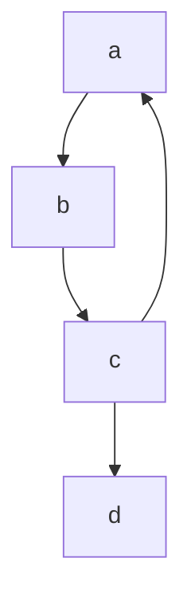
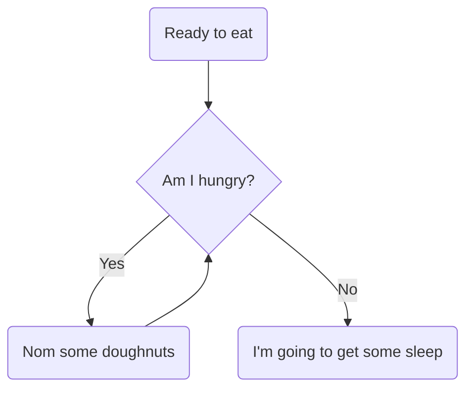
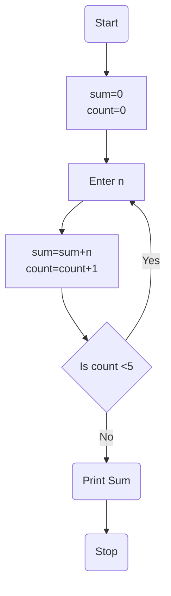
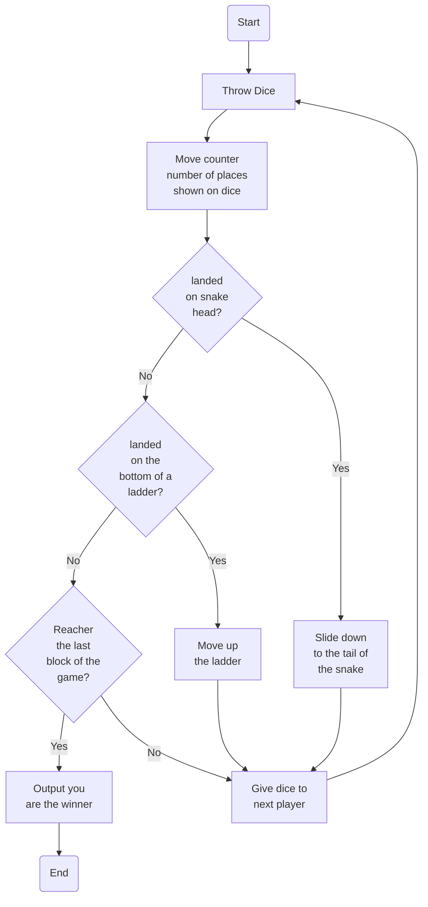

CS Unplugged
============

Async
-----

* Many aspects of computing can be taught without a computer.
* Watch the following trailer video
    * [Computer Science Unplugged trailer](https://youtu.be/KOYy4kyLEHs) 3min
* This adds an extra dimension of excitement and intrigue. Magic tricks can form discussion points. These physical activities are memorable and powerful.
* There are lots of resources out there. The trick is YOU knowing what's out their and digesting the activities so that you can run them.
    * As a group we can explore 10hours+ of reading/exploring and share it with the group

TASK: (2 hours total)
* Goal: To have 3 activities that you could run for a class with 0min notice.
    * e.g.
        * The network is down
        * There is a power cut
        * You are asked to cover another teachers lesson and no work has been set
        * You are asked to give a 1 hour workshop to a group of visiting primary students in the school hall
        * It's the last day of term and students are not particularly focused and want to do something different
    * Consider having the various printouts you would need to have ready _on standby_ in your classroom
        * I know in covid times some of these activities may not be appropriate, but it wont be this way forever!

1. Explore a range of CS Unplugged activities (1 hour 30 min) - consider 3 activities
    * Put links to the activies that you have settled on in Google Doc
2. Describe some of the activities your explored to the group (30 min)

### Starting points and ideas
* [CS Unplugged](http://csunplugged.org) - Teaching Computing concepts without a computer
    * [classic resources](https://classic.csunplugged.org/)
* cs4fn
    * [Inspiring Unplugged classroom activities](https://teachinglondoncomputing.org/resources/inspiring-unplugged-classroom-activities/)
        * [The Chocolate Turing Machine](https://teachinglondoncomputing.org/turingmachine/)
            * [Paul Curzon - The Chocolate Turing Machine - Lockdown Lecture 01](https://youtu.be/soJ3FPvs7QI?t=1356) 22:35 to 26:48
            * Roleplay the machine/state/tape with people
        * [The Invisible Palming Activity](https://teachinglondoncomputing.org/resources/inspiring-unplugged-classroom-activities/the-invisible-palming-activity/)
        * [The Locked-in Activity](https://teachinglondoncomputing.org/resources/inspiring-unplugged-classroom-activities/the-locked-in-activity/)
            * Explore the design of an algorithm to allow someone with locked-in syndrome to communicate.
        * [Algorithmic Doodle Art](https://teachinglondoncomputing.org/algorithmic-doodle-art/)
            * recursive artwork - can actually be a starter to gcse/a-level to build their own recursive artwork algorithms
    * [cs4fnpuzzlebook11.pdf](https://cs4fndownloads.files.wordpress.com/2016/02/cs4fnpuzzlebook11.pdf)
    * [Computer science magic trick books](http://www.cs4fn.org/magic/magicdownload.php)
* [Missing square puzzle](https://en.wikipedia.org/wiki/Missing_square_puzzle)
    * printout?


Lecture (30 min)
----------------

Some ideas and consolidating thoughts

Sequence
--------

demo making tea
lighting a candle


Magic
-----

* Parity Puzzle - I'm reading your minds - I'm psycic
    * [An Honest Liar](https://www.imdb.com/title/tt2246565/) Documentary 2014 -
        * The life and career of the renowned stage magician turned scientific skeptic of the paranormal, James Randi.


Assembly Idea?
--------------

* Each student given unique sudoku problem (batch generated by code)
* Explain the rules of sudoku
* I will write some code to solve sudoku - while the class/assembly solves the paper problems
* 30 Mortals vs 1 'Computer + Programmer' - play the _Mortal Kombat_ soundtrack
* [hackertyper.net](https://hackertyper.net/) - fun hacker stereotype simulator in a webbrowser - each keypress types 3 characters from a random linux source file
    * You can upload your own file
* Get the program to list and solve every problem that was given to the room (in realtime)

With code: One person on the planet solve the problem 'once' and it's solved forever

> The pen is mightier than the sword - a computer may be mightier than the pen

* If you could use a computer properly - if you could code ... 
* you could use it for incredible personal gain, maximise output, control information
* or 
* you could use it to empower people, grow community's, foster collaboration and share the expanded capabilities with humanity
* The choice is yours, but only if you know how to use the tool
* Otherwise ... you don't get a choice, you'll be solving somebody else's (possibly meaningless) sudokus

More on the topic of automation
* [Ask HN: What automation tools have you used to replace mundane activities?](https://news.ycombinator.com/item?id=22345150)
* [A New PS4 Is Born Every 30 Seconds Thanks To Modern Manufacturing](https://www.gamespot.com/articles/a-new-ps4-is-born-every-30-seconds-thanks-to-moder/1100-6479342/)
    * Sony's manufacturing plant in Japan uses 26 robots to assemble consoles faster and more efficiently
    * Only 4 humans are directly involved in the process (every ps4 on the planet)

### python sudoku code

* [Algorithm for solving Sudoku](https://stackoverflow.com/questions/1697334/algorithm-for-solving-sudoku)
* [tech with tim: python sudoku solver with backtracking](https://www.techwithtim.net/tutorials/python-programming/sudoku-solver-backtracking/)
* [another solution](https://dev.to/willamesoares/what-i-learned-from-implementing-a-sudoku-solver-in-python-3a3g)
* [101computing: sudoku generator](https://www.101computing.net/sudoku-generator-algorithm/)
* [101computing: sudoku solver](https://www.101computing.net/backtracking-algorithm-sudoku-solver/)

```python
# https://stackoverflow.com/a/57876668/3356840

board = [
    [8, 0, 0, 0, 0, 0, 0, 0, 0],
    [0, 0, 3, 6, 0, 0, 0, 0, 0],
    [0, 7, 0, 0, 9, 0, 2, 0, 0],
    [0, 5, 0, 0, 0, 7, 0, 0, 0],
    [0, 0, 0, 0, 4, 5, 7, 0, 0],
    [0, 0, 0, 1, 0, 0, 0, 3, 0],
    [0, 0, 1, 0, 0, 0, 0, 6, 8],
    [0, 0, 8, 5, 0, 0, 0, 1, 0],
    [0, 9, 0, 0, 0, 0, 4, 0, 0],
]


def solve(bo):
    find = find_empty(bo)
    if not find:  # if find is None or False
        return True
    else:
        row, col = find
    for num in range(1, 10):
        if valid(bo, num, (row, col)):
            bo[row][col] = num
            if solve(bo):
                return True
            bo[row][col] = 0
    return False


def valid(bo, num, pos):
    # Check row
    for i in range(len(bo[0])):
        if bo[pos[0]][i] == num and pos[1] != i:
            return False
    # Check column
    for i in range(len(bo)):
        if bo[i][pos[1]] == num and pos[0] != i:
            return False
    # Check box
    box_x = pos[1] // 3
    box_y = pos[0] // 3
    #
    for i in range(box_y*3, box_y*3 + 3):
        for j in range(box_x*3, box_x*3 + 3):
            if bo[i][j] == num and (i, j) != pos:
                return False
    return True


def print_board(bo):
    for i in range(len(bo)):
        if i % 3 == 0:
            if i == 0:
                print(" ┎─────────┰─────────┰─────────┒")
            else:
                print(" ┠─────────╂─────────╂─────────┨")
        for j in range(len(bo[0])):
            if j % 3 == 0:
                print(" ┃ ", end=" ")
            if j == 8:
                print(bo[i][j], " ┃")
            else:
                print(bo[i][j], end=" ")
    print(" ┖─────────┸─────────┸─────────┚")


def find_empty(bo):
    for i in range(len(bo)):
        for j in range(len(bo[0])):
            if bo[i][j] == 0:
                return i, j  # row, column
    return None


print_board(board)
print('\n--------------------------------------\n')
solve(board)
print_board(board)
```


### Parity


Reverse Engineering - Paper Plane
---------------------------------


Theory Roleplay
---------------

Networks hands over desk
Thread and process's


Charts
------










